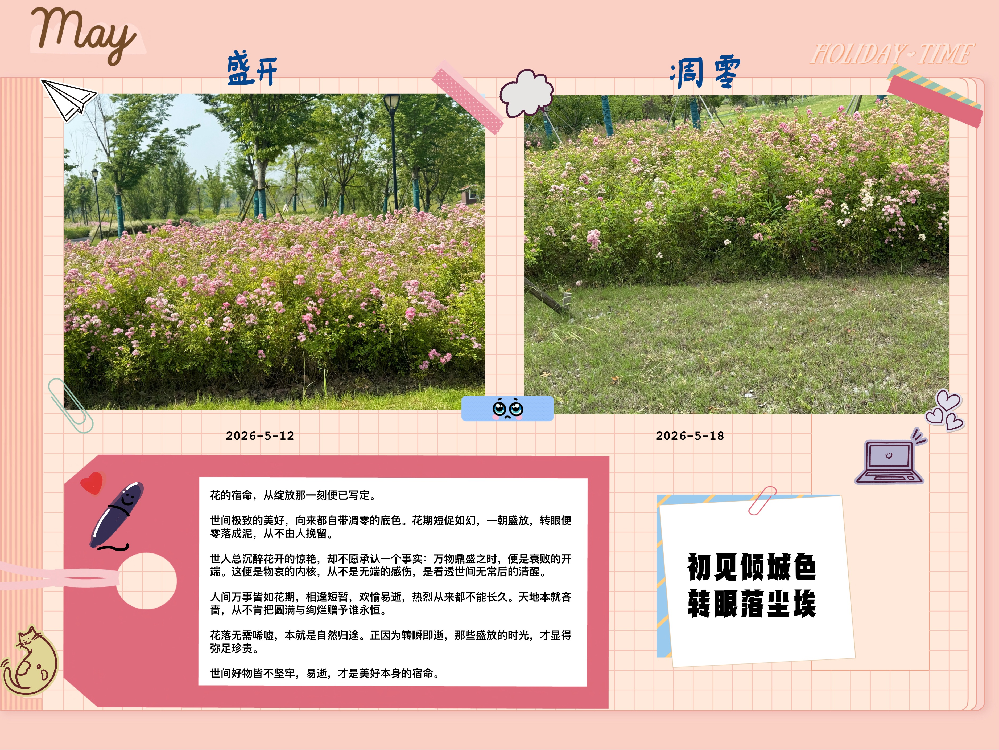

!!! quote
    花束从被采摘的那一刻起  
    就注定了它的生命是短暂的  
    他的意义不在于永恒♾️   
    而在于盛开时的绚烂  

```
这部现实主义题材电影整体剧情我就不让ai帮我总结了，  
想要了解的可以去找找完整版资源或者直接看解说版。  
我只零散地做一些我观点性的总结。
```

## 1. 相遇
   `【开始，亦是结束的开始】`

电影前半段，麦和绢的相遇堪称奇迹。同样的帆布鞋、同样的歌单、同样错过的天竺鼠展览。但这种建立在“消费同一种文化产品”上的灵魂契合，真的能抵御生活的消磨吗？

所谓的 “百分百合拍”，大概就是指这种灵魂同频率共振的颤栗感。对于两个长期感到孤独的灵魂来说，这种被完全理解、完全接纳的快感，远比任何肉体上的吸引都要来的更加致命和深刻。

他们的爱情，像一束刚刚包装好的花束，绚烂、纯粹、美好得不真实。麦说：“我的人生目标，就是和你维持现状。” 可他不知道，维持现状，是这世界上最奢侈的事情。

从奇迹般的相遇可以窥得，如果我们总带着百分百合拍的滤镜去审视另一半，那这层滤镜就会像放大镜般，将也许可能百分之一的“不合拍”无限放大。而且百分百合拍本身就是个悖论，现实中接触到百分百合拍的人的概率微乎其微，也许互联网中一些人所谓的网友能让你感觉到很大程度的“合拍”，但是那也许是别人为了迎合你，伪装出的面纱。

所以从恋爱的角度，我觉得线下的相处尤为重要，其中一个很重要的评判标准是，两个人待在一起是否能自在舒适，另外我觉得对于伴侣的要求并不需要多高程度的合拍，但也必须有个阈值，这个因人而异。但是我的观点是：契合适合做朋友，互补适合做伴侣。

## 2.理想主义与社会化的碰撞


`杀死爱情的不是“不爱了”，而是两人在面对现实压力时，做出了不同的选择，导致步调不再一致。`

两人毕业后步入社会的阶段是全片的分水岭。麦代表了被现实规训的理想主义者，为了两人的未来，他放下了画笔，变成了连《塞尔达》都没精力玩的“社畜”；绢则代表了坚守内心的浪漫主义者，她宁愿降薪也要做自己喜欢的活动策划。

这是很典型的水仙花和面包选择的问题

!!! tip "补充"
    “水仙花和面包”常被用来隐喻物质生活与精神追求的关系，典出穆罕默德名言：“假如你有两块面包，你得用其中一块去换一朵水仙花”。面包代表维持生存的物质基础，水仙花代表高雅的精神需求、美学享受或理想追求。
    

我认为：人不能只靠面包活着，但也不能只闻水仙花。  

但是这是建立在我有两块的面包的基础上，这背后蕴含着“**物质是精神的基础**”的哲学原理。如果连一块面包都拥有不了时，我觉得正常人的优先级是把面包放在水仙花前，这无可厚非。 “拥有两块面包”意味着在满足基本生存需求（一块面包）的前提下，才去追求更高层次的精神享受（另一块换水仙花）。当我们连最基本的温饱都解决不了，何谈更高的理想追求？所谓`仓廪实而知礼节，衣食足而知荣辱`。

单有面包只是活着，追求“水仙花”则是高雅、快乐和有意义的生活。“精神的滋养”让生活更有意义，精神的滋养可以是对于音乐的鉴赏，可以是对于一些小说作品阅读（准确来说是文学作品这个大类，只是我很喜欢读小说），包括现在年轻群体对于娱乐明星的追捧、对于游戏电竞的热爱、在自媒体圈子看乐子，我觉得这些都属于精神滋养的范畴（这些只是方式和载体不同），只不过不同程度和方式的精神滋养对于一个人的行为和认知的影响是不同的，有正向、反向之分，且这个也因人而异，不能一棍子打死。

这个问题映射到我个人的现实生活是，如果我现在有两片面包，其中一片是父母的托举，另一片是自己争取的，我会把其中一片换取“水仙花”，然后努力让自己拥有独立争取两块甚至更多“面包”的能力。说通俗点，我在面临人生选择时，我会先优先满足我的事业，现有物质基础，“小孩子才做选择，成年人选择都要”这话不假，人性是贪婪的，但是我有物质基础的同时或者说我追求物质基础的路上，我会驻足观赏“水仙花”，于我而言，水仙花可以是：一部电影、一本书、甚至是对于新事物的体验。避免我的精神进入贫瘠的荒漠，最终变成一条渴死的鱼。

## 3.婚姻是一座围城

爱情最残忍的地方，从来不是背叛，而是 “我还在原地，你却已经走远”。不是不爱了，而是曾经的爱在现实的打磨下，慢慢失去了光芒。
在朋友的婚礼上，看着新人幸福的样子，他们同时冒出了分手的念头。
婚礼结束后，他们一起坐了摩天轮，唱了 KTV，回到了第一次告白的餐厅，翻看旧照片，回忆涌上心头。
麦突然动摇了，他想用婚姻挽留这段关系。他认为世上的爱情最后都会变成亲情，不如就这样凑合过吧。

这让我想起了钱钟书《围城》里的一句话：

!!! tip 补充
    “婚姻是一座围城，城外的人想进去，城里的人想出来”出自钱钟书的名著《围城》，  
    意指婚姻像一座被围困的城堡，城外的人想冲进去，城里的人想逃出来。  
    这比喻描述了对未曾拥有事物的憧憬与身处其中后的失落，  
    反映了婚恋中常见的围城心理与生活琐碎导致的困境。  

虽然《花束般的恋爱》中的麦和绢最终没有步入婚姻的殿堂，但他们五年的同居生活，以及电影高潮处那场“关于结婚的争论”，却将“围城”的困境展现得淋漓尽致，甚至比结了婚更令人唏嘘。

**接下来是我让ai帮我总结的内容：**

#### 1. 将婚姻作为“避难所”的麦（试图建城）

* **体现：** 在两人感情已经名存实亡、相对无言的时候，麦不仅没有提出分手，反而**向绢求婚**了。他的理由是：“世界上结了婚的夫妻，很多都不相爱了，不也一样过日子吗？我们可以变成家人。”
* **剖析：** 此时的麦，正是想要主动建造一座“围城”。当爱情的内驱力消失时，他试图用婚姻的**制度、契约和世俗惯例**来强行绑定两人。他认为只要进了这座城，哪怕没有爱情，也能靠“亲情”和“习惯”安稳度日。婚姻在这里不是爱情的升华，而成了掩盖感情枯竭的遮羞布。

#### 2. 拒绝被“妥协”困住的绢（拒绝入城）

* **体现：** 面对麦的求婚和描绘的“一家三口推着婴儿车逛超市”的平淡岁月，绢曾有过一瞬间的动摇（她甚至想，这样或许也能过一辈子），但最终她流着泪拒绝了。
* **剖析：** 绢清醒地看到了这座“围城”的本质——那是对当年纯粹爱情的背叛与妥协。她不愿意接受“大家都是这么凑合的”，不愿意在城里扮演一对貌合神离的夫妻，更不愿意把过去的闪闪发光变成偶尔拿出来叹息的回忆。她宁愿让花束彻底枯萎，也不愿将其做成毫无生气的干花摆在围城里。**她的分手，是对“围城”最决绝的抵抗。**

#### 3. 同居生活：未领证的“隐形围城”

* **体现：** 虽然没有那一纸婚书，但两人后期的同居生活已经完全陷入了围城式的僵局。从最初看同一本书都会激动半天、舍不得睡觉，到后来哪怕坐在同一张桌子上，也只能面对面戴着耳机，各自看着毫无交集的屏幕。
* **剖析：** 围城的墙，从来不是民政局盖的章，而是生活里无处不在的**琐碎与疲惫**。水电费、加不完的班、被客户痛骂的压力，一砖一瓦地砌成了这座城。它把曾经无话不谈的灵魂伴侣，困成了同在一个屋檐下却无法共情的“合租室友”。城里的人感到窒息，却连吵架的力气都没有了。

#### 4. 理想与现实的城内外之别

* **体现：** 电影开篇，两个在城外的人，以为靠着100%合拍的文学、电影、音乐品味，就能打造一座抵御世俗的乌托邦。但当他们真正进入社会（进入广义的成人世界之城），才发现那些曾经视若珍宝的爱好，在生存压力面前不堪一击。麦把《塞尔达》扔在角落落灰，不再看哪怕一页文学书。
* **剖析：** 城外是浪漫主义的理想，城内是现实主义的柴米油盐。悲剧的根源在于，他们手拉手走进了现实，却发现现实的城里，根本没有空间来安放当年那束浪漫的花。

#### 5. 尊重与边界

在麦向绢求婚的场景中，有一个细节容易被忽视：麦试图用婚姻来"挽留"这段关系。他认为"世界上结了婚的夫妻，很多都不相爱了，不也一样过日子吗？我们可以变成家人。"这种想法看似是为两人的未来负责，实则是一种变相的**情感绑架**——他按照自己的逻辑和需求来规划两人的结局，却忽略了绢的真实意愿。

**一厢情愿，从来不是真正的爱。** 喜欢一个人，是主观的情感；但尊重对方的选择，是理性的必修课。真正的爱，不是强行把对方纳入自己的未来，而是承认她有说"不"的权利。

这也让我重新审视东西方婚恋观的差异。西方文化中，相敬如宾、保持边界感是一种绅士风度——喜欢你是我的事，但尊重你的意愿是底线。而中国某些传统婚恋观念中，"为你好"往往成了忽视对方真实想法的借口，将婚姻等同于责任、任务甚至"完成任务"。健康的亲密关系，应该是**相互尊重**的两个人，即便再亲密，也为彼此保留say no的空间。

最后想用电影片头的那一句话总结：

!!! quote
    虽然恋爱的存活率很低，但我的爱情不会死亡。


