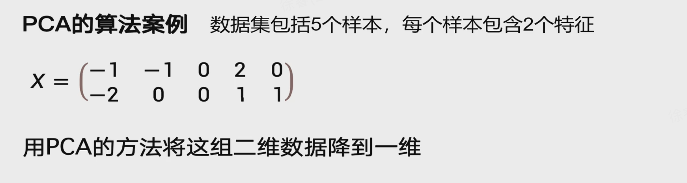
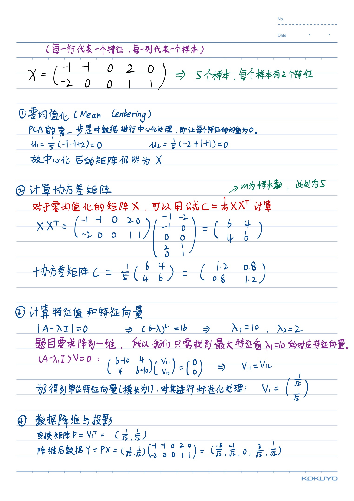
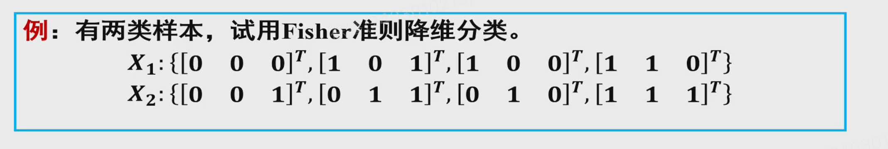
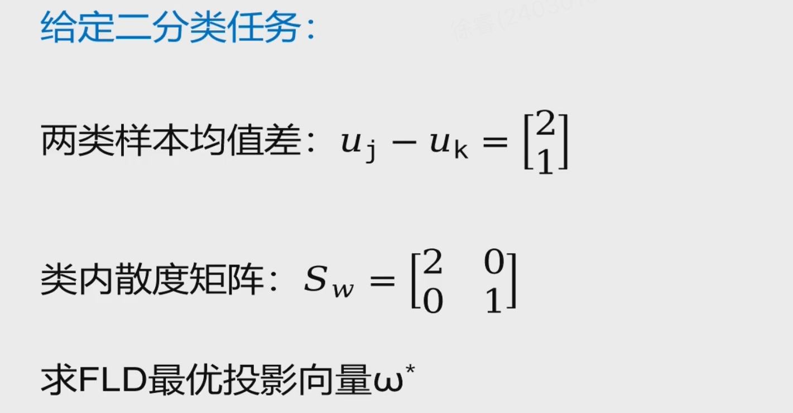
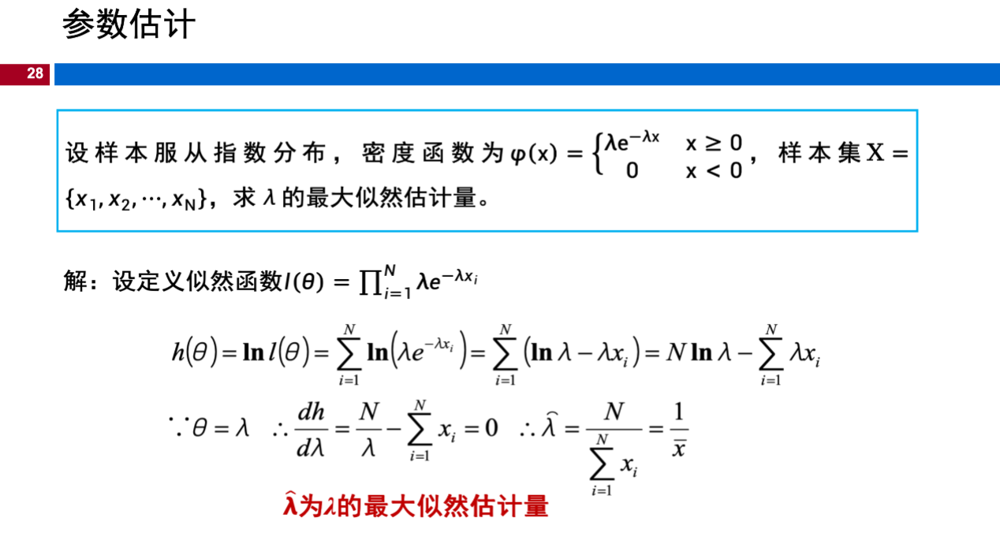
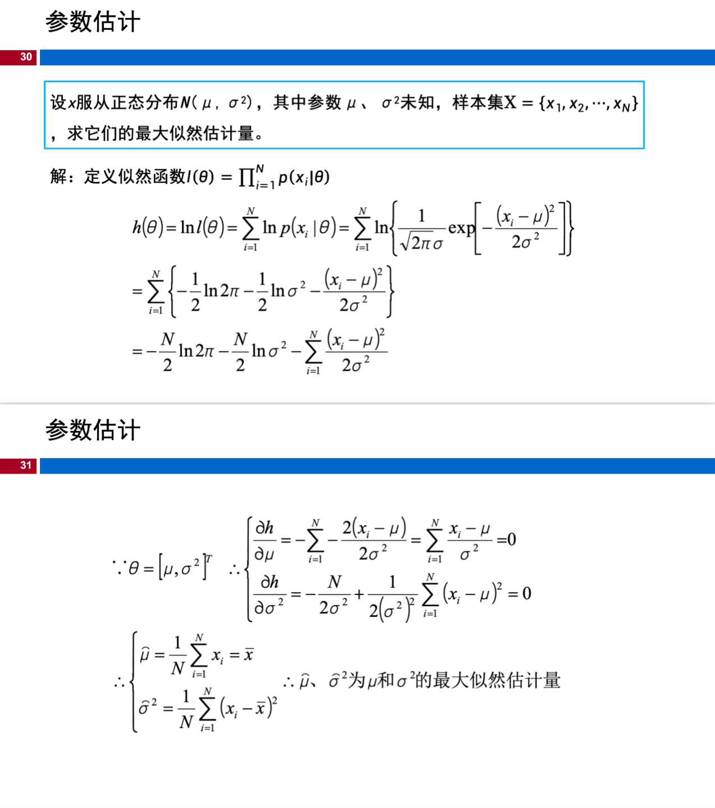
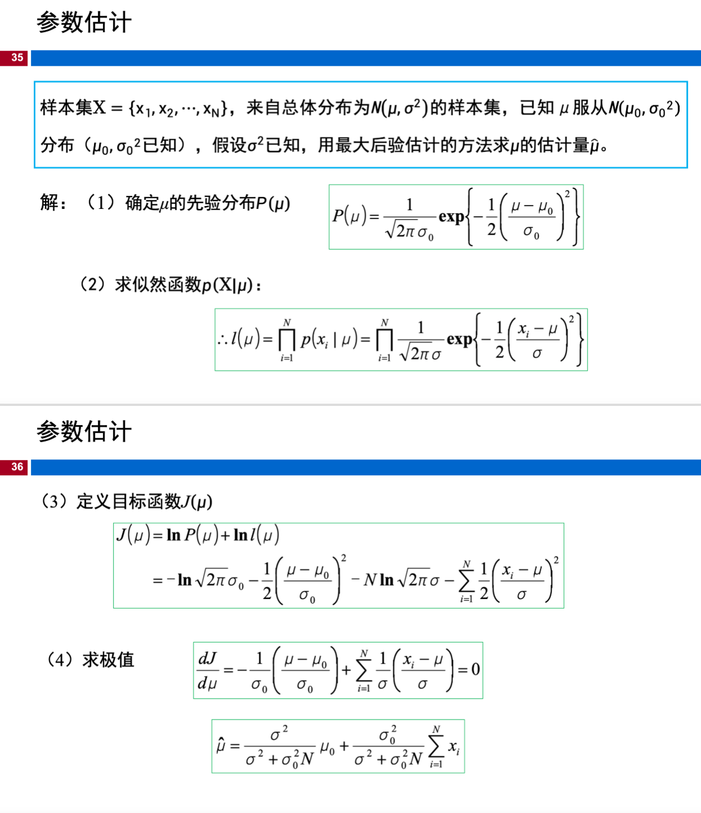

# 考试复习

## 评估

1\. 模型出现过拟合时，其训练误差与测试误差的典型表现为（）  
A.训练误差大，测试误差大  
B.训练误差小，测试误差大  
C.训练误差小，测试误差小  
D.训练误差大，测试误差小

**答案：B**

**解析：**

过拟合是指模型在训练数据上学得太"死"，把训练数据中的**噪声和随机波动**也当成规律学进去了，导致泛化能力差。

| 情况 | 训练误差 | 测试误差 | 原因 |
|------|---------|---------|------|
| **过拟合** | **小** | **大** | 模型记住了训练样本的噪声，无法推广到新数据 |
| 欠拟合 | 大 | 大 | 模型太简单，连训练数据的规律都没学到 |
| 理想拟合 | 小 | 小 | 学到了真正的底层规律，泛化能力好 |
| 不可能情况 | 大 | 小 | 如果连训练集都学不好，几乎不可能在测试集上表现更好 |

过拟合本质上产生了**巨大的训练-测试误差差距（generalization gap）**：在训练集上表现近乎完美（误差很小），一到测试集/新数据就"翻车"（误差很大）。

这也印证了**奥卡姆剃刀原则**在机器学习中的应用——并非模型越复杂、在训练集上拟合得越好就代表模型越优，泛化能力才是衡量模型好坏的关键指标。

---

2\. 下列方法中，无法缓解欠拟合的是（）  
A. 增加模型的复杂度  
B. 减小或移除过度的正则化  
C.增加训练迭代次数  
D. 增大L2 正则化系数

**答案：D**

**解析：**

欠拟合指模型对训练数据本身的学习都不充分。各项分析：

| 选项 | 能否缓解欠拟合 | 原因 |
|------|:----------:|------|
| A. 增加模型复杂度 | ✅ 能 | 更复杂的模型（如加深网络、增加特征）能更好地拟合数据 |
| B. 减小/移除正则化 | ✅ 能 | 正则化约束模型复杂度，减小正则化相当于"松绑"，让模型更自由地拟合训练数据 |
| C. 增加训练迭代次数 | ✅ 能 | 更多轮训练可能让模型进一步收敛，降低训练误差 |
| D. 增大L2正则化系数 | ❌ 不能 | 增大正则化等于**更强地约束模型**，会使模型更简单，反而**加重欠拟合** |

总结：正则化是防止**过拟合**的手段，增大正则化系数会加剧欠拟合。

---

3\. 下列说法正确的是：  
A. 为了防止过拟合，正则化系数越大越好。  
B. 为了防止过拟合，应当选择尽可能简单的模型。  
C. L2 正则化系数属于超参数  
D. 正则化系数可以通过令损失函数对其求梯度为零计算出来。

**答案：C**

**解析：**

| 选项 | 正误 | 原因 |
|------|:--:|------|
| A | ❌ | 正则化系数并非越大越好。过大的正则化会过度约束模型，导致**欠拟合**。需要在验证集上调优 |
| B | ❌ | 模型也不是越简单越好。模型应匹配任务复杂度——过于简单会**欠拟合**，过于复杂会**过拟合**。应在偏差-方差中找平衡 |
| C | ✅ | **L2正则化系数 λ 是超参数**。它不在训练过程中通过梯度下降学习，而是在训练前由人设定或通过验证集调整 |
| D | ❌ | 正则化系数是**超参数**，不能通过求梯度为零直接算出。模型参数（如权重w）可以通过求导求解，但超参数需要靠交叉验证等方法选取 |

---

4\. 关于训练/测试集划分的原则，下列说法错误的是（）  
A. 测试集可以参与模型超参数调优  
B.测试集在训练全过程中必须保持独立  
C. 验证集用于模型选择与超参数调优  
D.测试集仅用于模型最终泛化能力的评估

**答案：A**

**解析：**

| 选项 | 正误 | 原因 |
|------|:--:|------|
| A | ❌ 错误 | 测试集**不能**参与超参数调优。调参应使用验证集，测试集必须保持完全独立 |
| B | ✅ 正确 | 测试集在训练全过程中保持独立，避免数据泄露，保证评估的客观性 |
| C | ✅ 正确 | 验证集的作用就是进行模型选择和超参数调优 |
| D | ✅ 正确 | 测试集唯一的作用是评估最终模型的泛化能力 |

训练/验证/测试三者的职责必须严格分离，测试集一旦参与调参就会导致对泛化能力的高估。

---

5\. 在K 折交叉验证中，每一轮训练使用___,剩余___折作为验证集。

**答案：K-1 折；1 折**

**解析：**

K 折交叉验证将数据集均匀划分为 K 份。每一轮中：

- 选取 **K-1 折**作为训练集
- 剩下的 **1 折**作为验证集

整个过程重复 K 次，每折恰好被用作验证集一次。最终将 K 轮验证结果取平均，得到对模型性能的可靠估计。

这样做的优点：每条样本都参与过验证，避免了单次划分的偶然性，尤其适合数据量较少的情况。

---

6\. 数据集总共有100个样本，20个是正类，80个是负类。分类器预测结果如下：25个是正类（其中15个与真实标签相符，10个与真实标签不符），75个是负类（其中70个与真实标签相符，5个与真实标签不符），试计算分类器的准确性、查准率、查全率、F1值。

**解析：**

先根据题意列出混淆矩阵：

|  | 预测正类 | 预测负类 | 合计 |
|--|---------|---------|------|
| **真实正类** | TP = 15 | FN = 5 | 20 |
| **真实负类** | FP = 10 | TN = 70 | 80 |
| **合计** | 25 | 75 | 100 |

计算各指标：

- **准确率 (Accuracy)** = (TP + TN) / 总数 = (15 + 70) / 100 = **0.85**
- **查准率 (Precision)** = TP / (TP + FP) = 15 / (15 + 10) = 15/25 = **0.6**
- **查全率 (Recall)** = TP / (TP + FN) = 15 / (15 + 5) = 15/20 = **0.75**
- **F1 值** = 2 × (Precision × Recall) / (Precision + Recall) = 2 × (0.6 × 0.75) / (0.6 + 0.75) = 2 × 0.45 / 1.35 ≈ **0.667**

---

7\. 对于一个二分类任务，数据的标签和对于预测正例的概率如下表所示，试画出ROC 曲线并计算模型的AUC值。

| 样本序号 | 真实标签 | 预测正类概率 |
|-------|------|----------|
| 1     | 0    | 0.1      |
| 2     | 1    | 0.35     |
| 3     | 0    | 0.4      |
| 4     | 1    | 0.8      |

!!! danger "tip"
    TPR:实际是正类却被预测为正类的比例。**正类判正率**  
    FPR:实际是负类却被错误预测为正类的比例。**负类误判正率**

**解析：**

**Step 1:** 将样本按预测正类概率**从大到小**排序：

| 序号 | 真实标签 | 概率（降序） |
|-----|---------|------------|
| 4   | 1(正)   | 0.8        |
| 3   | 0(负)   | 0.4        |
| 2   | 1(正)   | 0.35       |
| 1   | 0(负)   | 0.1        |

**Step 2:** 以每个概率作为阈值，计算 TPR 和 FPR：

- 总正例数 P = 2，总负例数 N = 2

| 阈值 | 预测为正的样本 | TP | FP | TPR = TP/P | FPR = FP/N |
|-----|-------------|----|----|-----------|-----------|
| +∞ → 全部判负   | — | 0 | 0 | 0 | 0 |
| 0.8 | {4} | 1 | 0 | 1/2 = 0.5 | 0/2 = 0 |
| 0.4 | {4, 3} | 1 | 1 | 1/2 = 0.5 | 1/2 = 0.5 |
| 0.35 | {4, 3, 2} | 2 | 1 | 2/2 = 1.0 | 1/2 = 0.5 |
| 0.1 | {4, 3, 2, 1} | 2 | 2 | 2/2 = 1.0 | 2/2 = 1.0 |

**Step 3:** 绘制 ROC 曲线点（FPR, TPR）：(0,0) → (0, 0.5) → (0.5, 0.5) → (0.5, 1.0) → (1, 1)

ROC 曲线呈阶梯状：

**Step 4:** 计算 AUC（曲线下面积）：

AUC = 左侧矩形 + 上方矩形 = (0.5 - 0) × 0.5 + (1 - 0.5) × 1.0

= 0.5 × 0.5 + 0.5 × 1.0 = 0.25 + 0.5 = **0.75**

---

8\. 问题：训练集、验证集和测试集的作用分别是什么？

**答：**

- **训练集（Training Set）**：用于训练模型，即**拟合模型参数**（如权重、偏置）。模型通过学习训练集中的样本调整自身参数。
- **验证集（Validation Set）**：用于**模型选择和超参数调优**，如选择模型结构、正则化系数、学习率等。验证集不参与参数训练，避免了数据泄露。
- **测试集（Test Set）**：用于**评估最终模型的泛化能力**。测试集在训练和调参过程中完全不被使用，仅用于最后给出模型的性能指标，是模型在新数据上表现的无偏估计。

三者的划分保证了模型评估的客观性——如果只用训练集+测试集，调参时会间接"窥探"测试集信息，导致过拟合于测试集。

---

9\. 问题：如何通过ROC曲线评估分类器性能？

**答：**

ROC 曲线以**FPR（False Positive Rate，假正例率）** 为横轴、**TPR（True Positive Rate，真正例率）** 为纵轴，通过改变分类阈值绘制而成。

评估方式：

1. **AUC 值（曲线下面积）**：最核心的量化指标。AUC ∈ [0, 1]，数值越大性能越好：  
   - AUC = 1.0：理想分类器，存在一个阈值可完美区分正负样本  
   - AUC = 0.5：随机猜测，曲线为对角线  
   - AUC < 0.5：比随机更差（反向使用则优于随机）
2. **曲线形状定性判断**：曲线越靠近左上角（(0, 1)点），说明 TPR 高、FPR 低时，分类器能在低误判率下获得高召回率，性能越好。
3. **与准确率的对比优势**：ROC 曲线不受类别不平衡影响，即使正负样本比例变化，曲线形状基本保持不变，因此更适合评估在不平衡场景下的模型表现。

---

10\. 问题：准确率（Accuracy）的局限性是什么？为什么不平衡数据集任务中需要引入查准率、查全率等其它评价指标？

**答：**

**局限性：** 准确率 = (TP + TN) / 总数，它把所有样本等权看待，在类别不平衡时会产生**误导性结果**。

**举例：** 某检测任务中100个样本，95个是正常（负类），5个是异常（正类）。若分类器将所有样本判为"正常"：  

- Accuracy = 95/100 = 95%，看似很高  
- 但实际上一个异常都没检测出来，查全率 Recall = 0/5 = 0

**为何需要查准率、查全率：**

- **查准率（Precision）**：关注"预测为正的样本中有多少是真正例"，回答"判对了多少"——在"宁缺毋滥"场景（如垃圾邮件过滤，不想误删重要邮件）中很重要。
- **查全率（Recall）**：关注"真正的正例中有多少被找出来了"，回答"找全了没有"——在"宁错杀不放过"场景（如疾病筛查，不能漏掉患者）中很重要。
- 两者通常是一对**矛盾**，提高阈值查准率上升但查全率下降。F1 值调和二者，在二指标不可偏废时使用。

---

11\. 已知：TP=50, FN=10, FP=5, TN=100，求：查准率、查全率、F1。

**解析：**

- **查准率 (Precision)** = TP / (TP + FP) = 50 / (50 + 5) = 50/55 ≈ **0.909**
- **查全率 (Recall)** = TP / (TP + FN) = 50 / (50 + 10) = 50/60 ≈ **0.833**
- **F1 值** = 2 × (P × R) / (P + R) = 2 × (0.909 × 0.833) / (0.909 + 0.833) = 2 × 0.757 / 1.742 ≈ **0.869**

---

## PCA主成分分析

1\. 主成分分析法（PCA）的核心目的是（）  
A.增加数据维度，提升模型复杂度  
B.降低数据维度，保留数据核心信息，减少冗余  
C.选择合适的特征，降低特征维度  
D.对数据进行标准化处理

**答案：B**

**解析：**

PCA（Principal Component Analysis）的核心思想是通过正交变换，将原始高维数据投影到低维空间，同时**最大化保留数据的方差（信息量）**，减少特征间的冗余相关性。

| 选项 | 正误 | 原因 |
|------|:--:|------|
| A | ❌ | PCA 是降维方法，不是增加维度 |
| B | ✅ | **降低维度，保留核心信息，去除冗余**——这正是 PCA 的核心目的 |
| C | ❌ | "选择合适的特征"描述的是**特征选择**（Feature Selection），而非 PCA。PCA 是通过线性变换构造**新特征（主成分）**，不是从原始特征中挑选 |
| D | ❌ | 标准化是数据预处理手段，不是 PCA 的目的。PCA 通常在标准化**之后**再进行 |

> PCA 的关键区分：PCA 是**特征提取**（构造新特征），不是**特征选择**（挑选旧特征）。

---

2\. 若原始数据为100个样本、20个特征，使用PCA降维到5维后，得到的数据形状为（）  
A. (100, 20)  
B. (20, 5)  
C. (100, 5)  
D. (5, 100)

**答案：C**

**解析：**

原始数据形状为 (100, 20)，即 100 个样本、20 个特征。PCA 降维后，**样本数量不变**，特征维度从 20 降到 5，所以新数据形状为 **(100, 5)**。

> 记忆技巧：PCA 降维只压缩"特征列"，不改变"样本行"。

---

3\. 在PCA降维过程中，主成分的选择依据是（）  
A. 原特征的均值大小  
B. 原特征的方差大小  
C. 协方差矩阵的特征值大小  
D. 样本的数量多少

**答案：C**

**解析：**

PCA 的步骤：计算协方差矩阵 → 对协方差矩阵做特征值分解 → 取**特征值最大**的前 k 个特征向量作为主成分方向。

| 选项 | 正误 | 原因 |
|------|:--:|------|
| A | ❌ | PCA 与均值无关（数据通常已中心化，均值为 0） |
| B | ❌ | 衡量的是**投影方向上的方差**（即特征值），而不是原始特征各自的方差 |
| C | ✅ | 特征值越大 → 该方向方差越大 → 保留信息越多 → 优先选为主成分 |
| D | ❌ | 样本数不影响主成分的选择，只影响降维后的维度上限 |

---

4\. PCA中，协方差矩阵的主要作用是（）  
A. 衡量样本之间的相似度  
B. 衡量不同特征之间的相关性  
C. 对数据进行归一化处理  
D. 计算特征的方差大小

**答案：B**

**解析：**

协方差矩阵的元素 (i, j) 表示第 i 个特征与第 j 个特征的**协方差**，反映了特征之间的线性**相关性**：

- 正协方差 → 正相关（一个特征增大，另一个也增大）
- 负协方差 → 负相关（一个特征增大，另一个减小）
- 协方差 ≈ 0 → 特征间几乎无关

PCA 的目标是找到一组新坐标轴（主成分），使得投影后各维度之间的协方差为零（去相关），因此协方差矩阵是 PCA 的核心运算对象。

5\. PCA 计算题

**解析：**

> 注：第一步零均值化，每一行都减去这个均值，就能做到零均值化。

!!! note "变式"
    $$X_{raw} = \begin{pmatrix} 3 & 5 & 2 & 6 \\ 3 & 7 & 4 & 6 \end{pmatrix}$$

    在这个矩阵中，第一行是特征1，第二行是特征2；每一列是一个样本。现在我们用 PCA 将它降维到一维。

---

## Fisher线性判别

1\. Fisher 线性判别（FLD）的核心目标是（）  
A. 最小化类间距离，最大化类内距离  
B. 最大化类间离散度，最小化类内离散度  
C. 从原始特征中挑选最有利于分类的特征  
D. 寻找数据方差最大的投影方向

**答案：B**

**解析：**

FLD 的目标是找一个投影方向 **w**，使得投影后：

- **类间离散度 SB 尽量大**（不同类别的样本均值投影后分得越开越好）
- **类内离散度 SW 尽量小**（同一类别的样本投影后聚得越紧越好）

目标函数为广义瑞丽商：**J(w) = (wTSBw) / (wTSWw)**

| 选项 | 正误 | 原因 |
|------|:--:|------|
| A | ❌ | 弄反了——应该**最大化类间、最小化类内** |
| B | ✅ | 最大化类间离散度、最小化类内离散度 |
| C | ❌ | 这是特征选择，不是 FLD。FLD 是寻找最佳投影方向，而非挑选特征 |
| D | ❌ | 这是 **PCA** 的目标，不是 FLD。FLD 利用类别标签，是有监督方法 |

---

2\. 以下关于 Fisher 散度矩阵说法错误的是（）  
A. SW 为类内离散度矩阵  
B. SB 为类间离散度矩阵  
C. 目标函数的大小与投影向量 w 的长度无关  
D. 类内散度越大，越有利于分类

**答案：D**

**解析：**

| 选项 | 正误 | 原因 |
|------|:--:|------|
| A | ✅ | SW（Within-class scatter）类内离散度矩阵——正确 |
| B | ✅ | SB（Between-class scatter）类间离散度矩阵——正确 |
| C | ✅ | J(w) = (wTSBw) / (wTSWw)，分子分母都是 w 的二次型，w 等比例缩放时比值不变。因此 J 与 w 的**长度**无关，只与**方向**有关 |
| D | ❌ | 类内散度**越小**越好（同类样本越紧凑），越大越不利于分类 |

---

3\. FLD 与 PCA 相比，最核心的区别是（）  
A. FLD 计算复杂度更低  
B. FLD 属于有监督降维/判别，PCA 是无监督降维  
C. FLD 只能用于二维数据  
D. PCA 可用于分类，FLD 只能用于降维

**答案：B**

**解析：**

| 对比维度 | PCA | FLD |
|---------|-----|-----|
| 是否使用类别标签 | ❌ 无监督 | ✅ 有监督 |
| 优化目标 | 最大化投影方差 | 最大化类间 / 最小化类内离散度 |
| 适用场景 | 通用降维 | 分类任务中的降维 / 特征提取 |

| 选项 | 正误 | 原因 |
|------|:--:|------|
| A | ❌ | 两者计算复杂度相似，都需要特征值分解 |
| B | ✅ | FLD 利用类别标签信息，属于**有监督**方法；PCA 不使用标签，是**无监督**方法——这是最核心的区别 |
| C | ❌ | FLD 可用于任意维度数据，不仅限于二维 |
| D | ❌ | FLD 本身就可用于分类（Fisher 线性判别分类器），PCA 不能直接用于分类 |

---

4\. 广义瑞丽商的表达式：

**J(w) = (wTSBw) / (wTSWw)**

其中 SB 为类间离散度矩阵，SW 为类内离散度矩阵。最大化 J(w) 等价于让投影后类间距离尽可能大、类内距离尽可能小。

---

5\. Fisher 最优投影向量 w 满足广义特征方程：

**SB w = λ SW w**

最优投影方向 w 是 SW-1SB 的最大特征值对应的特征向量。对于二分类问题，解析解为：

**w = SW-1 (μ1 - μ2)**

即类内散度矩阵的逆乘以两类均值之差。

---

6\. Fisher 三维数据计算题

**解析：**

这是一道经典的 Fisher 线性判别分析（LDA）计算题，核心思想是”类内方差尽可能小，类间方差尽可能大”。

**(1) 计算两类样本的均值向量**

$$m_1 = \frac{1}{4} \left( \begin{bmatrix} 0 \\ 0 \\ 0 \end{bmatrix} + \begin{bmatrix} 1 \\ 0 \\ 1 \end{bmatrix} + \begin{bmatrix} 1 \\ 0 \\ 0 \end{bmatrix} + \begin{bmatrix} 1 \\ 1 \\ 0 \end{bmatrix} \right) = \frac{1}{4} \begin{bmatrix} 3 \\ 1 \\ 1 \end{bmatrix} = \begin{bmatrix} 0.75 \\ 0.25 \\ 0.25 \end{bmatrix}$$

$$m_2 = \frac{1}{4} \left( \begin{bmatrix} 0 \\ 0 \\ 1 \end{bmatrix} + \begin{bmatrix} 0 \\ 1 \\ 1 \end{bmatrix} + \begin{bmatrix} 0 \\ 1 \\ 0 \end{bmatrix} + \begin{bmatrix} 1 \\ 1 \\ 1 \end{bmatrix} \right) = \frac{1}{4} \begin{bmatrix} 1 \\ 3 \\ 3 \end{bmatrix} = \begin{bmatrix} 0.25 \\ 0.75 \\ 0.75 \end{bmatrix}$$

**(2) 计算类内离散度矩阵 Sw**

Sw = Sw1 + Sw2，其中 Swi = Σ(x - mi)(x - mi)T

$$S_{w1} = \begin{bmatrix} 0.75 & 0.25 & 0.25 \\ 0.25 & 0.75 & -0.25 \\ 0.25 & -0.25 & 0.75 \end{bmatrix}$$

$$S_{w2} = \begin{bmatrix} 0.75 & 0.25 & 0.25 \\ 0.25 & 0.75 & -0.25 \\ 0.25 & -0.25 & 0.75 \end{bmatrix}$$

*(注：这里两类的离散度矩阵刚好相等)*

$$S_w = S_{w1} + S_{w2} = \begin{bmatrix} 1.5 & 0.5 & 0.5 \\ 0.5 & 1.5 & -0.5 \\ 0.5 & -0.5 & 1.5 \end{bmatrix}$$

**(3) 计算最佳投影方向 W**

W = Sw-1(m1 - m2)

$$m_1 - m_2 = \begin{bmatrix} 0.75 \\ 0.25 \\ 0.25 \end{bmatrix} - \begin{bmatrix} 0.25 \\ 0.75 \\ 0.75 \end{bmatrix} = \begin{bmatrix} 0.5 \\ -0.5 \\ -0.5 \end{bmatrix}$$

$$S_w^{-1} = \begin{bmatrix} 1 & -0.5 & -0.5 \\ -0.5 & 1 & 0.5 \\ -0.5 & 0.5 & 1 \end{bmatrix}$$

$$W = \begin{bmatrix} 1 & -0.5 & -0.5 \\ -0.5 & 1 & 0.5 \\ -0.5 & 0.5 & 1 \end{bmatrix} \begin{bmatrix} 0.5 \\ -0.5 \\ -0.5 \end{bmatrix} = \begin{bmatrix} 1 \\ -1 \\ -1 \end{bmatrix}$$

*(缩放 W 的常数倍不影响投影方向，可取 W = [1, -1, -1]T)*

**(4) 样本降维与分类阈值**

投影公式：y = WTx = x(1) - x(2) - x(3)

| X1 样本投影 | y | X2 样本投影 | y |
|---|---|---|---|
| y1,1 = 0 - 0 - 0 | 0 | y2,1 = 0 - 0 - 1 | -1 |
| y1,2 = 1 - 0 - 1 | 0 | y2,2 = 0 - 1 - 1 | -2 |
| y1,3 = 1 - 0 - 0 | 1 | y2,3 = 0 - 1 - 0 | -1 |
| y1,4 = 1 - 1 - 0 | 0 | y2,4 = 1 - 1 - 1 | -1 |

- X1 降维后均值：m̃1 = (0+0+1+0)/4 = **0.25**
- X2 降维后均值：m̃2 = (-1-2-1-1)/4 = **-1.25**

分类阈值：y0 = (m̃1 + m̃2) / 2 = (0.25 + (-1.25)) / 2 = **-0.5**

**最终结论：**

- **降维向量**：W = [1, -1, -1]T
- **分类准则**：对于未知样本 x，计算 y = WTx  
  - 若 y > -0.5 → 属于 X1 类  
  - 若 y < -0.5 → 属于 X2 类

---

7\. Fisher 投影向量计算题

**解析：**

**(1) 确定理论公式**

最优投影向量：**ω\* = Sw-1(μj - μk)**

**(2) 求 Sw 的逆矩阵**

$$S_w = \begin{bmatrix} 2 & 0 \\ 0 & 1 \end{bmatrix}$$

对角矩阵求逆：主对角线元素取倒数：

$$S_w^{-1} = \begin{bmatrix} \frac{1}{2} & 0 \\ 0 & 1 \end{bmatrix}$$

**(3) 计算投影向量 ω\***

$$u_j - u_k = \begin{bmatrix} 2 \\ 1 \end{bmatrix}$$

$$\omega^* = \begin{bmatrix} \frac{1}{2} & 0 \\ 0 & 1 \end{bmatrix} \begin{bmatrix} 2 \\ 1 \end{bmatrix} = \begin{bmatrix} 1 \\ 1 \end{bmatrix}$$

**最终答案：** ω\* = [1, 1]T

*(注：投影向量关注的是方向，任何非零常数倍数等价)*

---

## SVM支持向量机

1\. SVM 的核心思想是：  
A）最小化经验风险  
B）最大化分类间隔  
C）最小化结构风险  
D）最大化后验概率

**答案：B**

**解析：**

SVM（Support Vector Machine）的核心思想是找到一个超平面，使得不同类别样本到超平面的**最小距离（即间隔 margin）最大化**。最大化间隔有助于提升泛化能力。

| 选项 | 正误 | 原因 |
|------|:--:|------|
| A | ❌ | 最小化经验风险是传统机器学习方法的思路，SVM 追求的是**结构风险最小化** |
| B | ✅ | **最大化分类间隔**是 SVM 的核心思想，”间隔最大化”是 SVM 的灵魂 |
| C | ❌ | 结构风险最小化是 SVM 的理论框架，但核心思想表述为”最大化间隔”更准确 |
| D | ❌ | 最大化后验概率是生成模型（如朴素贝叶斯）的思路 |

---

2\. SVM 中的软间隔（Soft Margin）用于处理：  
A）线性不可分数据  
B）过拟合问题  
C）类别不平衡  
D）高维特征

**答案：A**

**解析：**

硬间隔要求所有样本严格满足 yi(wTxi+b) ≥ 1，这在数据存在噪声或近似线性可分时无法实现。**软间隔引入松弛变量 ξi**，允许少量样本位于间隔内部甚至错误分类，从而**处理线性不可分/近似线性可分的数据**。

---

3\. SVM中核函数的作用是：  
A）降低特征维度  
B）解决线性不可分问题  
C）减少计算复杂度  
D）直接求解非线性问题

**答案：B**

**解析：**

核函数（Kernel Function）的核心作用是通过**隐式地将数据映射到高维空间**，使在原始空间中线性不可分的数据在高维空间中变得线性可分。同时核函数避免了显式计算高维映射 φ(x)，这称为”核技巧”（Kernel Trick）。

| 选项 | 正误 | 原因 |
|------|:--:|------|
| A | ❌ | 核函数是升维而非降维 |
| B | ✅ | 通过映射到高维空间，间接解决非线性分类问题 |
| C | ❌ | 核函数本身不减少计算量，但避免了显式计算高维内积 |
| D | ❌ | 核函数不**直接**求解，而是间接将非线性问题转化为高维线性问题 |

---

4\. 支持向量是指：  
A）所有训练样本  
B）距离超平面最近的样本  
C）分类错误的样本  
D）特征值最大的样本

**答案：B**

**解析：**

支持向量（Support Vector）是距离分类超平面**最近**的那些样本点。它们”支撑”着超平面的位置——SVM 的最终模型只由支持向量决定，与其他非支持向量的训练样本无关。这也是 SVM 稀疏性的来源。

---

5\. SVM的对偶问题与原问题的关系是：  
A）对偶问题更难解  
B）对偶问题的最优值大于原问题  
C）对偶问题和原问题的解等价  
D）对偶问题无法处理不等式约束

**答案：C**

**解析：**

SVM 的原问题是凸二次规划问题，满足**强对偶性（Slater 条件）**，因此原问题和对偶问题的最优值相等，解等价。转对偶的好处是：

- 引入核函数更方便（对偶问题只出现样本内积）
- 约束变为等式约束，更简洁
- 可用 SMO 等算法高效求解

---

6\. 关于支持向量机基本型中间隔、支持向量和超平面 wTx+b=0 的说法，下列说法正确的是？  
A）对于线性可分的训练样本，存在唯一的超平面将训练样本全部分类正确  
B）对于线性可分的训练样本，支持向量机算法学习得到的能够将训练样本正确分类且具有”最大间隔”的超平面是存在并且唯一的  
C）支持向量机训练完成后，最后的解与所有训练样本都有关  
D）间隔只与w有关，与b无关

**答案：B**

**解析：**

| 选项 | 正误 | 原因 |
|------|:--:|------|
| A | ❌ | 将样本正确分类的超平面有**无数个**，不唯一 |
| B | ✅ | SVM 寻找的是**唯一**的最大间隔超平面。间隔最大化这个约束保证了唯一性 |
| C | ❌ | SVM 的解只与**支持向量**有关，与其他样本无关（稀疏性） |
| D | ❌ | 间隔 = 2 / ‖w‖，b 影响超平面的平移，也影响间隔的具体位置 |

---

7\. 下面关于支持向量机的优化错误的是？  
A）可以通过常规的优化计算包求解  
B）可以通过SMO进行高效的求解  
C）在使用SMO时需要先推导出支持向量机的对偶问题  
D）SMO需要迭代的进行求解，且每一步迭代的子问题不存在闭式解

**答案：D**

**解析：**

| 选项 | 正误 | 原因 |
|------|:--:|------|
| A | ✅ | SVM 是凸二次规划，可用通用 QP 求解器 |
| B | ✅ | SMO（Sequential Minimal Optimization）是 SVM 的高效求解算法 |
| C | ✅ | SMO 求解的是对偶问题，需要先推导对偶形式 |
| D | ❌ | SMO 每一步只优化两个变量，该子问题**存在闭式解**（解析解），不需要数值迭代 |

---

8\. 若一个对称函数对于任意数据所对应的核矩阵____，则它就能作为核函数来使用。  
A）正定  
B）半正定  
C）负定  
D）半负定

**答案：B**

**解析：**

**Mercer 定理**：一个对称函数 K(x, z) 能作为合法核函数的充要条件是，对于任意数据集，其对应的核矩阵（Gram 矩阵）是**半正定**（Positive Semi-definite）的。

---

9\. 将样本映射到高维空间后，支持向量机问题的表达式为：

**答案：A**

**解析：**

SVM 基本型（硬间隔）的标准化形式为：

$$\min_{w,b}\frac{1}{2}\|w\|^2$$

$$s.t.\quad y_i(w^T\phi(x_i)+b)\geq 1,\quad i=1,2,\cdots,m$$

关键点：

- 约束中是 **+b**（不是 -b），因为超平面定义为 wTx + b = 0
- 约束 ≥ **1**（不是 -1），1 是函数间隔的最小要求
- φ(x) 表示将 x 映射到高维空间

---

10\. 下面哪一项不是支持向量机基本型得到对偶问题的求解步骤：  
A）引入拉格朗日乘子得到拉格朗日函数  
B）对拉格朗日函数求偏导并令其为0  
C）回带变量关系  
D）梯度下降

**答案：D**

**解析：**

SVM 对偶问题的推导步骤：

1. **引入拉格朗日乘子** αi，构造拉格朗日函数
2. **对 w 和 b 求偏导并令为 0**，得到 w = Σαiyixi 和 Σαiyi = 0
3. **回带**这些关系代入拉格朗日函数，消去 w 和 b，得到仅含 α 的对偶问题

**梯度下降**不在上述步骤中——SVM 对偶问题通常用 SMO 算法求解，而非梯度下降。

---

11\. 支持向量机的解具有什么性质？——（三个字）

**答案：稀疏性**

**解析：**

SVM 的解具有**稀疏性（Sparsity）**：训练完成后，大部分样本对应的拉格朗日乘子 αi = 0，只有少数**支持向量**的 αi > 0。因此最终模型只由少量支持向量决定，计算效率高。

---

12\. 用SVM解决多分类任务，假设类别总数为10，OvO策略和OvA策略分别要训练多少个分类器？

**解析：**

- **OvO（一对一，One-vs-One）**：每两类之间训练一个分类器。总数为 **C(10, 2) = 10×9/2 = 45** 个
- **OvA/OvR（一对多，One-vs-All/Rest）**：每个类别与其余所有类别训练一个分类器。总数为 **10** 个

---

## 概率方法

---

---

---

## 8-10章串题

1\. 霍夫曼编码的核心思想是？  
A. 对高频符号分配长编码，低频符号分配短编码  
B. 对高频符号分配短编码，低频符号分配长编码  
C. 所有符号分配等长编码  
D. 随机分配编码长度

**答案：B**

**解析：**

霍夫曼编码是一种**最优前缀码**，核心思想是根据符号出现概率进行变长编码：

- **高频符号 → 短编码**（节省存储空间）
- **低频符号 → 长编码**（可以容忍，因为出现次数少）

这样可以使得**平均编码长度最短**，接近信息熵的下界。

---

2\. 信息熵的物理意义是？  
A. 数据的存储大小  
B. 随机变量的不确定性度量  
C. 数据的压缩比  
D. 信号的传输速率

**答案：B**

**解析：**

信息熵 H(X) = -Σ p(x) log p(x)，是**随机变量不确定性**的度量：

- 熵越大 → 不确定性越大 → 包含的信息量越多
- 熵越小 → 不确定性越小 → 结果越确定
- 熵 = 0 → 完全确定（某一事件概率为 1，其余为 0）

信息熵也代表了**无损编码该随机变量的理论最小平均编码长度**。

---

3\. 当随机变量 X 的分布为均匀分布时，其信息熵如何？  
A. 最小  
B. 0  
C. 不确定  
D. 最大

**答案：D**

**解析：**

在给定取值个数的情况下，**均匀分布**时信息熵**最大**。因为每种结果等可能出现，不确定性最高，无法偏向任何一个取值。

> 这也是最大熵原理的基础——在没有额外信息时，应选择熵最大的分布（均匀分布）作为先验。

---

4\. 条件熵 H(Y|X) 的含义是？  
A. 已知 X 时 Y 的剩余不确定性  
B. X 和 Y 的共同不确定性  
C. X 的不确定性  
D. Y 的不确定性

**答案：A**

**解析：**

H(Y|X) 表示**在已知随机变量 X 的条件下，Y 还有多少不确定性**（剩余不确定性）。

关系式：H(Y|X) = H(X,Y) - H(X)

- 若 X 完全决定 Y，则 H(Y|X) = 0（已知 X 后 Y 不再有不确定性）
- 若 X 与 Y 独立，则 H(Y|X) = H(Y)（知道 X 对预测 Y 毫无帮助）

---

5\. 关于最小冗余最大相关（mRMR）特征选择算法，下列说法正确的是？  
A. 最大化特征之间的相关性，最小化特征与标签的相关性  
B. 最大化特征与类别标签的相关性，最小化特征彼此之间的冗余度  
C. 依靠方差大小筛选特征  
D. 需要对原始特征进行变换

**答案：B**

**解析：**

mRMR（minimal Redundancy Maximal Relevance）的核心：

- **最大相关（Max Relevance）**：选出的特征与类别标签相关性**尽可能大**
- **最小冗余（Min Redundancy）**：选出的特征彼此之间相关性**尽可能小**（避免冗余）

| 选项 | 正误 | 原因 |
|------|:--:|------|
| A | ❌ | 说反了——应该最大化与标签的相关，最小化特征间的冗余 |
| B | ✅ | 正是 mRMR 的核心思想 |
| C | ❌ | 那是方差选择法（Variance Threshold），不是 mRMR |
| D | ❌ | mRMR 是**特征选择**（过滤式），不是特征变换（如 PCA） |

---

6\. 在分类模型训练中，最小化交叉熵的本质是（）  
A. 最大化模型参数数量  
B. 最小化真实分布与预测分布之间的KL散度  
C. 增大数据本身的信息熵  
D. 降低模型拟合能力

**答案：B**

**解析：**

交叉熵损失：L = -Σ p(x) log q(x)，其中 p 是真实分布，q 是模型预测分布。

KL 散度：DKL(p‖q) = Σ p(x) log(p(x)/q(x)) = **交叉熵 - 信息熵**

由于真实分布 p 的信息熵是常数，**最小化交叉熵等价于最小化 KL 散度**，即让预测分布 q 尽可能接近真实分布 p。

---

7\. ID3 决策树选择分裂特征的依据是？  
A. 基尼指数  
B. 信息增益比  
C. 均方误差  
D. 信息增益

**答案：D**

**解析：**

| 算法 | 分裂依据 |
|------|---------|
| **ID3** | **信息增益**（Information Gain） |
| C4.5 | 信息增益比（Gain Ratio） |
| CART | 基尼指数（Gini Index）—分类；均方误差—回归 |

ID3 选择**信息增益最大**的特征进行分裂。信息增益越大，说明使用该特征划分后不确定性下降越多。

---

8\. 信息增益的计算公式是？（Y 为目标变量，X为特征）  
A. H(X) - H(X|Y)  
B. H(Y) - H(Y|X)  
C. H(X,Y)  
D. H(Y|X)

**答案：B**

**解析：**

信息增益 = **划分前的熵 - 划分后的条件熵**

**Gain(Y, X) = H(Y) - H(Y|X)**

即：使用特征 X 划分后，目标变量 Y 的不确定性**减少了多少**。增益越大说明 X 对 Y 的分类帮助越大。

---

9\. ID3 决策树如何处理连续型特征？  
A. 直接使用连续值进行分裂  
B. 先离散化为离散特征再分裂  
C. 忽略连续型特征  
D. 使用基尼指数替代信息增益

**答案：B**

**解析：**

ID3 算法本身不能直接处理连续型特征。对于连续特征，需要**先离散化**（如分箱、二分法找最优切分点），然后再按离散特征的方式计算信息增益进行分裂。

> C4.5 和 CART 原生支持连续特征处理（选择最优二分点）。

---

10\. 余弦相似度主要衡量两个向量的？  
A. 数值大小差异  
B. 空间夹角、方向相似度  
C. 向量距离远近  
D. 数据方差大小

**答案：B**

**解析：**

余弦相似度：cos(θ) = (A·B) / (‖A‖‖B‖)

它衡量的是两个向量的**方向**是否一致，取值 [-1, 1]：

- 1 → 方向完全相同
- 0 → 正交（无关）
- -1 → 方向完全相反

**与欧氏距离的区别**：余弦相似度对向量的长度/模长不敏感，适合文本相似度等高维稀疏场景。

---

11\. 关于幂平均，下列说法错误的是（）  
A. 幂平均随幂次增大单调递增  
B. 幂次为1时为算术平均  
C. 幂次为2时为平方平均  
D. 幂次趋近无穷大时等于最小值

**答案：D**

**解析：**

幂平均 Mp = (1/n Σxip)1/p

| 幂次 p | 名称 | 公式 |
|:------:|------|------|
| p → -∞ | 最小值 | min(xi) |
| p = -1 | 调和平均 | n / Σ(1/xi) |
| p = 0 | 几何平均 | (Πxi)1/n |
| p = 1 | 算术平均 | Σxi / n |
| p = 2 | 平方平均（RMS） | √(Σxi2 / n) |
| p → +∞ | 最大值 | max(xi) |

- A ✅：幂平均随 p 增大**单调不减**
- D ❌：p → +∞ 时趋近**最大值**，而非最小值

---

12\. 线性回归采用最小二乘法的核心优化目标是？  
A. 最小化交叉熵损失  
B. 最小化预测值与真实值的平方误差和  
C. 最大化数据熵  
D. 最小化模型参数

**答案：B**

**解析：**

最小二乘法（Ordinary Least Squares, OLS）的目标函数：

**min Σ(yi - ŷi)² = min ‖y - Xw‖²**

即最小化**残差平方和**（Sum of Squared Errors）。解析解为 **w = (XTX)-1XTy**。

---

13\. 线性回归模型训练中，若训练误差低、测试误差很高，该现象称为？  
A. 欠拟合  
B. 过拟合  
C. 早停  
D. 归一化失效

**答案：B**

**解析：**

训练误差低 + 测试误差高 = **过拟合**的典型表现。模型过度学习了训练数据中的噪声和细节，泛化能力差。

---

14\. 极大似然估计（MLE）的核心思想是？  
A. 寻找参数使先验概率最大  
B. 寻找参数使当前样本出现的概率最大  
C. 人为给定固定参数  
D. 最小化后验概率

**答案：B**

**解析：**

MLE（Maximum Likelihood Estimation）：选择参数 θ，使得在 θ 下**观测到当前样本的概率（似然）最大**。

θMLE = arg maxθ P(D | θ)

与贝叶斯估计的区别：MLE 不考虑先验，把参数视为未知常数而非随机变量。

---

15\. 直方图概率密度估计最大的缺点是？  
A. 计算速度极慢  
B. 存在边界不连续、台阶状突变  
C. 属于参数估计方法  
D. 需要预先假设分布类型

**答案：B**

**解析：**

直方图密度估计（非参数方法）的缺点：

- **边界不连续/台阶状**：在 bin 的边界处密度突变为 0，曲线不光滑
- **对 bin 宽度敏感**：太宽丢失细节，太窄引入噪声
- **维度灾难**：高维时每个 bin 中的样本急剧减少

---

16\. 相比于直方图估计，核密度估计的主要优势是？  
A. 计算量小  
B. 生成的密度曲线连续光滑  
C. 固定窗宽  
D. 可以处理多维数据

**答案：B**

**解析：**

核密度估计（KDE）用一个**核函数（如高斯核）** 平滑地加权每个样本，使得估计出的密度函数**连续光滑**。而直方图在 bin 边界处有突变。

KDE 公式：f̂(x) = (1/nh) Σ K((x-xi)/h)，其中 K 为核函数，h 为带宽。

