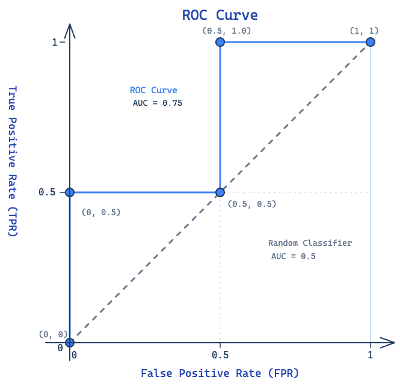

# 考试复习

## 评估

1\. 模型出现过拟合时，其训练误差与测试误差的典型表现为（）  
A.训练误差大，测试误差大  
B.训练误差小，测试误差大  
C.训练误差小，测试误差小  
D.训练误差大，测试误差小

**答案：B**

**解析：**

过拟合是指模型在训练数据上学得太"死"，把训练数据中的**噪声和随机波动**也当成规律学进去了，导致泛化能力差。

| 情况 | 训练误差 | 测试误差 | 原因 |
|------|---------|---------|------|
| **过拟合** | **小** | **大** | 模型记住了训练样本的噪声，无法推广到新数据 |
| 欠拟合 | 大 | 大 | 模型太简单，连训练数据的规律都没学到 |
| 理想拟合 | 小 | 小 | 学到了真正的底层规律，泛化能力好 |
| 不可能情况 | 大 | 小 | 如果连训练集都学不好，几乎不可能在测试集上表现更好 |

过拟合本质上产生了**巨大的训练-测试误差差距（generalization gap）**：在训练集上表现近乎完美（误差很小），一到测试集/新数据就"翻车"（误差很大）。

这也印证了**奥卡姆剃刀原则**在机器学习中的应用——并非模型越复杂、在训练集上拟合得越好就代表模型越优，泛化能力才是衡量模型好坏的关键指标。

---

2\. 下列方法中，无法缓解欠拟合的是（）  
A. 增加模型的复杂度  
B. 减小或移除过度的正则化  
C.增加训练迭代次数  
D. 增大L2 正则化系数

**答案：D**

**解析：**

欠拟合指模型对训练数据本身的学习都不充分。各项分析：

| 选项 | 能否缓解欠拟合 | 原因 |
|------|:----------:|------|
| A. 增加模型复杂度 | ✅ 能 | 更复杂的模型（如加深网络、增加特征）能更好地拟合数据 |
| B. 减小/移除正则化 | ✅ 能 | 正则化约束模型复杂度，减小正则化相当于"松绑"，让模型更自由地拟合训练数据 |
| C. 增加训练迭代次数 | ✅ 能 | 更多轮训练可能让模型进一步收敛，降低训练误差 |
| D. 增大L2正则化系数 | ❌ 不能 | 增大正则化等于**更强地约束模型**，会使模型更简单，反而**加重欠拟合** |

总结：正则化是防止**过拟合**的手段，增大正则化系数会加剧欠拟合。

---

3\. 下列说法正确的是：  
A. 为了防止过拟合，正则化系数越大越好。  
B. 为了防止过拟合，应当选择尽可能简单的模型。  
C. L2 正则化系数属于超参数  
D. 正则化系数可以通过令损失函数对其求梯度为零计算出来。

**答案：C**

**解析：**

| 选项 | 正误 | 原因 |
|------|:--:|------|
| A | ❌ | 正则化系数并非越大越好。过大的正则化会过度约束模型，导致**欠拟合**。需要在验证集上调优 |
| B | ❌ | 模型也不是越简单越好。模型应匹配任务复杂度——过于简单会**欠拟合**，过于复杂会**过拟合**。应在偏差-方差中找平衡 |
| C | ✅ | **L2正则化系数 λ 是超参数**。它不在训练过程中通过梯度下降学习，而是在训练前由人设定或通过验证集调整 |
| D | ❌ | 正则化系数是**超参数**，不能通过求梯度为零直接算出。模型参数（如权重w）可以通过求导求解，但超参数需要靠交叉验证等方法选取 |

---

4\. 关于训练/测试集划分的原则，下列说法错误的是（）  
A. 测试集可以参与模型超参数调优  
B.测试集在训练全过程中必须保持独立  
C. 验证集用于模型选择与超参数调优  
D.测试集仅用于模型最终泛化能力的评估

**答案：A**

**解析：**

| 选项 | 正误 | 原因 |
|------|:--:|------|
| A | ❌ 错误 | 测试集**不能**参与超参数调优。调参应使用验证集，测试集必须保持完全独立 |
| B | ✅ 正确 | 测试集在训练全过程中保持独立，避免数据泄露，保证评估的客观性 |
| C | ✅ 正确 | 验证集的作用就是进行模型选择和超参数调优 |
| D | ✅ 正确 | 测试集唯一的作用是评估最终模型的泛化能力 |

训练/验证/测试三者的职责必须严格分离，测试集一旦参与调参就会导致对泛化能力的高估。

---

5\. 在K 折交叉验证中，每一轮训练使用___,剩余___折作为验证集。

**答案：K-1 折；1 折**

**解析：**

K 折交叉验证将数据集均匀划分为 K 份。每一轮中：

- 选取 **K-1 折**作为训练集
- 剩下的 **1 折**作为验证集

整个过程重复 K 次，每折恰好被用作验证集一次。最终将 K 轮验证结果取平均，得到对模型性能的可靠估计。

这样做的优点：每条样本都参与过验证，避免了单次划分的偶然性，尤其适合数据量较少的情况。

---

6\. 数据集总共有100个样本，20个是正类，80个是负类。分类器预测结果如下：25个是正类（其中15个与真实标签相符，10个与真实标签不符），75个是负类（其中70个与真实标签相符，5个与真实标签不符），试计算分类器的准确性、查准率、查全率、F1值。

**解析：**

先根据题意列出混淆矩阵：

|  | 预测正类 | 预测负类 | 合计 |
|--|---------|---------|------|
| **真实正类** | TP = 15 | FN = 5 | 20 |
| **真实负类** | FP = 10 | TN = 70 | 80 |
| **合计** | 25 | 75 | 100 |

计算各指标：

- **准确率 (Accuracy)** = (TP + TN) / 总数 = (15 + 70) / 100 = **0.85**
- **查准率 (Precision)** = TP / (TP + FP) = 15 / (15 + 10) = 15/25 = **0.6**
- **查全率 (Recall)** = TP / (TP + FN) = 15 / (15 + 5) = 15/20 = **0.75**
- **F1 值** = 2 × (Precision × Recall) / (Precision + Recall) = 2 × (0.6 × 0.75) / (0.6 + 0.75) = 2 × 0.45 / 1.35 ≈ **0.667**

---

7\. 对于一个二分类任务，数据的标签和对于预测正例的概率如下表所示，试画出ROC 曲线并计算模型的AUC值。

| 样本序号 | 真实标签 | 预测正类概率 |
|-------|------|----------|
| 1     | 0    | 0.1      |
| 2     | 1    | 0.35     |
| 3     | 0    | 0.4      |
| 4     | 1    | 0.8      |

!!! danger "tip"
    TPR:实际是正类却被预测为正类的比例。**正类判正率**  
    FPR:实际是负类却被错误预测为正类的比例。**负类误判正率**

**解析：**

**Step 1:** 将样本按预测正类概率**从大到小**排序：

| 序号 | 真实标签 | 概率（降序） |
|-----|---------|------------|
| 4   | 1(正)   | 0.8        |
| 3   | 0(负)   | 0.4        |
| 2   | 1(正)   | 0.35       |
| 1   | 0(负)   | 0.1        |

**Step 2:** 以每个概率作为阈值，计算 TPR 和 FPR：

- 总正例数 P = 2，总负例数 N = 2

| 阈值 | 预测为正的样本 | TP | FP | TPR = TP/P | FPR = FP/N |
|-----|-------------|----|----|-----------|-----------|
| +∞ → 全部判负   | — | 0 | 0 | 0 | 0 |
| 0.8 | {4} | 1 | 0 | 1/2 = 0.5 | 0/2 = 0 |
| 0.4 | {4, 3} | 1 | 1 | 1/2 = 0.5 | 1/2 = 0.5 |
| 0.35 | {4, 3, 2} | 2 | 1 | 2/2 = 1.0 | 1/2 = 0.5 |
| 0.1 | {4, 3, 2, 1} | 2 | 2 | 2/2 = 1.0 | 2/2 = 1.0 |

**Step 3:** 绘制 ROC 曲线点（FPR, TPR）：(0,0) → (0, 0.5) → (0.5, 0.5) → (0.5, 1.0) → (1, 1)

ROC 曲线呈阶梯状：

**Step 4:** 计算 AUC（曲线下面积）：

AUC = 左侧矩形 + 上方矩形 = (0.5 - 0) × 0.5 + (1 - 0.5) × 1.0

= 0.5 × 0.5 + 0.5 × 1.0 = 0.25 + 0.5 = **0.75**

---

8\. 问题：训练集、验证集和测试集的作用分别是什么？

**答：**

- **训练集（Training Set）**：用于训练模型，即**拟合模型参数**（如权重、偏置）。模型通过学习训练集中的样本调整自身参数。
- **验证集（Validation Set）**：用于**模型选择和超参数调优**，如选择模型结构、正则化系数、学习率等。验证集不参与参数训练，避免了数据泄露。
- **测试集（Test Set）**：用于**评估最终模型的泛化能力**。测试集在训练和调参过程中完全不被使用，仅用于最后给出模型的性能指标，是模型在新数据上表现的无偏估计。

三者的划分保证了模型评估的客观性——如果只用训练集+测试集，调参时会间接"窥探"测试集信息，导致过拟合于测试集。

---

9\. 问题：如何通过ROC曲线评估分类器性能？

**答：**

ROC 曲线以**FPR（False Positive Rate，假正例率）** 为横轴、**TPR（True Positive Rate，真正例率）** 为纵轴，通过改变分类阈值绘制而成。

评估方式：

1. **AUC 值（曲线下面积）**：最核心的量化指标。AUC ∈ [0, 1]，数值越大性能越好：  
   - AUC = 1.0：理想分类器，存在一个阈值可完美区分正负样本  
   - AUC = 0.5：随机猜测，曲线为对角线  
   - AUC < 0.5：比随机更差（反向使用则优于随机）
2. **曲线形状定性判断**：曲线越靠近左上角（(0, 1)点），说明 TPR 高、FPR 低时，分类器能在低误判率下获得高召回率，性能越好。
3. **与准确率的对比优势**：ROC 曲线不受类别不平衡影响，即使正负样本比例变化，曲线形状基本保持不变，因此更适合评估在不平衡场景下的模型表现。

---

10\. 问题：准确率（Accuracy）的局限性是什么？为什么不平衡数据集任务中需要引入查准率、查全率等其它评价指标？

**答：**

**局限性：** 准确率 = (TP + TN) / 总数，它把所有样本等权看待，在类别不平衡时会产生**误导性结果**。

**举例：** 某检测任务中100个样本，95个是正常（负类），5个是异常（正类）。若分类器将所有样本判为"正常"：  

- Accuracy = 95/100 = 95%，看似很高  
- 但实际上一个异常都没检测出来，查全率 Recall = 0/5 = 0

**为何需要查准率、查全率：**

- **查准率（Precision）**：关注"预测为正的样本中有多少是真正例"，回答"判对了多少"——在"宁缺毋滥"场景（如垃圾邮件过滤，不想误删重要邮件）中很重要。
- **查全率（Recall）**：关注"真正的正例中有多少被找出来了"，回答"找全了没有"——在"宁错杀不放过"场景（如疾病筛查，不能漏掉患者）中很重要。
- 两者通常是一对**矛盾**，提高阈值查准率上升但查全率下降。F1 值调和二者，在二指标不可偏废时使用。

---

11\. 已知：TP=50, FN=10, FP=5, TN=100，求：查准率、查全率、F1。

**解析：**

- **查准率 (Precision)** = TP / (TP + FP) = 50 / (50 + 5) = 50/55 ≈ **0.909**
- **查全率 (Recall)** = TP / (TP + FN) = 50 / (50 + 10) = 50/60 ≈ **0.833**
- **F1 值** = 2 × (P × R) / (P + R) = 2 × (0.909 × 0.833) / (0.909 + 0.833) = 2 × 0.757 / 1.742 ≈ **0.869**
