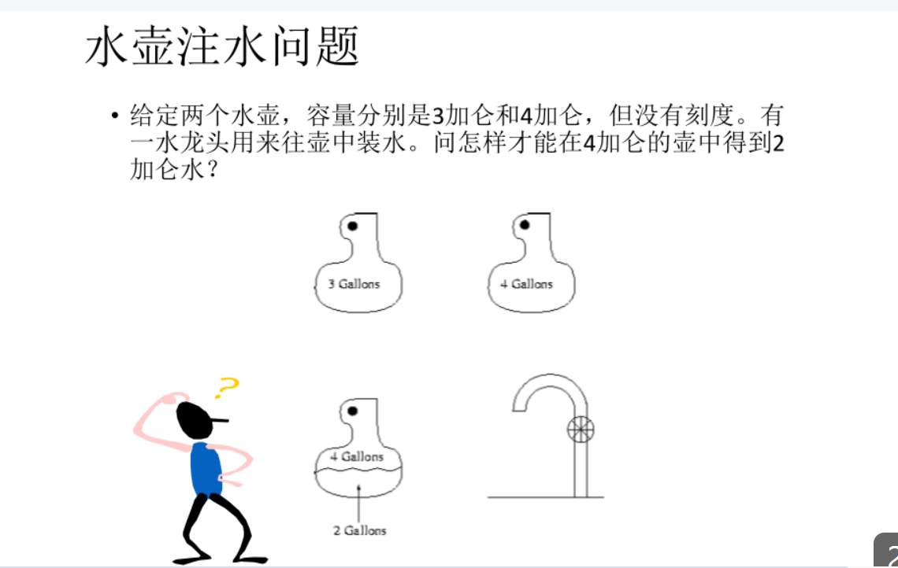

这道经典的水壶问题（Water Jug Problem）本质上是一个**状态空间搜索**问题。我们要利用两个容器的容量差，通过“倒满、倒空、互倒”三个动作，最终凑出目标数值。


## 🧠 解题思路

## 1️⃣ 状态转移逻辑
我们可以将两个水壶的状态记为 $(x, y)$，其中 $x$ 是 3 加仑壶的水量，$y$ 是 4 加仑壶的水量。初始状态为 $(0, 0)$。
我们的目标是让状态变为 $(x, 2)$。

解决这类问题的核心动作只有三种：
* **装满（Fill）**：把其中一个水壶接满水。
* **倒空（Empty）**：把其中一个水壶里的水全部倒掉。
* **互倒（Pour）**：把一个壶里的水倒入另一个壶，直到前者空了或者后者满了。

## 2️⃣ 最短路径操作步骤
为了在 4 加仑壶里得到 2 加仑水，最直观的方法是利用“多退少补”的逻辑：

1.  **装满 3 加仑壶**，倒入 4 加仑壶。（此时 4 壶有 3 加仑）
2.  **再次装满 3 加仑壶**，继续往 4 加仑壶里倒，直到 4 壶满为止。
    * 因为 4 壶还剩 1 加仑空间，所以 3 壶会倒出 1 加仑，**此时 3 壶剩 2 加仑**。
3.  **倒空 4 加仑壶**。
4.  **将 3 加仑壶剩下的 2 加仑水倒入 4 加仑壶**。目标达成！

## 3️⃣ 数学原理：裴蜀定理 (Bézout's identity)
这道题能解出来的数学前提是：目标水量必须是两个水壶容量最大公约数的倍数。
$3x + 4y = z$
由于 $gcd(3, 4) = 1$，且 2 是 1 的倍数，所以此题必有解。


## 💻 状态演变表

我们将每一步的水量变化记录如下：

| 步骤 | 操作说明 | 3加仑壶 (x) | 4加仑壶 (y) | 备注 |
| :--- | :--- | :--- | :--- | :--- |
| 0 | 初始状态 | 0 | 0 | 壶全是空的 |
| 1 | 装满 3 壶 | **3** | 0 | $x = 3$ |
| 2 | 3 倒入 4 | 0 | **3** | $y$ 还没满 |
| 3 | 再装满 3 壶 | **3** | 3 | |
| 4 | 3 倒满 4 | **2** | **4** | 3 壶倒出 1 加仑，剩 2 |
| 5 | 倒空 4 壶 | 2 | **0** | 清空大壶 |
| 6 | 3 倒入 4 | 0 | **2** | **目标达成！** |


## ⚠️ 易错点

### ❌ 1. 陷入“死循环”
在手动推导时，初学者容易在 $(3, 0) \to (0, 3) \to (3, 3) \to (2, 4)$ 之后，如果不慎把 2 加仑倒回水龙头，就会回到起点。一定要记住**保留那个关键的差值**。

### ❌ 2. 忽略反向解法
其实还有另一种解法：先装满 4 壶往 3 壶倒。虽然步数可能不同，但同样能解。对于某些题目，从大壶开始可能更快，但在本题中，从 3 壶开始更直观。


## 🚀 一句话总结

```text
利用 3 壶两次灌满 4 壶，多出来的 2 加仑就是我们要的“余数”，最后腾挪一下即可。
```


## 🔥 补充：硬核知识点

**如果这道题出现在编程竞赛中……**

1.  **BFS (广度优先搜索) 视角**
    * 如果你需要求**最少步数**，就把 $(x, y)$ 看作图的节点，三个动作看作边，直接跑一个 BFS。BFS 会优先遍历所有一步能达到的状态，再遍历两步的，从而保证找到的第一个目标状态就是步数最短的。

2.  **数论视角：扩展欧几里得算法**
    * 对于方程 $3x + 4y = 2$，我们可以通过扩展欧几里得算法求出一组整数解（例如 $x=2, y=-1$）。
    * 这在水壶问题中意味着：**装满 3 加仑壶 2 次 ($x=2$)，倒空 4 加仑壶 1 次 ($y=-1$)**。这恰恰对应了我们上面的操作流程！

3.  **状态空间大小**
    * 对于容量为 $M$ 和 $N$ 的水壶，状态总数最多只有 $(M+1) \times (N+1)$ 种。对于本题，仅有 20 种可能的状态，计算量极小。


### 代码描述
```cpp
#include <iostream>
#include <vector>
#include <queue>
#include <set>
#include <string>

using namespace std;

// 定义状态结构：(3加仑壶水量, 4加仑壶水量, 到达此状态的步骤描述)
struct State {
    int a, b;
    vector<string> path;
};

void solve() {
    int capA = 3, capB = 4, target = 2;
    
    // 队列用于 BFS，记录已访问状态以防死循环
    queue<State> q;
    set<pair<int, int>> visited;

    q.push({0, 0, {"初始状态 (0, 0)"}});
    visited.insert({0, 0});

    while (!q.empty()) {
        State curr = q.front();
        q.pop();

        // 检查是否达到目标：4加仑壶中有2加仑水
        if (curr.b == target) {
            cout << "找到解法！总步数：" << curr.path.size() - 1 << endl;
            for (const string& step : curr.path) {
                cout << " -> " << step << endl;
            }
            return;
        }

        // 生成 6 种可能的下一个状态
        vector<pair<int, int>> next_states;
        vector<string> actions;

        // 1. 填满 3 壶
        next_states.push_back({capA, curr.b});
        actions.push_back("填满 3 加仑壶");

        // 2. 填满 4 壶
        next_states.push_back({curr.a, capB});
        actions.push_back("填满 4 加仑壶");

        // 3. 倒空 3 壶
        next_states.push_back({0, curr.b});
        actions.push_back("倒空 3 加仑壶");

        // 4. 倒空 4 壶
        next_states.push_back({curr.a, 0});
        actions.push_back("倒空 4 加仑壶");

        // 5. 3 倒入 4 (直到 3 空或 4 满)
        int pourAtoB = min(curr.a, capB - curr.b);
        next_states.push_back({curr.a - pourAtoB, curr.b + pourAtoB});
        actions.push_back("将 3 加仑壶倒入 4 加仑壶");

        // 6. 4 倒入 3 (直到 4 空或 3 满)
        int pourBtoA = min(curr.b, capA - curr.a);
        next_states.push_back({curr.a + pourBtoA, curr.b - pourBtoA});
        actions.push_back("将 4 加仑壶倒入 3 加仑壶");

        // 遍历并尝试进入合法的新状态
        for (int i = 0; i < next_states.size(); i++) {
            if (visited.find(next_states[i]) == visited.end()) {
                visited.insert(next_states[i]);
                
                State next_s = {next_states[i].first, next_states[i].second, curr.path};
                string desc = actions[i] + " -> 当前状态 (" + to_string(next_s.a) + ", " + to_string(next_s.b) + ")";
                next_s.path.push_back(desc);
                
                q.push(next_s);
            }
        }
    }

    cout << "无解" << endl;
}

int main() {
    solve();
    return 0;
}
```