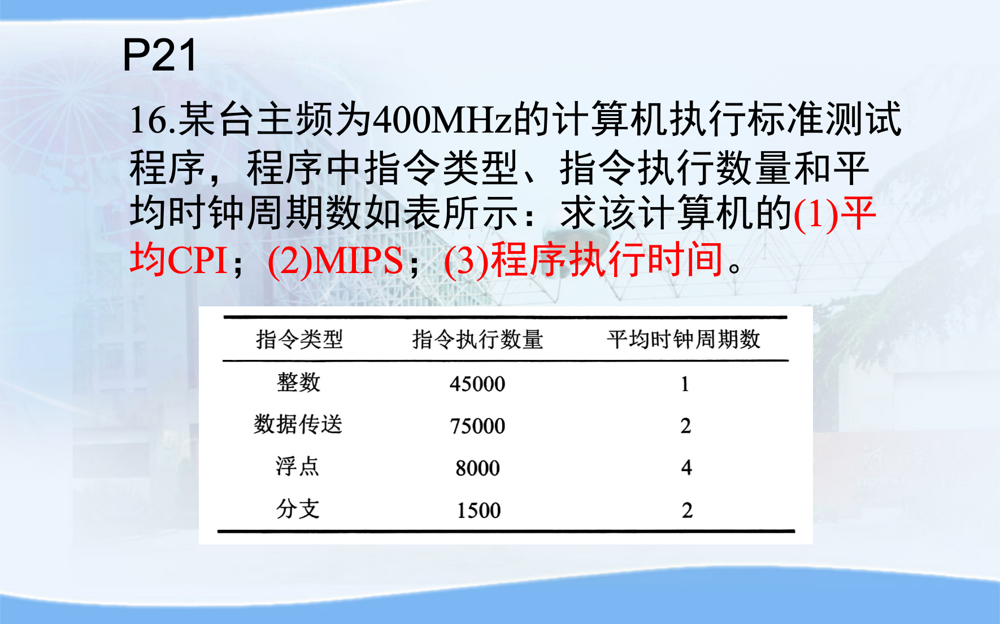

# 第1章：计算机系统概述

!!! 
    参考[计算机系统概述ppt](./resources/第1章-计算机系统概述-20260311.pdf)

作为大二学生开始学习《计算机组成原理》是非常关键的一步。这门课的核心教学目标是帮你理解计算机的组成结构和运行机理，把计算机从“黑盒”变成“白盒”，从“玩具”变成“工具”。  

第一章“计算机系统概述”是整门课程的基石，主要为你建立起计算机系统的整体宏观概念。  

**1. 计算机的发展简史与分类**    
-   **五代发展演变**：计算机经历了第一代电子管计算机（主要用于数据处理，如ENIAC）、第二代晶体管计算机（工业控制）、第三代中小规模集成电路计算机（小型机出现）、第四代超大规模集成电路计算机（进入个人计算机PC时代），直到第五代巨大规模集成电路/单片计算机。    
-   **摩尔定律**：在价格不变的情况下，芯片集成度每18个月翻一番，这极大地推动了计算机硬件的发展。      
-   **分类**：按照输入输出信号形式，可分为模拟计算机（处理连续电压等）和数字计算机（按位运算，逻辑判断能力强）。  
  
  
**2. 计算机的硬件系统（核心重点）**    
-   **冯·诺依曼体系结构**：这是现代计算机的基础。它的最主要设计思想是 **“存储程序”和“程序控制”**，即将指令和数据以二进制形式存放在同一个存储器中。    
-   **五大基本部件**：运算器（实现算术和逻辑运算）、控制器（分析并执行指令）、存储器、输入设备和输出设备。其中，**运算器和控制器共同组成了中央处理器（CPU）**。    
-   **哈佛体系结构**：作为对比，哈佛结构将指令存储器和数据存储器分开存储，并采用独立的两条总线，现在的处理器（如ARM结构或CPU内的Cache）经常采用这种结构以提高效率。    
      

**3. 计算机的软件系统与层次结构**       
-   **软件分类**：软件是用户与硬件的桥梁，主要分为**系统软件**（如操作系统、数据库系统、语言处理程序等）和**应用软件**（如Word、用户程序等）。    
-   **语言处理程序**：了解机器语言、汇编语言和高级语言的演变。重点区分翻译程序的三种类型：**汇编程序**、**编译程序**（整体翻译）和**解释程序**（边翻译边执行，不产生目标程序）。    
-   **多级层次结构**：现代计算机系统可以看作是由多层抽象组成的，从底层到高层依次为：微程序设计级（由硬件直接执行） -> 一般机器级（机器语言） -> 操作系统级 -> 汇编语言级 -> 高级语言级。需理解**软件与硬件的逻辑等价性**。    

**4. 计算机系统性能评价（必考计算点）**     
这是第一章中最需要掌握量化计算的部分，一定要牢记以下指标及其关系：    
-   **主频与时钟周期**：主频（f）是CPU工作节拍的时钟频率，时钟周期（T）是主频的倒数（T = 1/f）。  
-   **CPI（Cycles Per Instruction）**：执行一条指令所需的平均时钟周期数。  
-   **MIPS（Million Instructions Per Second）**：平均每秒执行的百万条定点指令数。计算公式：`MIPS = 主频 / (CPI * 10^6)`。  
-   **FLOPS**：平均每秒执行的浮点操作次数。  
-   **程序执行时间（tCPU）**：`tCPU = 指令总条数 * CPI * 时钟周期`。  

**💡 学习建议：**  
在复习第一章时，建议你重点吃透 **“存储程序”的工作机制** 以及**性能指标（CPI、MIPS等）的计算题** ，这通常是期末考试的重点。如果遇到一些暂时不理解的硬件概念（如各种寄存器或总线），不用过于深究，因为这些在后续的“运算器”、“存储系统”和“中央处理器”等章节中都会进行详细剖析。  

**（1）平均 CPI**

总指令数：

$$
N = 45000 + 75000 + 8000 + 1500 = 129500
$$

总时钟周期数：

$$
C = 45000 \times 1 + 75000 \times 2 + 8000 \times 4 + 1500 \times 2
$$

$$
= 45000 + 150000 + 32000 + 3000
$$

$$
= 230000
$$

平均 CPI：

$$
\text{CPI} = \frac{230000}{129500} \approx 1.78
$$

**（2）MIPS**

计算公式：

$$
\text{MIPS} = \frac{\text{主频}}{\text{CPI} \times 10^6}
$$

代入数据：

$$
\text{MIPS} = \frac{400}{1.78} \approx 224.7
$$

因此：

$$
\boxed{\text{MIPS} \approx 225}
$$

**（3）程序执行时间**

计算公式：

$$
T = \frac{\text{总时钟周期数}}{\text{主频}}
$$

代入数据：

$$
T = \frac{230000}{4 \times 10^8}
$$

$$
= 5.75 \times 10^{-4}\text{s}
$$

$$
= 0.575\text{ms}
$$

---

### CPU 性能评估相关知识

CPU 执行时间公式：

$$
T = \frac{\text{CPU时钟周期数}}{\text{时钟频率}}
$$

又因为：

$$
\text{CPU时钟周期数} = IC \times CPI
$$

因此：

$$
T = \frac{IC \times CPI}{f}
$$

其中：

- $IC$：指令总数（Instruction Count）
- $CPI$：平均每条指令所需时钟周期数
- $f$：主频（时钟频率）
- $T$：程序执行时间

### CPI（平均时钟周期数）

定义：

$$
CPI = \frac{\text{总时钟周期数}}{\text{总指令数}}
$$

若存在多种指令类型，则使用加权平均：

$$
CPI_{avg}
=\frac{\sum (IC_i \times CPI_i)
}{
\sum IC_i
}
$$

其中：

- $IC_i$：第 $i$ 类指令数量
- $CPI_i$：第 $i$ 类指令对应的 CPI

### MIPS

MIPS 表示：

> CPU 每秒执行多少百万条指令。

计算公式：

$$
MIPS
=\frac{f}{CPI \times 10^6}
$$

若主频单位为 MHz：

$$
MIPS = \dfrac{\text{主频(MHz)}}{CPI}
$$

### 时钟频率与时钟周期

时钟频率：

$$
f
$$

单位：

$$
1\text{MHz} = 10^6\text{Hz}
$$

$$
1\text{GHz} = 10^9\text{Hz}
$$

时钟周期：

$$
T_{clock} = \frac{1}{f}
$$

表示一个时钟周期持续的时间。

### 本题常用计算步骤

总指令数：

$$
IC = \sum IC_i
$$

总时钟周期数：

$$
C = \sum (IC_i \times CPI_i)
$$

平均 CPI：

$$
CPI_{avg} = \frac{C}{IC}
$$

MIPS：

$$
MIPS = \frac{f}{CPI \times 10^6}
$$

程序执行时间：

$$
T = \frac{C}{f}
$$

### 核心理解

CPU 性能由三部分共同决定：

$$
T = \frac{IC \times CPI}{f}
$$

即：

- 指令数越少，程序越快
- CPI 越小，CPU 效率越高
- 主频越高，执行速度越快

但：

> 主频高不一定性能高。

因为 CPI 和指令数量同样会影响最终性能。

另外：

> MIPS 不能完全反映 CPU 性能。

因为不同指令复杂度不同，不同 CPU 的指令系统也不同。