# 存储系统
第三章"存储系统"是《计算机组成原理》中**承上启下、也是期末考试必考大题的绝对核心**。如果说前两章是在研究CPU如何"算"，那么这一章就是研究数据如何"存"。

存储系统设计的核心矛盾是：**容量大、速度快、成本低三者不可兼得**。为了解决这个矛盾，现代计算机采用了**多级存储体系**（寄存器 -> Cache -> 主存 -> 辅存）。
## 知识点
### 1. 核心基础：主存技术指标与数据组织

*   **计算容量与引脚**：这是最基础的考点。芯片的存储容量 = $2^M \times N$位（其中M为地址线根数，N为数据线根数）。例如，64K×8位的芯片，需要16根地址线和8根数据线。

*   **大端与小端模式**：按字节编址时，一个字跨越多个字节。**大端模式（Big-endian）**是将最高有效字节（MSB）存放在低地址；**小端模式（Little-endian）**是将最低有效字节（LSB）存放在低地址。在考试中常以结构体在内存中的地址分配来出题。

### 2. 必考对比：SRAM 与 DRAM（高频选择/填空）

主存通常由半导体存储器构成，你需要深刻理解这两者的底层区别：

*   **SRAM（静态RAM）**：依靠**触发器**（锁存器）记忆信息，只要不断电信息就一直保持，速度快但价格贵，不需要刷新，非破坏性读出，通常**用作Cache**。
*   **DRAM（动态RAM）**：依靠**电容**上的电荷记忆信息，速度较SRAM慢但便宜，集成度高，通常**用作主存**。

*   **DRAM的"刷新"机制（重点考点）**：因为电容会漏电，所以必须定期补充电荷（刷新）。
    *   刷新原则：采用"读出"方式，每次**按行刷新**（同时刷新各DRAM芯片，片内逐行刷新）。
    *   刷新策略分为：**集中式刷新**（有"死时间"，期间CPU无法访问内存）和**分散式刷新**（将刷新分散到每个指令周期，无死区）。
    *   地址引脚复用：DRAM通常为了减少引脚，将行地址和列地址**分两次送入**。
    *   **刷新计算方法（必考计算）**：设DRAM芯片有 $L$ 行，刷新周期为 $T_{ref}$（通常为2ms或4ms），存取周期为 $T$。
        *   **集中刷新**：在刷新周期末尾集中安排所有行的刷新。死时间 = $L \times T$。例如 $L = 128$，$T = 0.5\mu s$，则死时间 = $64\mu s$，期间CPU无法访存。
        *   **分散刷新**：每个存取周期中前半段用于正常读/写，后半段用于刷新一行。存取周期变为 $2T$，无死区，但系统速度降低。
        *   **异步刷新**：将 $L$ 次刷新均匀分配到刷新周期内，每隔 $T_{ref}/L$ 时间刷新一行。例如 $T_{ref}=2ms$，$L=128$，则每隔 $15.6\mu s$ 刷新一行，每行刷新仅占用一个 $T$，死时间缩短为单行刷新时间。

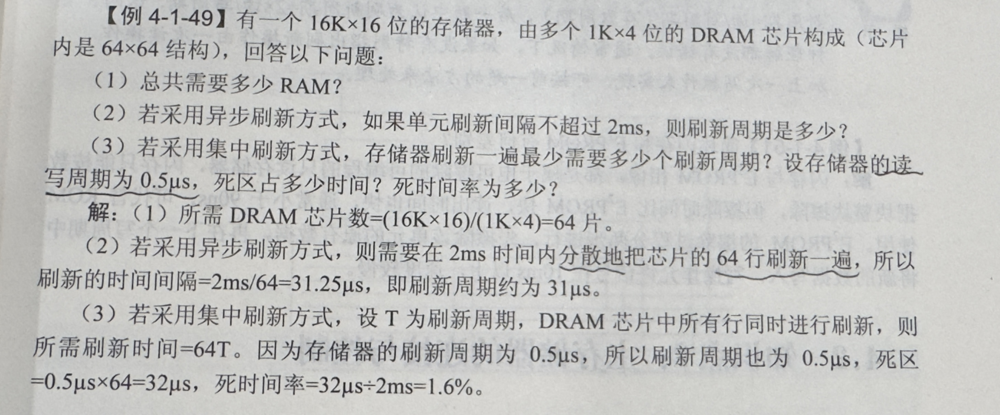

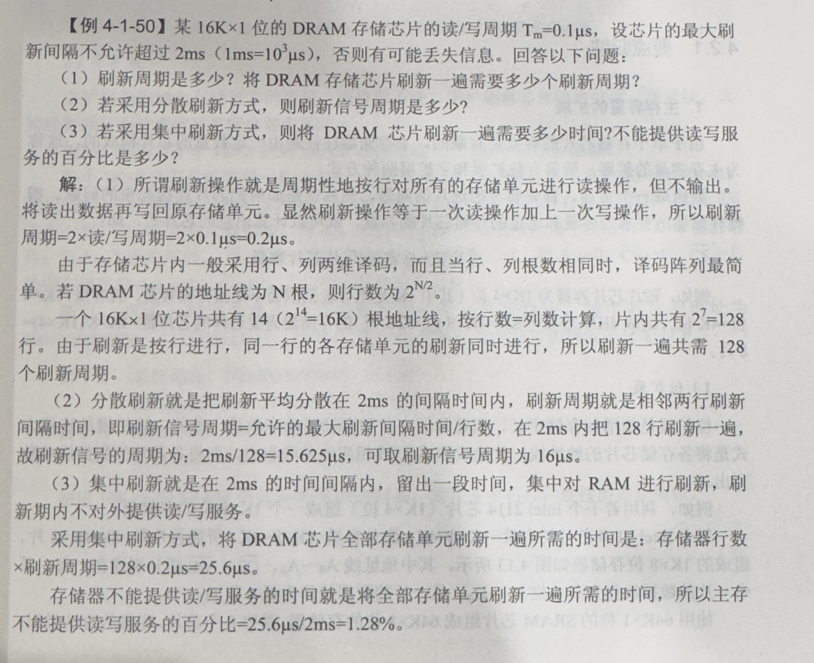

>
> 半导体静态存储器SRAM是由双稳态电路构成，并依靠其稳态特性来保存信息；
>动态存储器DRAM是利用电容器存储电荷的特性来存储数据，依靠定时刷新和读后再生对信息进行保存，而ROM中的信息一经写入就不再发生变化。
>DRAM是破坏性读出，因此需要读后重写。

### 3. 常考对比：ROM 的分类与特点

ROM（只读存储器）是另一大类半导体存储器，特点是**非易失性**（断电不丢数据），常用于存放固件、引导程序等。

*   **掩膜ROM（Mask ROM）**：在生产时一次性写入数据，之后不可修改。成本低（大批量），适合成熟产品的固件。
*   **PROM（可编程ROM）**：用户可用专用设备一次性写入（烧录），写入后不可修改。只允许写一次。
*   **EPROM（可擦除可编程ROM）**：可用紫外线照射擦除全部内容后重新写入。擦写次数有限（约几十次），需从电路板取下芯片才能擦除。
*   **EEPROM（电可擦除可编程ROM）**：可用电信号擦写，支持**按字节擦写**，无需取下芯片，方便但容量小、价格高。
*   **Flash Memory（闪存）**：EEPROM的改进版，支持**按块擦写**，速度快、集成度高，广泛用于U盘、SSD、BIOS芯片。

**速记**：掩膜ROM不可改 → PROM可改一次 → EPROM紫外线整片擦 → EEPROM电信号按字节擦 → Flash电信号按块擦（最快）。

### 4. 必考设计题：存储器容量的扩展

当单个芯片容量不够时，需要扩展，这是必考的连线设计题：

*   **位扩展**：增加存储字长。例如用2片1K×4位芯片组成1K×8位。特点是：地址线并联，片选线（CS）并联，数据线分别接不同的引脚。

*   **字扩展**：增加字数（存储单元数）。例如用2片1K×8位组成2K×8位。特点是：数据线并联，**高位地址线必须通过译码器（如74138）产生片选信号，选中不同的芯片**。

### 5. 性能优化：多模块交叉存储器

为了缓解CPU快和主存慢的矛盾，可以采用多个主存模块并行工作。

*   **高位交叉（顺序方式）**：高位地址选模块，低位地址选字。本质上还是串行，相当于单纯扩充容量。

*   **低位交叉（轮流方式 - 重点）**：低位地址选模块。使得连续的地址分布在不同的模块中，从而可以实现**流水线式的并行访问**。

*   **核心计算**：设模块存取周期为 $T$，总线传送周期为 $\tau$，交叉模块数为 $m$。为了实现流水线，必须满足 $T = m \tau$ （$m$ 也称为交叉存取度）。这种方式在不改变单个模块存取周期的前提下，成倍增加了存储器的带宽。

### 6. 绝对核心压轴大题：Cache（高速缓冲存储器）

这部分几乎占据了考试的大头，重点考察原理、计算和地址映射：
*   **理论基础**：**局部性原理**。包含**空间局部性**（程序倾向于访问刚访问过的数据的邻近位置，如顺序执行、数组遍历）和**时间局部性**（程序倾向于在不久的将来再次访问同一数据，如循环体、变量）。

*   **性能计算**：设 $h$ 为命中率，$t_c$ 为Cache存取周期，$t_m$ 为主存周期。系统的平均访问时间 $t_a = h \cdot t_c + (1-h)t_m$。访问效率 $e = t_c / t_a$。
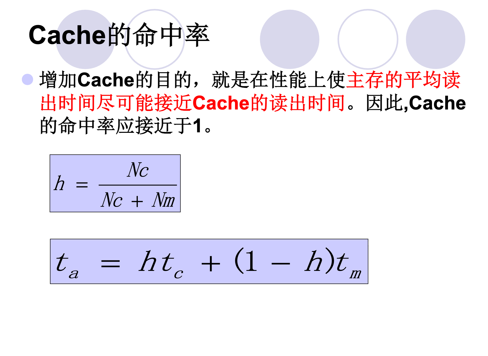{"width = 80%"}
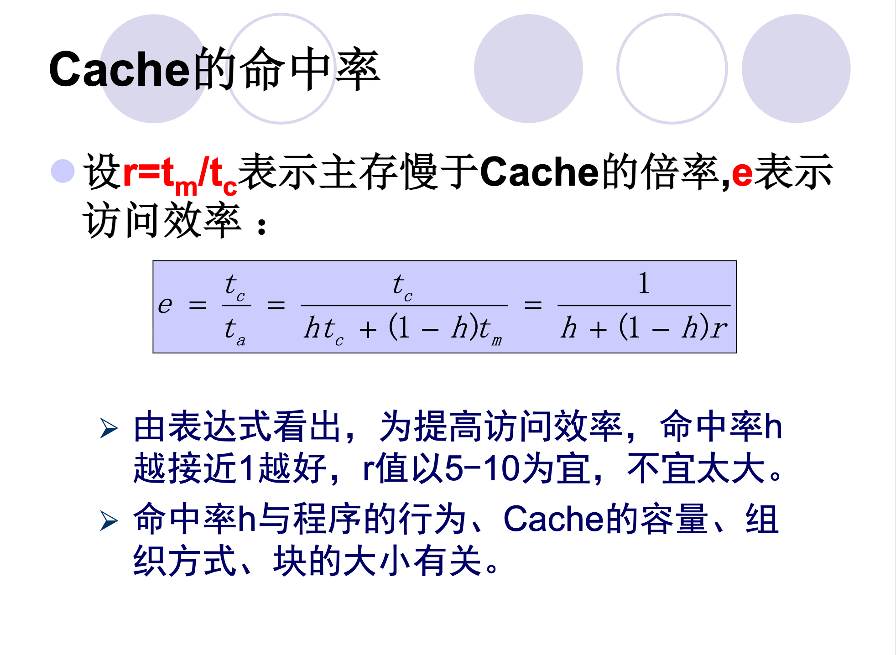{"width = 80%"}

*   **主存与Cache的地址映射（最硬核的计算/分析题）**：
    1.  **全相联映射**：主存块可以放到Cache的**任意行**。优点是冲突概率极小，缺点是需要昂贵的相联存储器进行比较，检索成本极高。主存地址划分为：`主存标记 (Tag) + 块内地址 (Word)`。
    2.  **直接映射**：主存块只能映射到Cache的**唯一固定行**（$j \pmod{2^c}$）。优点是硬件简单，缺点是极易发生冲突抖动。主存地址划分为：`主存标记 (Tag) + Cache行号 (Line/Index) + 块内地址 (Word)`。
    3.  **组相联映射（折中方案）**：Cache分为若干组，主存块可以映射到固定组的任意行（组间直接映射，组内全相联）。主存地址划分为：`主存标记 (Tag) + 组号 (Set) + 块内地址 (Word)`。

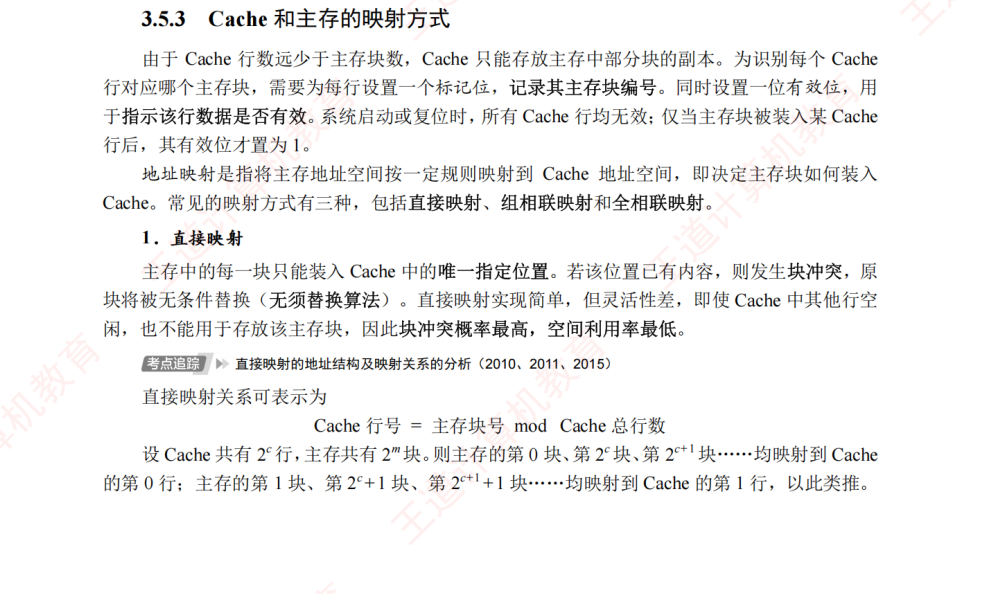

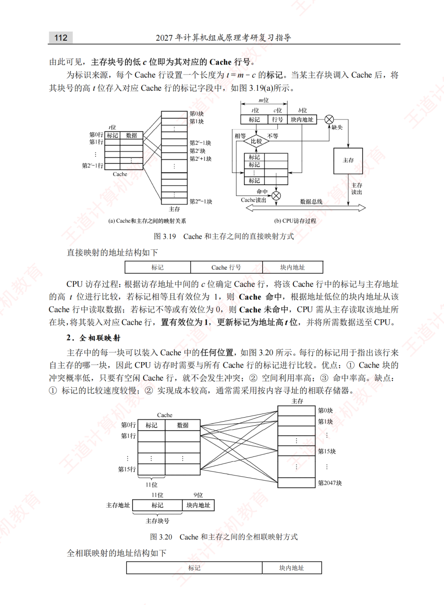

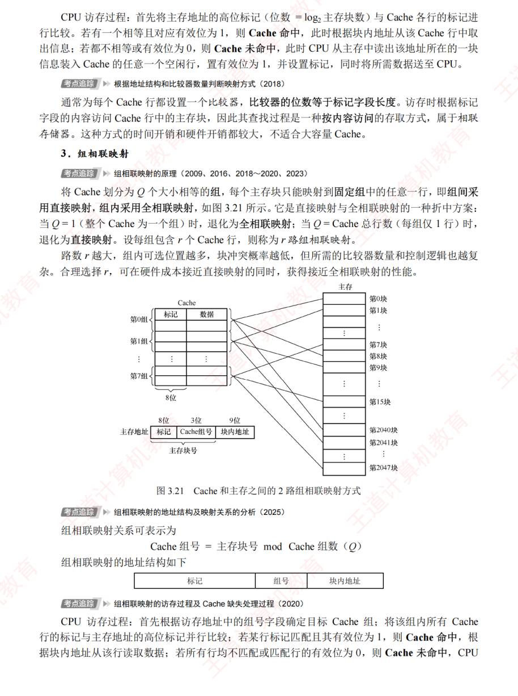

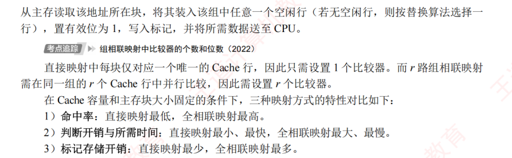

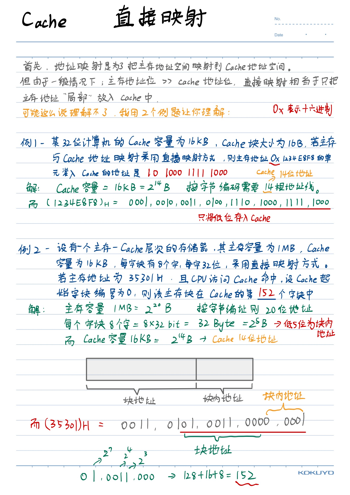

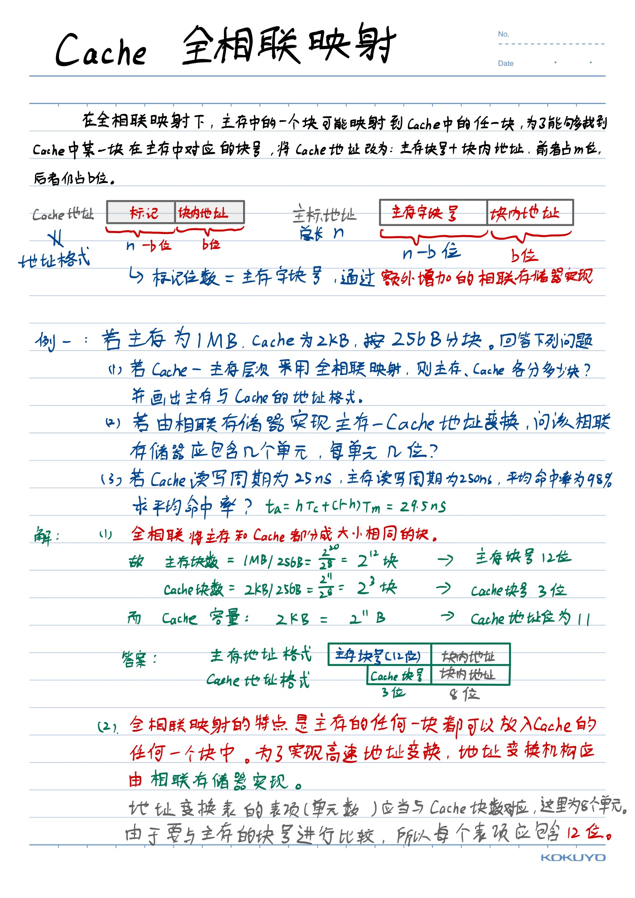

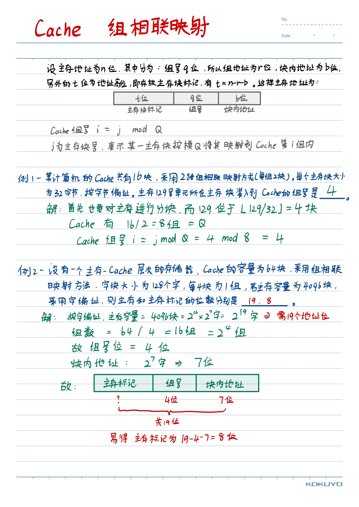

*   **替换算法**：当Cache满了，新数据该替换谁？常考 **LRU（近期最少使用法）** 和 FIFO（先进先出法）。考试常要求画图或列表计算命中率。

*   **写策略**：CPU写数据时如何保证Cache和主存一致？
    *   **全写法（Write-Through）**：同时写入Cache和主存。
    *   **写回法（Write-Back）**：只写Cache，利用一个"脏位（Dirty bit）"，只有当该块被替换出Cache时才写回主存。

*   **Cache总容量计算（必考陷阱题）**：Cache的实际存储容量不仅包含数据，还包含**标记（Tag）**和**有效位（Valid bit）**，写回法还要加**脏位（Dirty bit）**。
    *   每行的总位数 = 标记位数 + 有效位(+ 脏位) + 数据位数（即块大小）
    *   Cache总容量 = 每行总位数 × Cache行数
    *   **关键**：题目问"Cache总容量"时要包含标记和有效位；问"Cache数据容量"时只算数据部分。

### 7. 拓展：虚拟存储器

虚拟存储器是"主存-辅存"层次的关键技术，使得程序员可以使用比实际物理内存更大的地址空间。

*   **核心思想**：将程序使用的**虚拟地址（逻辑地址）**通过地址映射转换为**物理地址（实地址）**，只在需要时才将数据从辅存调入主存。
*   **三种管理方式**：
    1.  **页式虚拟存储器**：将虚拟地址空间和物理地址空间都划分为固定大小的**页（Page）**，通过**页表**进行映射。优点是简单、页内碎片小；缺点是页表可能很大。
    2.  **段式虚拟存储器**：按程序的逻辑模块划分**段（Segment）**，每段长度可变。优点是共享和保护方便；缺点是段间碎片（外部碎片）。
    3.  **段页式虚拟存储器**：先分段、段内再分页，结合两者优点，但地址变换需两次查表（段表+页表），开销较大。
*   **TLB（快表）**：页表存在主存中，每次访存都要先查页表会严重拖慢速度。TLB是页表的**高速缓存**，存放最近使用的页表项，命中时可直接得到物理地址，避免访问主存中的页表。
*   **与Cache的类比**：TLB-页表的关系 ≈ Cache-主存的关系，两者都依赖局部性原理。

**💡 大二备考复习建议：**
第三章的特点是**概念多且密，结合计算**。复习的重中之重是：
1. 自己画一遍"直接映射"和"组相联映射"的主存地址结构图，能清楚地根据"Cache总容量"和"块大小"算出 Tag、Index 和 Word 分别占多少位。
2. 搞懂 DRAM 集中刷新和分散刷新的区别。
3. 掌握存储器字扩展中 74138 译码器与高位地址线的连接逻辑。

### 8.其他（我从其他书上看到的）
**（1）主存储器的地址寄存器和数据寄存器各自的作用是什么？**
    在主寄存器中，地址寄存器 MAR 用来存放当前CPU访问的内存地址单元，或者存放CPU写入内存的内存地址单元。数据寄存器 MDR 用来存放由内存中读出的信息，或者写入内存的信息。

**(2) 字节地址空间（Byte Address Space）**
    简单来说，就是 **CPU 能够直接寻址和访问的、以“字节（Byte）”为最小独立单位的内存地址范围。**

为了让你更容易理解，我们可以把它拆解成两个核心概念：**“按字节寻址”** 和 **“空间大小”**。

1. 核心概念：为什么要“按字节”？

    在现代计算机体系结构中，内存就像一栋极其巨大的公寓楼，而**字节地址空间**就是这栋楼的房间号系统。

* **最小划分单位（房间）**：内存里最小的存储单元是“位”（bit，即 0 或 1），但 CPU 觉得按“位”来找东西太繁琐了。于是，计算机规定把 **8 个 bit 组成一个字节（Byte）**。
* **每一个字节都有一个专属的“门牌号”**：这个门牌号就是**内存地址（Address）**。CPU 只要给出某一个地址，就能精确地取出或者写入这 1 个字节的数据。这种管理方式就叫做**按字节寻址（Byte-addressable）**。

2. 空间的大小由什么决定？

    “地址空间”的大小，也就是这栋公寓楼到底能盖多少个房间，完全取决于 **CPU 的地址总线宽度（也就是常说的 32 位或 64 位系统）**。

    如果 CPU 有 $n$ 根地址线，它就能发出 $2^n$ 个不同的二进制地址组合。因为每个地址对应一个字节，所以：

$$\text{字节地址空间大小} = 2^n \times 1 \text{ Byte}$$

**💡 举个经典的例子：**
某计算机系统主存采用32位字节地址空间和64位数据线访问存储器。

① 核心核心指标

* **空间有多大（32位字节地址空间）**：最大支持 **4GB** 内存（$2^{32} \times 1\text{ Byte}$），地址范围从 `0x00000000` 到 `0xFFFFFFFF`。
* **一次搬多少（64位数据线）**：每次访存可以同时传输 **8个字节**（64位）的数据。

② 硬件如何运作（29位选行 + 3位选列）

由于内存是一口气读 8 字节，32 位的地址线在送往内存硬件时会被拆分：

* **高 29 位**（$A_{31} \sim A_3$）：用来寻找是哪一个 64 位的“数据行”。
* **低 3 位**（$A_2 \sim A_0$）：在硬件层决定这 8 个字节里的哪几位生效（或由 CPU 内部筛选）。

③ 得出的结论

* ❶ **最大容量**：4 GB。
* ❷ **传输效率**：一次读写 8 字节。
* ❸ **代码优化要求**：数据对象的起始地址最好是 **8 的倍数**（即低 3 位地址为 0）。如果数据跨行存放，CPU 需要访存 **2 次** 才能读完，会严重拖慢性能（这也是 C/C++ 编译器会自动做**内存对齐**的原因）。

## 解题
### 1.ppt练习1
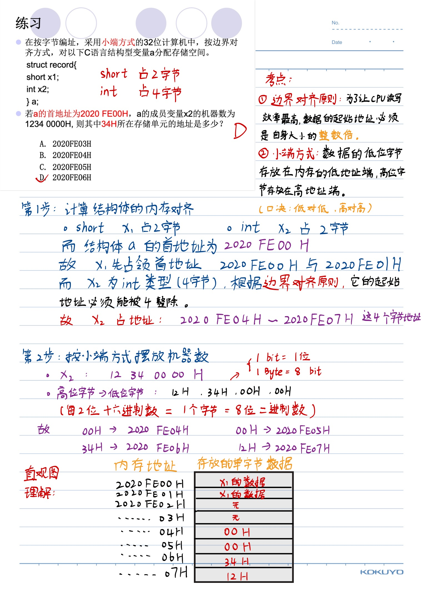

---

### 2.ppt练习2
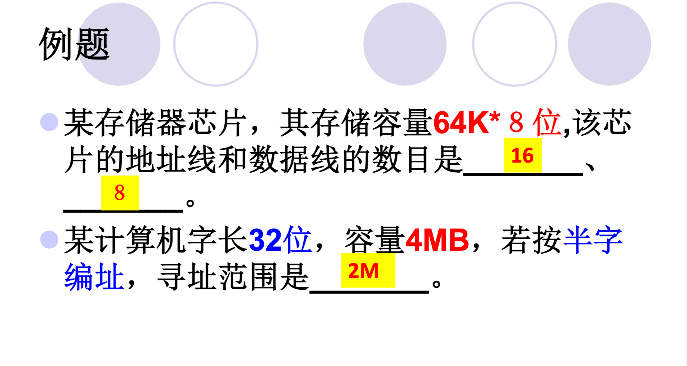{width=80%}
#### 题目：某计算机字长32位，容量4MB，若按半字编址，寻址范围是_______。

###### 🛠️概念理解
* **容量（以字节为单位）**：指的是这个存储器里总共能装多少个 Byte（也就是 $1\text{B} = 8\text{位}$ 组成的单元）。这是物理上固定死的。

* **编址方式**：决定了计算机怎么给这些空间发"门牌号"。
    - 按字节编址：每 $1\text{B}$（8位）发一个门牌号。
    - 按半字编址：每半个字发一个门牌号。
    - 按字编址：每完整的一个字发一个门牌号。

* **寻址范围**：指的是最多能发出多少个不同的"门牌号"。

###### 💡 详细解题步骤：

1. **统一基本已知量：**
   * 计算机字长：$\text{Word} = 32 \text{ 位 (bit)} = 4 \text{ 字节 (Byte)}$
   * 总容量：$\text{Capacity} = 4 \text{ MB} = 4 \times 2^{20} \text{ B}$

2. **计算编址单位（半字）的大小：**
   * 题目规定"按半字编址"，即每半个字分配一个物理地址。

$$\text{半字大小} = \frac{\text{字长}}{2} = \frac{4 \text{ B}}{2} = 2 \text{ B}$$

3. **计算寻址范围：**
   * 寻址范围即该存储器在当前编址方式下，总共能分出多少个不同的地址（门牌号）。

$$\text{寻址范围} = \frac{\text{总容量}}{\text{编址单位大小}}$$

   * 代入数据计算

$$\text{寻址范围} = \frac{4 \text{ MB}}{2 \text{ B}} = \frac{4 \times 2^{20} \text{ B}}{2 \text{ B}} = 2 \times 2^{20} = 2 \text{ M}$$

---

### 3.作业P122 - 1
1. 设有一个具有 20 位地址和 32 位字长的存储器，问：
   (1)该存储器能存储多少字节的信息? (2)如果存储器由 512K×8 位 SRAM 芯片组成，需要多少片? (3)需要多少位地址作芯片选择?

##### 🛠️ 思路拆解与核心概念

###### (1) 该存储器能存储多少字节的信息？

* **核心逻辑**：存储器的总容量由**地址线位数**（决定有多少个房间）和**字长**（决定每个房间有多大）共同决定。

* 地址线 20 位，说明有 $2^{20} = 1\text{M}$ 个存储单元（房间）。

* 每个存储单元的字长是 32 位（bit）。题目问的是**多少字节（Byte）**，所以要把位（bit）换算成字节（Byte）：$32\text{位} = 4\text{字节}$。

* 总容量 = $1\text{M} \times 4\text{字节} = 4\text{MB}$。

###### (2) 需要多少片 512K×8 位的 SRAM 芯片？

* **核心逻辑**：总目标是建一个 $1\text{M} \times 32\text{位}$ 的大仓库，现在手里只有 $512\text{K} \times 8\text{位}$ 的小积木，直接用**总容量 $\div$ 单片芯片容量**。

* 我们可以把这个扩展拆成两步（位扩展和字扩展）：

* **位扩展（加宽）**：从 8 位到 32 位，需要 $32 / 8 = 4$ 列。

* **字扩展（加深）**：从 $512\text{K}$ 到 $1\text{M}$（即 $1024\text{K}$），需要 $1024\text{K} / 512\text{K} = 2$ 行。

* 最终形成一个 $2 \times 4$ 的芯片阵列，总片数 = $2 \times 4 = 8$ 片。

###### (3) 需要多少位地址作芯片选择？

* **核心逻辑**：20 位总地址线里，有一部分要连到芯片内部去寻找芯片里的具体单元，剩下用不完的高位地址线，就用来通过译码器选择"哪一组芯片"工作。

* 单片芯片的容量是 $512\text{K}$，因为 $512\text{K} = 2^9 \times 2^{10} = 2^{19}$，所以**单片芯片内部寻址需要 19 位地址线**（通常连到地址线的低 19 位 $A_0 \sim A_{18}$）。

* 剩下的高位地址线数量 = 总地址线 - 片内寻址线 = $20 - 19 = 1$ 位（即最高位 $A_{19}$）。这一位地址线经过译码（或直接取反）正好可以产生 2 个片选信号，去区分我们前面算出来的"2行"芯片。

---

### 4.作业P122 - 3

#### **3. 用 16K×8 位的 DRAM 芯片构成 64K×32 位存储器，请画出该存储器的组成逻辑框图。**

##### 🛠️ 第一步：核心数据计算（磨刀不误砍柴工）

##### 1. 计算芯片总数与排列阵列

* **目标容量**：$64\text{K} \times 32\text{位}$

* **单片芯片**：$16\text{K} \times 8\text{位}$

* **字扩展（行数）**：$64\text{K} / 16\text{K} = 4\text{行}$ （需要 4 组芯片轮流工作）

* **位扩展（列数）**：$32\text{位} / 8\text{位} = 4\text{列}$ （每组需要 4 片芯片拼成 32 位字长）

* **总片数**：$4 \times 4 = 16\text{片}$

##### 2. 地址线分配（如何精准定位）

* **总地址线**：$64\text{K} = 2^{16}$，所以系统总地址线为 **16位**，记为 $A_{15} \sim A_0$。

* **片内地址线**：单片容量 $16\text{K} = 2^{14}$，所以需要 **14位** 连到芯片内部，通常占用低位：$A_{13} \sim A_0$。

* **片选地址线**：剩下的高位地址线数量 = $16 - 14 = \textbf{2位}$（即 $A_{15}, A_{14}$）。这两位需要外接一个 **2:4 译码器**，产生 4 个片选信号（$\overline{Y_0} \sim \overline{Y_3}$），分别接到 4 行芯片上。

##### 3. 数据线分配

* 系统总数据线为 **32位**（$D_{31} \sim D_0$）。

* 每一行的 4 片芯片分别负责：$D_7 \sim D_0$、$D_{15} \sim D_8$、$D_{23} \sim D_{16}$、 $D_{31} \sim D_{24}$。

##### 🗺️ 第二步：存储器组成逻辑框图描述

在画图展示时，框图的连接遵循以下标准：

1. **芯片阵列**：画出 $4 \times 4$ 的正方形方块阵列，每片标上"$16\text{K} \times 8\text{位}$"。
2. **地址线连接**：系统低位地址线 $A_{13} \sim A_0$ **同时并行**连接到所有 16 片芯片的地址输入端。
3. **数据线连接**：按列合并。第 1 列的 4 片芯片数据端并联到 $D_7 \sim D_0$，第 2 列并联到 $D_{15} \sim D_8$，以此类推。
4. **控制线连接**：

* **读写控制线 ($\overline{WE}$)**：系统的读写控制信号**同时**连到所有 16 片芯片。

* **片选控制线 ($\overline{CS}$ 或 $\overline{RAS}/\overline{CAS}$)**：系统高位地址 $A_{15}, A_{14}$ 接到 2:4 译码器的输入端。译码器的 4 个输出端 $\overline{Y_0} \sim \overline{Y_3}$ 分别横向连接到第 1 行至第 4 行的芯片片选端。

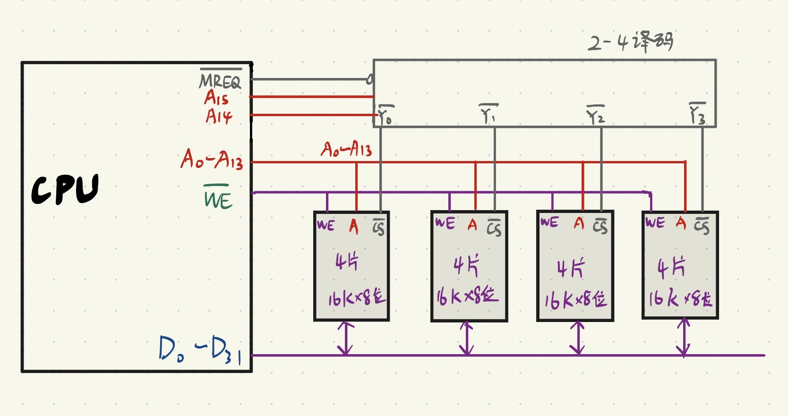

**用 $\overline{MREQ}$ 作为译码器芯片的输出许可证信号，译码器的输出作为存储器芯片的选择信号 ；用 $\overline{WE} $ 作为读写控制信号**

!!! note "补充"
    借鉴王道计算机考研的资料，如果需要可以找我要电子版的，文件太大了，不太好往我网站传。

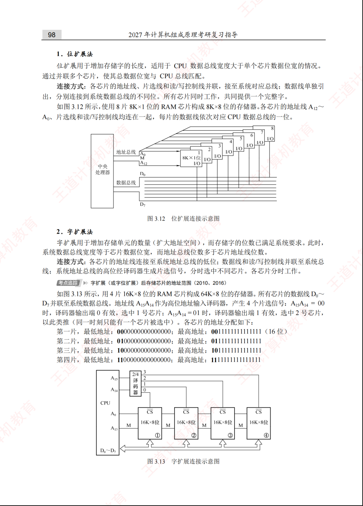
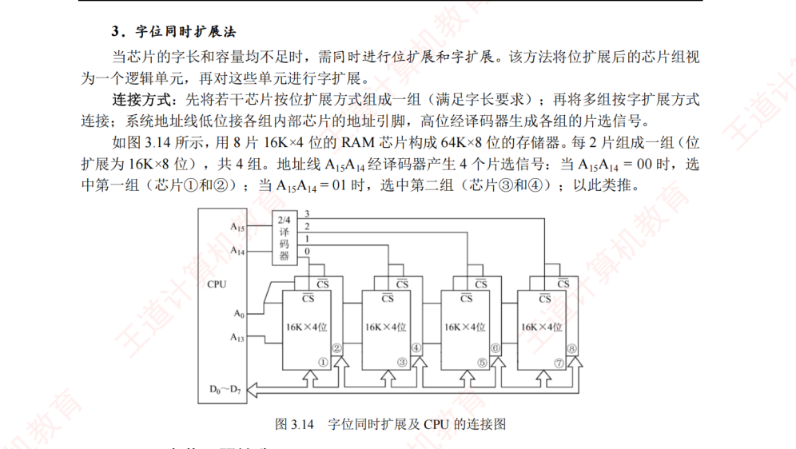

---

### 5.作业P122 - 8
####  设存储器容量为 64MB，字长为 64 位，模块数 m=8，分别用顺序和交叉方式进行组织。存储周期 T=100ns，数据总线宽度为 64 位，总线传送周期 τ=50ns。求：顺序存储器和交叉存储器的带宽各是多少?

##### 🛠️ 思路拆解与核心概念

在做题前，我们先理清什么是“存储器带宽”：

> 带宽（Bandwidth）就是指**存储器在单位时间内能向 CPU 传输的最大数据量**。单位通常是 字节/秒（$\text{B/s}$）。
> 核心计算公式：$\text{带宽} = \dfrac{\text{连续传输的数据量}}{\text{总消耗时间}}$

##### 1. 顺序存储器（高位地址交叉）

* **核心逻辑**：8 个模块是“串行”工作的。当 CPU 访问完第一个模块后，必须等待这个模块的存储周期 $T$ 彻底结束，才能去访问下一个模块。
* **时间计算**：这意味着，每读取一个字（64位），就需要耗费完整的 **$T = 100\text{ns}$**。
* **数据量**：数据总线宽度为 64 位 = 8 字节（$\text{8B}$）。

##### 2. 交叉存储器（低位地址交叉）

* **核心逻辑**：8 个模块采用“流水线”方式并行工作。CPU 发出第一个地址后，数据线经过 $\tau$ 产生传输，此时第一个模块开始“回血”（恢复期），而 CPU 紧接着在 $\tau$ 时间后就可以去读第二个模块。
* **时间计算**：
* 读取 1 个字的时间就是模块的存储周期 $T = 100\text{ns}$。
* 连续读取 $m$ 个字的总时间公式为：$t = T + (m - 1)\tau$。
* **极限情况（流水线完全充满后）**：存储器可以达到完美的满载状态，也就是**每隔一个总线传输周期 $\tau = 50\text{ns}$ 就能吐出一个字的数据**。

##### 💡 详细解题步骤：

##### (1) 准备工作：统一基本单位

* 字长 = $64\text{ 位 (bit)} = \frac{64}{8} = 8\text{ 字节 (Byte)}$
* 存储周期 $T = 100\text{ ns} = 100 \times 10^{-9}\text{ s}$
* 总线传输周期 $\tau = 50\text{ ns} = 50 \times 10^{-9}\text{ s}$
* 模块数 $m = 8$

##### (2) 计算顺序存储器的带宽

* **工作特点**：各模块串行工作，每隔一个存储周期 $T$ 只能成功连续读写一个字（$8\text{B}$）。
* **计算公式**：

$$W_{\text{顺序}} = \frac{\text{字长}}{T}$$

* **代入数据**：

$$W_{\text{顺序}} = \frac{8\text{ B}}{100 \times 10^{-9}\text{ s}} = 8 \times 10^7\text{ B/s} = 80\text{ MB/s}$$

##### (3) 计算交叉存储器的带宽

* **工作特点**：各模块流水线并行工作。因为满足流水线不间断条件（$T \le m \times \tau$，即 $100\text{ns} \le 8 \times 50\text{ns}$），在理想的连续读取状态下，**每隔一个总线传输周期 $\tau$ 就能开火一次**，吐出一个字（$8\text{B}$）的数据。
* **计算公式**：

$$W_{\text{交叉}} = \frac{\text{字长}}{\tau}$$

* **代入数据**：

$$W_{\text{交叉}} = \frac{8\text{ B}}{50 \times 10^{-9}\text{ s}} = 16 \times 10^7\text{ B/s} = 160\text{ MB/s}$$

* *(注：如果使用连续读取 $m$ 个字的公式计算，带宽为：$W = \dfrac{m \times \text{字长}}{T + (m-1)\tau} = \dfrac{8 \times 8\text{B}}{100\text{ns} + 7 \times 50\text{ns}} = \dfrac{64\text{B}}{450\text{ns}} \approx 142.22\text{MB/s}$。但在考研大题无特定字数说明时，标准做法通常按**极限最大带宽 $\dfrac{\text{字长}}{\tau}$** 来直接计算。)*    

##### 📌 正确答案：

1. 顺序存储器的带宽是 **$80\text{MB/s}$**。
2. 交叉存储器的带宽是 **$160\text{MB/s}$**。

!!! danger "提醒" 
    老师给的答案是：
    1. 顺序存储器的带宽是 **$640\text{Mbps}$**。
    2. 交叉存储器的带宽是 **$1280\text{Mbps}$**。
    
    **这与我的答案物理含义是一致的，我只是把bit换成了Byte**

    要注意的是：“若连续读出8个字，求：顺序存储器和交叉存储器的数据传输率各是多少？
    
    **“带宽是链路的最大传输能力，而数据传输率是实际的传输速度。”**

“带宽是最大理论能力，数据传输率是实际速度”在网络工程或者日常概念里是完全正确的。

但是在计算机组成原理（408考研标准）**的语境下，这两个词的微妙区别在于**“极限情况”与“特定任务（有限过程）”的计算差异。

当题目明确加上了“若连续读出 8 个字”**这个限定条件时，就是在考查你对**流水线建立过程（车头拉出阶段）时间损耗的精确计算，此时不能再粗暴地用极限公式了。

##### 🛠️ 核心区别：极限状态 vs 有限任务

##### 1. 顺序存储器：没有区别

* **原理**：不管你是读 1 个字、8 个字还是无数个字，顺序存储器都是死板地读完一个、等待 $T$、再读下一个。
* **时间**：读 8 个字需要完整的 $8 \times T$。
* **结论**：它的实际传输率和理论带宽永远相等。

##### 2. 交叉存储器：区别就在“前期的等待时间”

* **理论带宽（最大能力）**：假设我们**源源不断**地读几万个字，当流水线完全充满后，前期的“建立时间”可以忽略不计，实际速度无限逼近 $\frac{\text{字长}}{\tau}$。
* **实际数据传输率（连续读 8 个字）**：现在只读 8 个字，流水线还没跑多久就结束了。第一辆车（第一个字）从发出地址到彻底拿齐数据，必须熬过完整的 $T=100\text{ns}$，后面的 7 辆车才能以每隔 $\tau=50\text{ns}$ 的速度挨个出来。
* **总耗时**：$t = T + (8 - 1)\tau$。这里的 $T$ 就是流水线的“建立成本”。由于只读 8 个字，这个成本分摊下来就会拉低实际的传输速度。

##### 💡 “连续读出 8 个字”的精确计算步骤：

##### (1) 基础已知条件

* 字长 = $64\text{ 位} = 8\text{ B}$
* 连续读出数据量 = $8 \times 8\text{ B} = 64\text{ B}$
* 存储周期 $T = 100\text{ ns}$，总线传送周期 $\tau = 50\text{ ns}$，模块数 $m = 8$

##### (2) 顺序存储器的数据传输率

* **耗时计算**：各个模块串行执行，读 8 个字需要完整的 8 个存储周期。

$$t_{\text{顺序}} = 8 \times T = 8 \times 100\text{ ns} = 800\text{ ns} = 800 \times 10^{-9}\text{ s}$$

* **数据传输率计算**：

$$\text{传输率}_{\text{顺序}} = \frac{\text{总数据量}}{t_{\text{顺序}}} = \frac{64\text{ B}}{800 \times 10^{-9}\text{ s}} = 80\text{ MB/s}$$

* **结论**：顺序存储器的实际传输率与其最大带宽（$80\text{MB/s}$）保持一致。

##### (3) 交叉存储器的数据传输率

* **耗时计算**：采用流水线方式。读出第一个字需要 $100\text{ns}$，后续 7 个字每隔 $50\text{ns}$ 吐出一个。

$$t_{\text{交叉}} = T + (8 - 1)\times \tau = 100\text{ ns} + 7 \times 50\text{ ns} = 450\text{ ns} = 450 \times 10^{-9}\text{ s}$$

* **数据传输率计算**：

$$\text{传输率}_{\text{交叉}} = \frac{\text{总数据量}}{t_{\text{交叉}}} = \frac{64\text{ B}}{450 \times 10^{-9}\text{ s}} \approx 142.22\text{ MB/s}$$

* **结论**：因为只连续读了 8 个字，流水线刚充满就结束了，所以实际数据传输率（$142.22\text{MB/s}$）**小于**其理论最大带宽（$160\text{MB/s}$）。

##### 📌 考研答题避坑总结

在做组原大题时，只要看到题目出现 **“若连续读出 $n$ 个字，求传输率/带宽”** 这种句式：

1. 交叉存储器的分母**必须**使用流水线总时间公式：$t = T + (n - 1)\tau$。
2. 分子**必须**使用真实的传输总量：$\text{数据量} = n \times \text{字长}$。
只有题目**没有**提及连续读写多少个字，纯粹问“多体交叉存储器的带宽是多少”时，才直接使用极限公式 $\frac{\text{字长}}{\tau}$。
---

### 6.作业P122 - 9
#### CPU 执行一段程序时，cache 完成存取的次数为 2420 次，主存完成存取的次数为 80 次，已知 cache 存储周期为 40ns，主存存储周期为 240ns，求 cache/主存系统的效率和平均访问时间。  

这道题考查的是 Cache 性能指标中的两个核心概念：**平均访问时间**和**系统效率**。这是考研和期末考试中必考的经典计算题。

* **平均访问时间**：CPU 发出很多次请求，有的打中快库（Cache），有的只能去远郊大仓库（主存），平均下来每次花多少时间。
* **系统效率**：由于加入了 Cache，系统速度提升了。效率就是**理想状态下的最快速度（全中 Cache）占实际平均速度的百分比**。

##### 💡 详细解题步骤：

##### (1) 计算 Cache 的命中率 $H$

* 总访问次数：

$$N = N_c + N_m = 2420 + 80 = 2500\text{ 次}$$

* 命中率：

$$H = \frac{N_c}{N} = \frac{2420}{2500} = 0.968$$

##### (2) 计算平均访问时间 $T_a$

* 已知 $T_c = 40\text{ ns}$，$T_m = 240\text{ ns}$。
* 代入加权平均公式：

$$T_a = H \times T_c + (1 - H) \times T_m$$

$$T_a = 0.968 \times 40\text{ ns} + (1 - 0.968) \times 240\text{ ns}$$

$$T_a = 38.72\text{ ns} + 0.032 \times 240\text{ ns}$$

$$T_a = 38.72\text{ ns} + 7.68\text{ ns} = \textbf{46.4 ns}$$

##### (3) 计算 Cache/主存系统的效率 $e$

* 效率公式为最快周期与平均周期的比值：

$$e = \frac{T_c}{T_a} \times 100\%$$

* 代入数据计算：

$$e = \frac{40\text{ ns}}{46.4\text{ ns}} \times 100\% \approx \textbf{86.2\%}$$

##### 📌 正确答案：

1. Cache/主存系统的**平均访问时间**是 **$46.4\text{ns}$**。
2. Cache/主存系统的**效率**约为 **$86.2\%$**。

---

### 7. 作业P123 - 10

#### 已知 cache 存储周期 40ns，主存存储周期 200ns，cache/主存系统平均访问时间为 50ns，求 cache 的命中率是多少?

这道题是上一题的**逆向运算**，同样是考研和期末考试中非常高频的经典计算小题。

##### 🛠️ 思路拆解与核心公式

##### 1. 核心公式

依然使用**Cache/主存系统平均访问时间 ($T_a$)** 的加权平均公式：

$$T_a = H \times T_c + (1 - H) \times T_m$$

其中：

* $T_a$ 为平均访问时间（$50\text{ns}$）
* $T_c$ 为 Cache 存取周期（$40\text{ns}$）
* $T_m$ 为主存存取周期（$200\text{ns}$）
* $H$ 为我们需要求的 **Cache 命中率**

##### 💡 详细解题步骤：

##### (1) 建立方程

* 将已知数据 $T_c = 40\text{ ns}$，$T_m = 200\text{ ns}$，$T_a = 50\text{ ns}$ 代入平均访问时间公式：

$$50 = H \times 40 + (1 - H) \times 200$$

$$160H = 150$$

* 解得 $H$：

$$H = \frac{150}{160} = \frac{15}{16} = 0.9375$$

* 转换为百分比：

$$H = 93.75\%$$

##### 📌 正确答案：

Cache 的命中率是 **$93.75\%$**（或写成 $\frac{15}{16}$）。

---

### 8. 作业P123 - 13

#### 一个组相联 cache 由 64 个行组成，每组 4 行。主存储器包含 4K 个块，每块 128 字。请表示内存地址的格式。

这道题是考研（408）中关于 **Cache 组相联映射（Set-Associative Mapping）地址切分** 最经典的题型。

做这类题的终极套路依然是：**把所有的已知量化为 2 的幂次，然后从右往左依次切蛋糕（切分数据位）**。

##### 🛠️ 思路拆解与核心概念

一个完整的组相联映射内存地址，从左到右由三部分组成：
`[ 主存字块标记 (Tag) ] [ 组索引/组号 (Index) ] [ 块内地址/字地址 (Offset) ]`

我们需要依次算出这三个部分各自占多少个二进制位（bit）。

##### 1. 块内地址（Offset）—— 决定最右边切几位

* **核心逻辑**：块内地址的位数由**每块的大小**决定。
* 题目已知：每块有 $128\text{ 字}$。
* 因为 $128 = 2^7$，所以**块内地址占 7 位**。

##### 2. 组索引/组号（Index）—— 决定中间切几位

* **核心逻辑**：组索引的位数由 **Cache 总共分成了多少个组** 决定。
* 题目已知：Cache 共有 $64\text{ 行}$（块），每组有 $4\text{ 行}$（即四路组相联）。
* 那么 Cache 的总组数为：

$$\text{Cache组数} = \frac{64}{4} = 16\text{ 组}$$

* 因为 $16 = 2^4$，所以**组索引/组号占 4 位**。

##### 3. 主存字块标记（Tag）—— 剩下全归它

* **核心逻辑**：有两种算方法。
* **方法 A（用主存块数算）**：主存有 $4\text{K} = 4096$ 个块。$4096 = 2^{12}$，说明主存块号总共需要 $12\text{ 位}$。而主存块号是由 `Tag + 组号` 组成的。既然组号占了 $4\text{ 位}$，那么 $\text{Tag} = 12 - 4 = \textbf{8 位}$。
* **方法 B（用总地址线算）**：主存总块数 $4\text{K} = 2^{12}$，每块 $128 = 2^7$ 字。所以主存总容量为 $2^{12} \times 2^7 = 2^{19}$ 字。总地址线为 $19\text{ 位}$。$\text{Tag位数} = 19 (\text{总位数}) - 4 (\text{组号}) - 7 (\text{块内偏移}) = \textbf{8 位}$。

##### 💡 详细地址格式推导：

##### (1) 各字段位数计算

1. **块内地址 (Offset)**：

$$\text{每块字数} = 128 = 2^7 \longrightarrow \textbf{7 位}$$

2. **组索引 (Index)**：

$$\text{Cache 组数} = \frac{\text{Cache 行数}}{\text{每组行数}} = \frac{64}{4} = 16 = 2^4 \longrightarrow \textbf{4 位}$$

3. **主存字块标记 (Tag)**：

$$\text{主存总块数} = 4\text{K} = 2^{12} \longrightarrow \text{主存块号占 12 位}$$

$$\text{Tag 位数} = \text{主存块号位数} - \text{组索引位数} = 12 - 4 = \textbf{8 位}$$

* 系统总地址位数为：$8 + 4 + 7 = 19\text{ 位}$。

##### (2) 内存地址格式图

该计算机的内存地址（按字编址）总长度为 **19 位**，其格式划分如下：

| 主存字块标记 (Tag) | 组索引 (Index) | 块内地址 (Offset) |
| --- | --- | --- |
| 8 位 | 4 位 | 7 位 |
| $A_{18} \sim A_{11}$ | $A_{10} \sim A_7$ | $A_6 \sim A_0$ |

##### 📌 正确答案：

内存地址格式为：**Tag 占 8 位，组索引（组号）占 4 位，块内地址（字地址）占 7 位**，总地址长度为 19 位。

---

### 9.作业P123 - 14

#### 有一个处理机，主存容量 1MB，字长 1B，块大小 16B，cache 容量 64KB，若 cache 采用直接映 射式，请给出两个不同标记的内存地址，它们映射到同一个 cache 行。

这道题考查的是 **Cache 直接映射（Direct Mapping）中的冲突与地址划分原理**。题目让我们找两个映射到同一个 Cache 行但标记（Tag）不同的物理地址，这其实是在探究直接映射的“多对一”本质。

我们依然用最快的“切蛋糕法”把地址结构拆解出来。

##### 🛠️ 思路拆解与核心概念

在直接映射下，主存地址从左到右划分为三部分：
`[ 主存字块标记 (Tag) ] [ Cache行号/索引 (Index) ] [ 块内地址 (Offset) ]`

要让两个不同的内存地址映射到**同一个 Cache 行**，必须满足两个黄金条件：

1. **中间的“Cache行号 (Index)”必须完全相同**。
2. **左边的“主存字块标记 (Tag)”必须不同**。

##### 💡 详细地址划分与答案：

##### (1) 主存地址格式切分

* 物理地址总位数：$1\text{MB} = 2^{20}\text{B} \longrightarrow 20\text{ 位}$
* 块内地址 (Offset)：$\text{块大小} = 16\text{B} = 2^4\text{B} \longrightarrow 4\text{ 位}$
* Cache 行索引 (Index)：$\text{总行数} = \frac{64\text{KB}}{16\text{B}} = 4096 = 2^{12} \longrightarrow 12\text{ 位}$
* 主存字块标记 (Tag)：$\text{Tag} = 20 - 12 - 4 = 4\text{ 位}$

$$20\text{位物理地址结构：} \underbrace{[ \text{Tag: 4位} ]}_{A_{19}\sim A_{16}} \ \underbrace{[ \text{Index: 12位} ]}_{A_{15}\sim A_4} \ \underbrace{[ \text{Offset: 4位} ]}_{A_3\sim A_0}$$

##### (2) 构造实例

令 $\text{Index} = \text{0000 0000 0000}_2$，$\text{Offset} = \text{0000}_2$，通过改变 $\text{Tag}$ 的值可得到两个完全符合题意、映射到 **Cache第 0 行** 的地址：

| 地址 | 4位 Tag | 12位 Index | 4位 Offset | 二进制全称 | 十六进制地址 |
| --- | --- | --- | --- | --- | --- |
| **地址 1** | `0000` | `0000 0000 0000` | `0000` | `00000000000000000000` | **`00000H`** |
| **地址 2** | `0001` | `0000 0000 0000` | `0000` | `00010000000000000000` | **`10000H`** |

##### 📌 正确答案：

内存地址 **`00000H`** 和 **`10000H`**（或任意满足中间 12 位相同且最高 4 位不同的地址对）拥有不同的标记，但由于索引完全相同，它们都会映射到同一个 Cache 行（第 0 行）。

---

### 10.作业P123 - 15

#### 假设主存容量 16M×32 位，cache 容量 64K×32 位，主存与 cache 之间以每块 4×32 位大小传送 数据，请确定直接映射方式的有关参数，并画出主存地址格式。

这道题同样是直接映射中极其标准的考研必考大题。

这里有一个需要特别注意的“小陷阱”：题目给出的所有容量和块大小都带着 **`×32位`**。这意味着，这道题的计算机系统是**按“字（Word）”来编址的，每个字的长度是 32 位**。我们在切分地址时，所有的单位都要统一用“字”来计算，而不是传统的“字节（Byte）”。

##### 🛠️ 思路拆解与核心参数计算

在直接映射下，主存地址从左到右划分为三部分：
`[ 主存字块标记 (Tag) ] [ Cache行号/索引 (Index) ] [ 块内地址 (Offset) ]`

##### 1. 系统总地址位数

* 主存容量 = $16\text{M} \times 32\text{位}$。既然是以 32 位字长为单位编址，说明主存共有 $16\text{M}$ 个存储字单元。
* 因为 $16\text{M} = 16 \times 2^{20} = 2^4 \times 2^{20} = 2^{24}$，所以**主存总地址线为 24 位**。

##### 2. 块内地址位数（Offset）

* 主存与 Cache 之间以每块 $4 \times 32\text{位}$ 大小传送数据。也就是说，一块里面包含了 **4 个字**。
* 因为 $4 = 2^2$，所以**块内地址（字地址）占 2 位**。

##### 3. Cache 行号/索引位数（Index）

* Cache 总容量 = $64\text{K} \times 32\text{位}$，即共有 $64\text{K}$ 个字单元。
* Cache 的总行数（块数） = $\frac{\text{Cache总字数}}{\text{每块字数}} = \frac{64\text{K}}{4} = 16\text{K}$ 行。
* 因为 $16\text{K} = 16 \times 2^{10} = 2^4 \times 2^{10} = 2^{14}$，所以**Cache 行号占 14 位**。

##### 4. 主存字块标记位数（Tag）

* $\text{Tag 位数} = 24 (\text{总位数}) - 14 (\text{行号}) - 2 (\text{块内偏移}) = \textbf{8 位}$。

##### 5. 主存地址格式图
 
该计算机按字编址的总长度为 **24 位**，直接映射方式下的物理地址格式划分如下：

| 主存字块标记 (Tag) | Cache行号 (Index) | 块内地址 (Offset) |
| --- | --- | --- |
| 8 位 | 14 位 | 2 位 |
| $A_{23} \sim A_{16}$ | $A_{15} \sim A_2$ | $A_1 \sim A_0$ |

##### 📌 正确答案：

有关参数为：**主存总地址 24 位，Cache 行号占 14 位，块内地址占 2 位，主存字块标记（Tag）占 8 位**。主存地址格式见上表。

---
### 11.作业P123 - 21

#### 设某系统采用页式虚拟存储管理，页表存放在主存中。 
    (1)如果一次内存访问使用 50ns，访问一次主存需用多少时间？ 
    (2)如果增加 TLB，忽略查找 TLB 表项占用的时间，并且 75%的页表访问命中 TLB，内存的有效访问 时间是多少？ 

这道题考查的是虚拟存储器中 **TLB（快表）对内存有效访问时间（EAT, Effective Access Time）的影响**。这是 408 考研和各大高校期末考试中非常经典的必考大题。

我们直接用最形象的“去商场买东西”的逻辑来拆解这两问。

##### 🛠️ 思路拆解与核心概念

##### (1) 如果没有 TLB，访问一次主存数据需用多少时间？

* **核心逻辑**：CPU 给出的地址是虚拟地址，它想拿到真正的物理数据。
* **第一步**：CPU 必须先去内存里翻看“页表（Page）”，查到数据到底在哪一页，这需要访问一次内存（花费 50ns）。
* **第二步**：拿到真实的物理地址后，CPU 再次访问内存去把**真正的物理数据**读出来，这又需要访问一次内存（花费 50ns）。

* **结论**：在没有快表的情况下，每次读写数据都雷打不动地需要**访问两次内存**。

##### (2) 如果增加了 TLB，有效访问时间是多少？

* **核心逻辑**：有了快表（TLB），CPU 查地址时会分流：
* **情况 A：TLB 命中（概率 75%）**：CPU 速度极快地在 CPU 内部就把物理地址查到了。因为题目说“忽略查找 TLB 的时间（0ns）”，所以 CPU 查完地址后，直接去内存里读**真正的物理数据**即可。这时候只需要访问 **1 次内存**（花费 50ns）。
* **情况 B：TLB 未命中（概率 25%）**：快表里没查到。CPU 只能自认倒霉，回到第（1）问的老路子上——**先访问内存查页表（50ns），再访问内存读数据（50ns）**，总共需要访问 **2 次内存**（花费 100ns）。

* **最后一步**：把这两种情况按照概率加权平均，就能得到系统的**有效访问时间**。

##### 💡 详细解题步骤：

##### (1) 无 TLB 时的访问时间计算

* 在没有 TLB 的页式存储管理中，CPU 每次数据访问都需要双倍内存时间：

$$\text{总时间} = \text{访问内存页表时间} + \text{访问实际数据时间}$$

* 代入数据：

$$\text{总时间} = 50\text{ ns} + 50\text{ ns} = \textbf{100 ns}$$

##### (2) 增加 TLB 后的有效访问时间 (EAT) 计算

* **TLB 命中时（75%的概率）**：

$$\text{时间}_{\text{命中}} = \text{TLB查找时间} (0) + \text{访问实际数据时间} (50\text{ns}) = 50\text{ ns}$$

* **TLB 未命中时（25%的概率）**：

$$\text{时间}_{\text{未命中}} = \text{访问内存页表时间} (50\text{ns}) + \text{访问实际数据时间} (50\text{ns}) = 100\text{ ns}$$

* **有效访问时间计算**：

$$\text{EAT} = 75\% \times \text{时间}_{\text{命中}} + (1 - 75\%) \times \text{时间}_{\text{未命中}}$$

$$\text{EAT} = 0.75 \times 50\text{ ns} + 0.25 \times 100\text{ ns}$$

$$\text{EAT} = 37.5\text{ ns} + 25\text{ ns} = \textbf{62.5 ns}$$

##### 📌 正确答案：

1. 访问一次主存需要 **$100\text{ns}$**。
2. 引入 TLB 后，内存的有效访问时间是 **$62.5\text{ns}$**。

---

## 番外题
### 12.Cache 地址划分与总容量计算

#### 题目：某计算机的主存容量为 256KB，Cache 容量为 2KB，每块大小为 64B。分别求直接映射和2路组相联映射下主存地址各字段的位数，并计算Cache总容量。

##### 🛠️ 解题步骤

**基本参数计算：**

* 主存容量 = $256\text{KB} = 2^{18}\text{B}$ → 主存地址 18 位
* 块大小 = $64\text{B} = 2^6\text{B}$ → 块内地址（Word）= 6 位
* 主存块数 = $256\text{KB} / 64\text{B} = 4096 = 2^{12}$ 块
* Cache块数 = $2\text{KB} / 64\text{B} = 32 = 2^5$ 块

**直接映射：**

* Cache行号位数 = $5$ 位（$2^5 = 32$ 行）
* 标记位数 = $18 - 5 - 6 = 7$ 位
* 主存地址结构：`Tag(7位) + Line(5位) + Word(6位)`
* Cache总容量（含有效位）= $32 \times (7 + 1 + 64 \times 8) = 32 \times 520 = 16640$ 位

**2路组相联映射：**

* 组数 = $32 / 2 = 16 = 2^4$ 组
* 组号位数 = $4$ 位
* 标记位数 = $18 - 4 - 6 = 8$ 位
* 主存地址结构：`Tag(8位) + Set(4位) + Word(6位)`
* Cache总容量（含有效位）= $32 \times (8 + 1 + 64 \times 8) = 32 \times 521 = 16672$ 位

若采用写回法，每组还需加1位脏位：直接映射 $= 32 \times (7+1+1+512) = 16672$ 位，2路组相联 $= 32 \times (8+1+1+512) = 16704$ 位。

---

### 13.Cache 命中率与平均访问时间

#### 题目：某Cache-主存系统中，Cache存取周期为 20ns，主存存取周期为 200ns。设Cache命中率为 90%，求平均访问时间和访问效率。

##### 🛠️ 解题步骤

* 平均访问时间：$t_a = h \cdot t_c + (1-h) \cdot t_m = 0.9 \times 20 + 0.1 \times 200 = 18 + 20 = 38\text{ns}$
* 访问效率：$e = t_c / t_a = 20 / 38 \approx 52.6\%$

**注意**：若采用"先访问Cache再访问主存"的方式，命中时只需 $t_c$，未命中时需 $t_c + t_m$（先查Cache未命中，再访问主存），此时 $t_a = 0.9 \times 20 + 0.1 \times (20+200) = 40\text{ns}$。两种方式差一个 $t_c$，审题要看清是哪种访问方式。

---

### 14.LRU 替换算法命中率计算

#### 题目：某Cache采用4路组相联映射，某组中已有块号为 2、8、6、4 的数据。现在依次访问块号为 8、2、6、8、4 的数据，采用LRU替换算法，求命中率。

##### 🛠️ 解题步骤

LRU的核心规则：**最近被访问的块移到"最近使用"端，最久未使用的块在"最久未用"端，替换时淘汰最久未用端。**

初始状态（从最近到最远）：4, 6, 8, 2

| 访问块号 | 命中？ | 调整后（最近→最远） |
|---------|--------|-------------------|
| 8 | 命中 | 8, 4, 6, 2 |
| 2 | 命中 | 2, 8, 4, 6 |
| 6 | 命中 | 6, 2, 8, 4 |
| 8 | 命中 | 8, 6, 2, 4 |
| 4 | 命中 | 4, 8, 6, 2 |

命中率 = 5/5 = 100%（本题命中率高是因为访问序列恰好都在Cache中）

---

### 15.多模块交叉存储器带宽计算

#### 题目：一个4体低位交叉存储器，每个模块的存取周期为 200ns，总线传送周期为 50ns。求连续读取 8 个字的时间和带宽。

##### 🛠️ 解题步骤

1. **验证流水线条件**：模块数 $m = 4$，总线周期 $\tau = 50\text{ns}$，则 $m \times \tau = 4 \times 50 = 200\text{ns} = T$，满足 $T = m\tau$，可以采用流水线方式。
2. **连续读8个字的时间**：
    * 第1个字：完整的存取周期 $T = 200\text{ns}$
    * 后续7个字：每隔 $\tau = 50\text{ns}$ 产出一个
    * 总时间 = $T + (8-1) \times \tau = 200 + 7 \times 50 = 550\text{ns}$
3. **带宽**：
    * 低位交叉带宽 = 数据量 / 总时间 = $8 / 550\text{ns} \approx 14.5 \times 10^6$ 字/秒
    * 对比顺序方式：$8 \times 200 = 1600\text{ns}$，带宽仅 $8 / 1600\text{ns} = 5 \times 10^6$ 字/秒
    * 低位交叉约为顺序方式的 **2.9倍**

---

### 16.DRAM 刷新计算

#### 题目：某DRAM芯片有128行，存取周期为 50ns，刷新周期为 2ms。分别计算集中刷新、分散刷新和异步刷新下的死时间。

##### 🛠️ 解题步骤
那你仿照第三章存储系统的内容以及格式，帮我想想指令系统.md可以写什么吗，你可以参考/Users/xurry/Documents/mynotes/docs/计算机组成原理/resources/第4章-指令系统-20260410.pdf

* **集中刷新**：
    * 在2ms末集中刷新128行，每次刷新一行耗时等于存取周期50ns
    * 死时间 = $128 \times 50\text{ns} = 6400\text{ns} = 6.4\mu s$
    * 正常工作时间 = $2\text{ms} - 6.4\mu s \approx 1993.6\mu s$

* **分散刷新**：
    * 每个存取周期拆成两半：前半读/写，后半刷新
    * 系统存取周期变为 $2 \times 50 = 100\text{ns}$
    * 无死区，但整个系统速度降低一半

* **异步刷新**：
    * 将128次刷新均匀分配到2ms中
    * 刷新间隔 = $2\text{ms} / 128 = 15.625\mu s$
    * 每隔 $15.625\mu s$ 刷新一行，每行刷新仅耗时50ns
    * 死时间 = 单行刷新时间 = $50\text{ns}$（相比集中刷新的 $6.4\mu s$ 大幅缩短）
