# 第四章：指令系统

## 4.1 指令系统基本概念

### 4.1.1 机器指令

**机器指令**是计算机CPU能直接识别和执行的二进制代码，它规定了计算机应执行什么操作以及操作数的位置。一条机器指令包括**操作码**和**地址码**两部分。

- **操作码（Opcode）**：指明指令要执行的操作类型，如加、减、传送、跳转等
- **地址码（Address）**：指明操作数的地址或操作结果存放的位置

### 4.1.2 指令的一般格式

根据指令中包含的地址码数量，机器指令可分为以下几类：

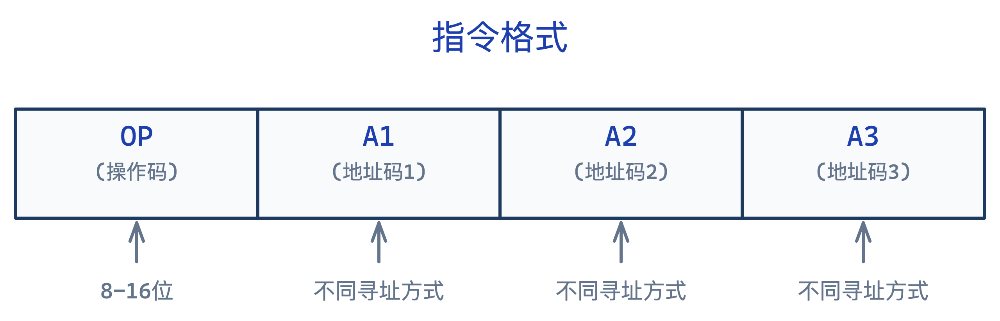

| 指令类型 | 地址码数量 | 格式特点 | 执行速度 |
|---------|-----------|---------|---------|
| **零地址指令** | 0 | 只有操作码，如停机、空操作 | 最快 |
| **一地址指令** | 1 | OP + A1，如INC、NOT | 较快 |
| **二地址指令** | 2 | OP + A1 + A2，如ADD、MOV | 中等 |
| **三地址指令** | 3 | OP + A1 + A2 + A3，如比较复杂的操作 | 较慢 |

**常见二地址指令格式**：


> 说明：A1和A2可以是寄存器、内存单元或立即数。根据操作数位置的不同，又可分为：
> - **寄存器-寄存器型**：两个操作数都在寄存器中
> - **寄存器-存储器型**：一个操作数在寄存器，一个在内存
> - **存储器-存储器型**：两个操作数都在内存中（很少使用）

---

## 4.2 指令的操作类型

### 4.2.1 数据传送指令

用于实现数据在寄存器、存储器和CPU之间的传送。

| 指令类型 | 功能说明 | 常见助记符 |
|---------|---------|-----------|
| 数据传送 | 数据从源传送到目的 | MOV, LDA, STA |
| 堆栈操作 | 入栈/出栈操作 | PUSH, POP |
| 交换操作 | 交换两个数据的位置 | XCHG |

### 4.2.2 算术运算指令

实现加、减、乘、除等算术运算。

| 指令类型 | 功能说明 | 常见助记符 |
|---------|---------|-----------|
| 加法 | 求两个操作数之和 | ADD, ADC, INC |
| 减法 | 求两个操作数之差 | SUB, SBB, DEC, NEG |
| 乘法 | 求两个操作数之积 | MUL, IMUL |
| 除法 | 求两个操作数之商 | DIV, IDIV |

**注意**：
- `INC` 是加1指令，`DEC` 是减1指令
- `NEG` 是取反指令（求补码）
- `ADC` 是带进位加法，`SBB` 是带借位减法

### 4.2.3 逻辑运算指令

实现按位与、或、异或等逻辑运算。

| 指令类型 | 功能说明 | 常见助记符 |
|---------|---------|-----------|
| 与 | 按位AND操作 | AND, TEST |
| 或 | 按位OR操作 | OR |
| 异或 | 按位XOR操作 | XOR |
| 非 | 按位取反 | NOT |

> 注意：`TEST`指令执行与操作但不保存结果，只影响标志位

### 4.2.4 移位操作指令

实现数据的左移、右移（包括算术移位和逻辑移位）。

| 指令类型 | 功能说明 |
|---------|---------|
| 逻辑左移/右移 | 数据整体左移/右移，移出的位丢弃，另一端补0 |
| 算术左移/右移 | 算术左移同逻辑左移；算术右移时最高位保持不变 |
| 循环左移/右移 | 移出的位从另一端移入，形成闭环 |
| 带进位循环 | 将进位标志位纳入循环 |

**算术移位的意义**：
- 左移一位：相当于乘2（左移后无溢出时）
- 右移一位：相当于除2（整除）

### 4.2.5 控制转移指令

改变程序执行的顺序，实现分支、循环、子程序调用等。

| 指令类型 | 功能说明 | 常见助记符 |
|---------|---------|-----------|
| 无条件转移 | 强制跳转到指定地址 | JMP |
| 条件转移 | 根据条件跳转 | JZ, JNZ, JC, JNC, JB, JA等 |
| 循环控制 | 循环结构的控制 | LOOP, LOOPE |
| 子程序调用 | 调用子程序 | CALL, RET |
| 中断控制 | 中断相关指令 | INT, IRET |

---

## 4.3 指令的寻址方式

**寻址方式**是指指令中给出操作数或操作数地址的方式。寻址方式的选择直接影响指令的执行速度和程序的长度。

指令的地址码字段并不一定代表操作数的真实地址，把它称为形式地址，记为 A。操作数的真实地址称为有效地址，记为 EA，它是由寻址方式和形式地址共同确定的。

所谓寻址方式，就是寻找指令或操作数的有效地址的方式，也就是指确定本条指令的数据地址以及下一条将要执行的指令地址的方法。寻址方式分为指令寻址和数据寻址两大类。

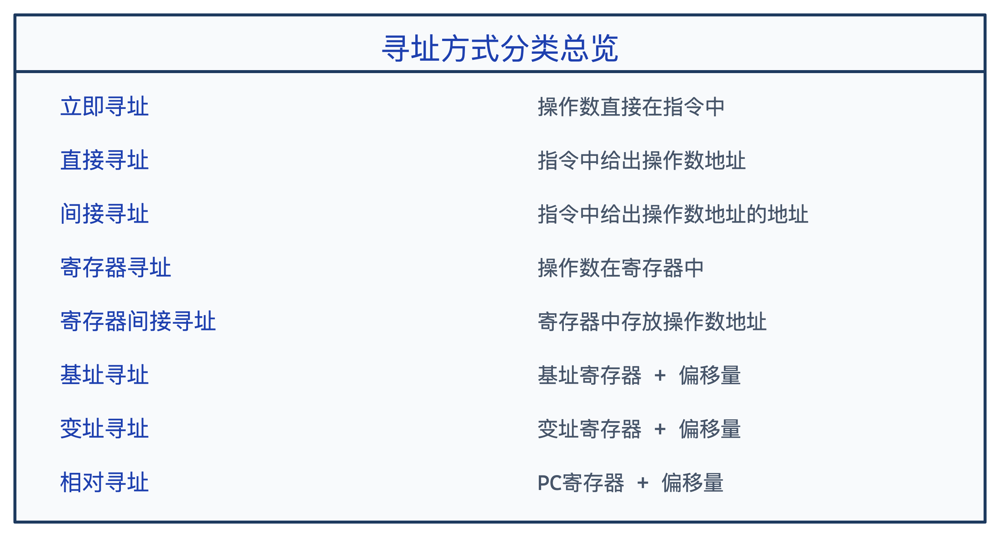

### 4.3.1 立即寻址（Immediate Addressing）

**特点**：操作数直接包含在指令中，紧跟在操作码后面。


**格式示例**：
```
MOV AX, 1234H    ; 将立即数1234H送入寄存器AX
ADD BX, 05H      ; 将BX的内容加5
```

**特点分析**：

- ✅ 取指令的同时就取到了操作数，**速度最快**
- ✅ 不需要访问内存，执行效率高
- ❌ 操作数是固定的，不能修改
- ❌ 操作数大小受指令字长限制
- **适用场景**：常量赋值、寄存器初始化

### 4.3.2 直接寻址（Direct Addressing）

**特点**：指令中直接给出操作数在内存中的**有效地址**。


**格式示例**：
```
; 假设地址2000H处存放的数据是1234H
MOV AX, [2000H]  ; 将内存2000H单元的数据1234H送入AX
```

**特点分析**：
- ✅ 简单直观，指令格式简单
- ✅ 不需要额外计算地址
- ❌ 地址固定在指令中，无法动态修改
- ❌ 指令长度受地址位数影响（地址空间大则指令长）
- **适用场景**：访问固定地址的变量、全局变量

### 4.3.3 间接寻址（Indirect Addressing）

**特点**：指令中给出的不是操作数本身，而是**存放操作数地址的内存单元地址**。需要两次访问内存：第一次取操作数地址，第二次取操作数。

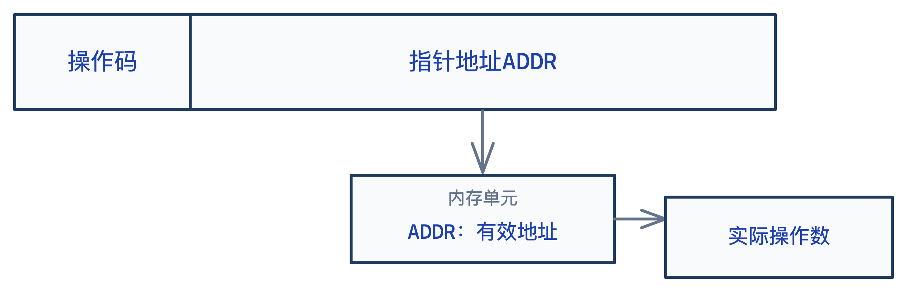

**格式示例**：
```
; 假设 (2000H) = 1234H（地址2000H处存放的是1234H）
; 假设 M[1234H] = 5678H
MOV AX, [[2000H]]   ; 先访问2000H得到1234H，再访问1234H得到5678H
```

**特点分析**：
- ✅ 可以灵活修改指针（修改2000H的内容即可改变最终操作数地址）
- ✅ 适合处理指针、链表等动态数据结构
- ❌ 访问内存次数多，速度慢（需要**两次访问内存**）
- **适用场景**：指针操作、动态数据结构遍历

### 4.3.4 寄存器寻址（Register Addressing）

**特点**：操作数存放在**寄存器**中，指令中给出寄存器编号。


**格式示例**：
```
MOV AX, BX      ; 将BX的内容送入AX
ADD AX, CX      ; 将CX的内容加到AX
```

**特点分析**：
- ✅ **最快**！不需要访问内存，寄存器访问速度远高于内存
- ❌ 寄存器数量有限

### 4.3.5 寄存器间接寻址（Register Indirect Addressing）

**特点**：寄存器中存放的是**操作数的地址**，而不是操作数本身。

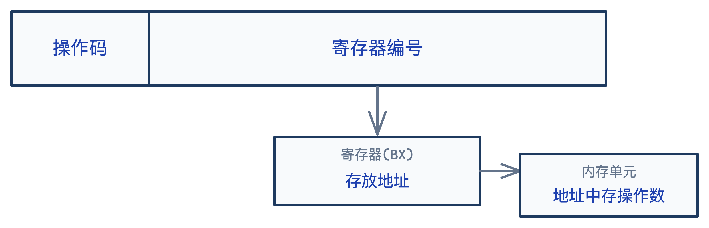

**格式示例**：
```
; 假设 BX = 2000H
MOV AX, [BX]    ; 将BX指向的内存单元的数据送入AX
; 相当于 AX ← M[BX]
```

**特点分析**：
- ✅ 结合了寄存器和间接寻址的优点，速度较快
- ✅ 可以通过修改寄存器内容来访问不同地址
- **适用场景**：数组遍历、表格查找

### 4.3.6 基址寻址（Base Addressing）

**特点**：将**基址寄存器**的内容与指令中给出的**偏移量**相加得到有效地址。

```
有效地址 EA = 基址寄存器(BR) + 位移量 Disp
```


**格式示例**：
```
; 假设基址寄存器BX = 1000H，指令中位移量 = 200H
MOV AX, [BX + 200H]   ; 有效地址 = 1000H + 200H = 1200H
```

**特点分析**：
- ✅ 基址寄存器可以动态改变，实现程序的**可重定位**
- ✅ 适合多道程序环境，每个程序有不同的基址
- **适用场景**：程序加载、数组首地址不固定的情况

> **扩展**：基址寻址与间接寻址结合 → **基址间接寻址**

### 4.3.7 变址寻址（Indexed Addressing）

**特点**：将**变址寄存器**的内容与指令中给出的**偏移量**相加得到有效地址。

```
有效地址 EA = 变址寄存器(IX) + 位移量 Disp
```

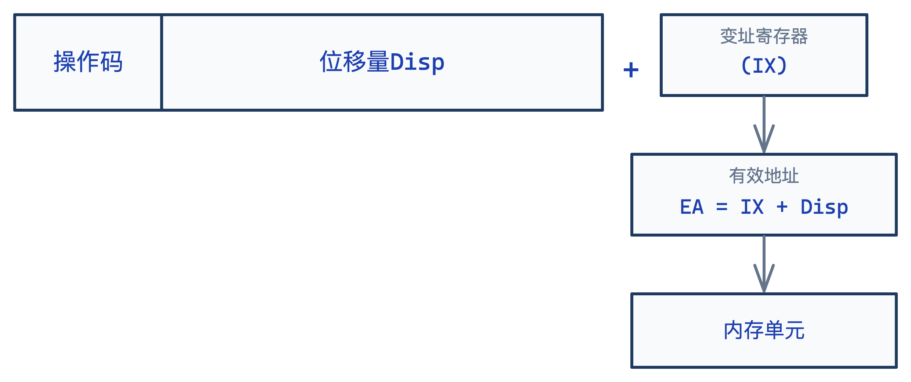

**格式示例**：
```
; 假设变址寄存器SI = 100H，数组起始地址 = 1000H
MOV AX, [SI + 1000H]   ; 访问数组第SI个元素
```

**特点分析**：
- ✅ 通过修改变址寄存器可以方便地遍历数组
- ✅ 适合处理 **顺序访问的数据结构**（如数组、表格）
- **典型应用**：数组元素顺序访问

> **基址寻址 vs 变址寻址**：
> - **基址寻址**：基址不变，位移量变化 → 适合程序重定位
> - **变址寻址**：位移量不变，基址（变址）变化 → 适合数组遍历

### 4.3.8 相对寻址（Relative Addressing）

**特点**：将**程序计数器PC**的当前值与指令中给出的**偏移量**相加得到有效地址。

```
有效地址 EA = PC(当前) + 位移量 Disp
```

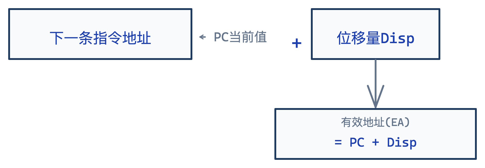

**格式示例**：
```
; 假设当前PC = 2000H，位移量 = +10H
JMP +10H      ; 跳转到 2000H + 10H = 2010H
```

**特点分析**：
- ✅ 与程序位置无关，程序可**浮动**（可重定位）
- ✅ 适合**分支跳转**和**循环控制**
- ✅ 节省指令存储空间（位移量通常比绝对地址短）
- **典型应用**：条件跳转、无条件跳转、调用子程序

### 4.3.9 寻址方式对比总结

| 寻址方式 | 操作数位置 | 访问内存次数 | 特点 |
|---------|-----------|-------------|------|
| 立即寻址 | 指令中 | 0 | 操作数固定，速度最快 |
| 直接寻址 | 内存 | 1 | 地址固定，简单直观 |
| 间接寻址 | 内存 | 2 | 灵活，但速度慢 |
| 寄存器寻址 | 寄存器 | 0 | 速度最快 |
| 寄存器间接寻址 | 内存 | 1 | 灵活，可变地址 |
| 基址寻址 | 内存 | 1 | 适合程序重定位 |
| 变址寻址 | 内存 | 1 | 适合数组遍历 |
| 相对寻址 | 内存 | 1 | 与位置无关，适合跳转 |

---

## 4.4 RISC与CISC

### 4.4.1 CISC（Complex Instruction Set Computer）- 复杂指令集计算机

**设计思想**：尽可能用复杂的指令完成更多功能，减少程序中指令的数量。

**特点**：
- 指令系统庞大，指令数量多（200条以上）
- 指令长度不固定，格式多样
- 大部分指令需要多个时钟周期完成
- 寻址方式种类繁多
- 各种复杂指令直接硬件实现
- **微程序控制**为主

**代表架构**：x86（Intel/AMD）、VAX

**优点**：
- 程序员可以用较少的指令完成较复杂的任务
- 编译器设计相对简单
- 兼容性好

**缺点**：
- 指令复杂，硬件实现困难
- 指令执行时间长，速度慢
- 很多复杂指令很少使用
- 难以进行流水线优化

### 4.4.2 RISC（Reduced Instruction Set Computer）- 精简指令集计算机

**设计思想**：简化指令系统，只保留最常用的基本指令，通过组合简单指令实现复杂功能。

**特点**：
- 指令数量少（通常少于100条）
- 指令长度固定，格式规整
- 大部分指令在**一个时钟周期**内完成
- 寻址方式少（通常2-3种）
- **硬布线控制**为主
- 强调**流水线**技术
- 加载/存储型指令（算术运算只在寄存器间进行）

**代表架构**：ARM、MIPS、RISC-V、PowerPC

**优点**：
- 指令简单，执行速度快
- 易于实现流水线
- 硬件设计相对简单
- 可靠性高

**缺点**：
- 程序可能需要更多指令
- 对编译器要求高
- 不兼容原有系统

### 4.4.3 RISC与CISC对比

| 特性 | CISC | RISC |
|-----|-----|-----|
| 指令数量 | 多（200+） | 少（<100） |
| 指令长度 | 变长 | 固定 |
| 指令周期 | 多周期 | 单周期 |
| 寻址方式 | 丰富 | 简单 |
| 控制方式 | 微程序 | 硬布线 |
| 寄存器数量 | 少 | 多 |
| 内存访问 | 多种指令可访问 | 仅Load/Store |
| 流水线 | 难实现 | 易于实现 |
| 典型代表 | x86 | ARM, MIPS |

### 4.4.4 现代发展趋势

当前处理器发展呈现**融合趋势**：

1. **CISC向RISC学习**：x86处理器内部将CISC指令转换为RISC微操作（μOps）
2. **RISC增强功能**：加入更多寻址方式和特权指令
3. **超标量流水线**：现代CPU普遍采用多发射流水线
4. **混合架构**：如Apple M系列芯片结合两者优点

---

## 4.5 指令格式设计

### 4.5.1 设计原则

1. **指令规整**：指令长度统一，格式规整
2. **操作码优化**：操作码长度最短化，使用哈夫曼编码
3. **地址码优化**：根据需要选择合适的寻址方式
4. **兼容性**：考虑未来扩展需求

### 4.5.2 指令字长选择

**固定字长** vs **可变字长**：

| 类型 | 优点 | 缺点 |
|-----|-----|-----|
| 固定字长 | 易于取指、译码 | 可能浪费空间 |
| 可变字长 | 节省空间 | 译码复杂 |

**常见选择**：
- 早期小型机：16位
- 微型机：32位
- 现代处理器：32位或64位

### 4.5.3 操作码设计

**定长操作码**：


- 简单，译码快
- 最多支持256条指令

**扩展操作码**：


- 更灵活，可支持更多指令

---

## 4.6 常见指令格式示例（以MIPS为例）

MIPS是一种经典的RISC架构，其指令格式规整统一。

### 4.6.1 三种指令格式

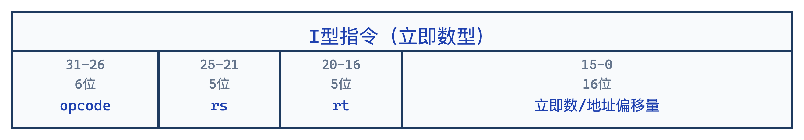

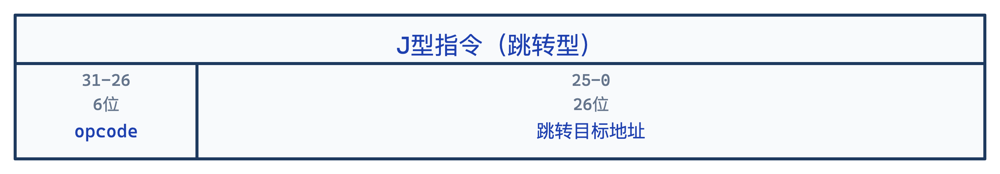

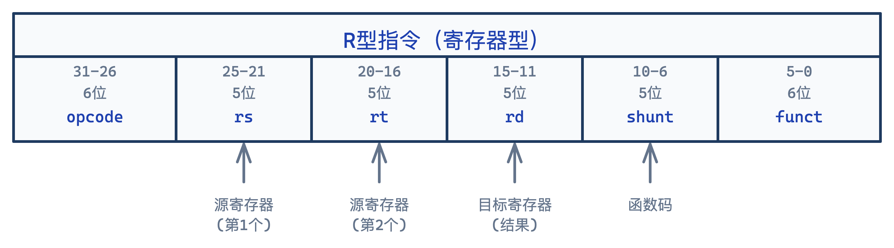

---

## 4.7 例题

### 作业p147 - 6

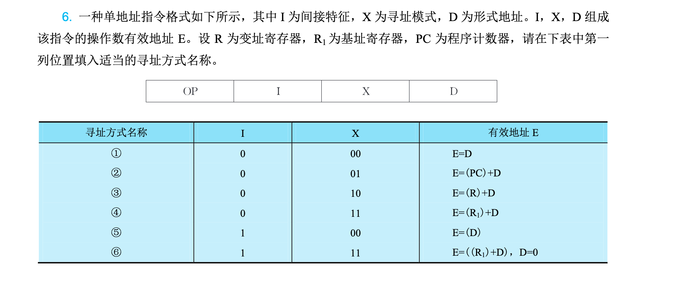


题目中 $I$ 表示是否间接寻址（$I=0$ 直接，$I=1$ 间接），$X$ 表示寻址模式。我们要根据**有效地址 $E$** 的计算公式，反推其寻址方式的名称。

##### 🛠️ 思路拆解与核心概念

##### ① $E = D$

* **特点**：有效地址就等于指令中的形式地址 $D$，不需要经过任何寄存器，也不需要查内存。
* **结论**：这是最基础的 **直接寻址**。

##### ② $E = (PC) + D$

* **特点**：以程序计数器 $PC$ 的当前值作为基准，加上偏移量 $D$。这种寻址方式常用于跳转指令，方便程序进行局部迁移。
* **结论**：由于是相对于 $PC$ 的位置，称为 **相对寻址**。

##### ③ $E = (R) + D$

* **特点**：题目明确说了 $R$ 为**变址寄存器**。变址寻址的特点是寄存器的内容（$R$）由用户或程序随时改变，而形式地址 $D$ 作为固定的首地址。
* **结论**：**变址寻址**。

##### ④ $E = (R_1) + D$

* **特点**：题目明确说了 $R_1$ 为**基址寄存器**。基址寻址的特点是基址寄存器的内容（$R_1$）由操作系统或硬件固化（通常存放程序在内存中的起点），而形式地址 $D$ 作为可变的偏移量。
* **结论**：**基址寻址**。

##### ⑤ $E = (D)$

* **特点**：此时 $I=1$。有效地址等于形式地址 $D$ 指向的内存单元**里存放的内容**。也就是要先去内存查一次地址，才能拿到真正的有效地址。
* **结论**：**间接寻址**（或称 **一次间接寻址**）。

##### ⑥ $E = ((R_1) + D)$ 且 $D = 0$

* **特点**：将这两项结合看：
* 括号里面 $(R_1) + D$ 本身是**基址寻址**的算式。
* 最外层又加了一个括号 $( \dots )$，说明在算出基址物理地址后，还要去该内存单元**间接**取一次实际的有效地址。
* 题目补充条件 $D=0$，说明有效地址简化为了 $((R_1))$，即通过基址寄存器里的内容进行间接访问。


* **结论**：**基址间接寻址**（或称 **间接基址寻址**）。


##### 💡 寻址方式对齐答案与解析：

| 序号 | 寻址方式名称 | $I$ | $X$ | 有效地址 $E$ | 核心大白话物理意义 |
| --- | --- | --- | --- | --- | --- |
| **①** | **直接寻址** | 0 | 00 | $E = D$ | 形式地址就是最终要找的物理内存地址。 |
| **②** | **相对寻址** | 0 | 01 | $E = (PC) + D$ | 以当前程序执行位置 $PC$ 为基准进行偏移。 |
| **③** | **变址寻址** | 0 | 10 | $E = (R) + D$ | 常用于循环和数组，通过变址寄存器 $R$ 自动累加。 |
| **④** | **基址寻址** | 0 | 11 | $E = (R_1) + D$ | 用于多道程序在内存中浮动分配，基址由系统锁定。 |
| **⑤** | **间接寻址** | 1 | 00 | $E = (D)$ | 地址嵌套，形式地址 $D$ 存放的是“存放有效地址的地址”。 |
| **⑥** | **基址间接寻址**<br><br>(或间接基址寻址) | 1 | 11 | $E = ((R_1) + D)$, $D=0$ | 先进行基址加法，再对得到的内存单元进行间接寻址。 |

##### 📌 考研答题避坑口诀

1. 看到 **$(PC)$** $\rightarrow$ 无脑判定为 **相对寻址**。
2. 看到 **变址/基址寄存器** $\rightarrow$ 对应 **变址/基址寻址**。
3. 最外层多套了一个 **`()`** $\rightarrow$ 代表多了一次 **间接寻址** 的动作。

---

### 作业p148 - 12

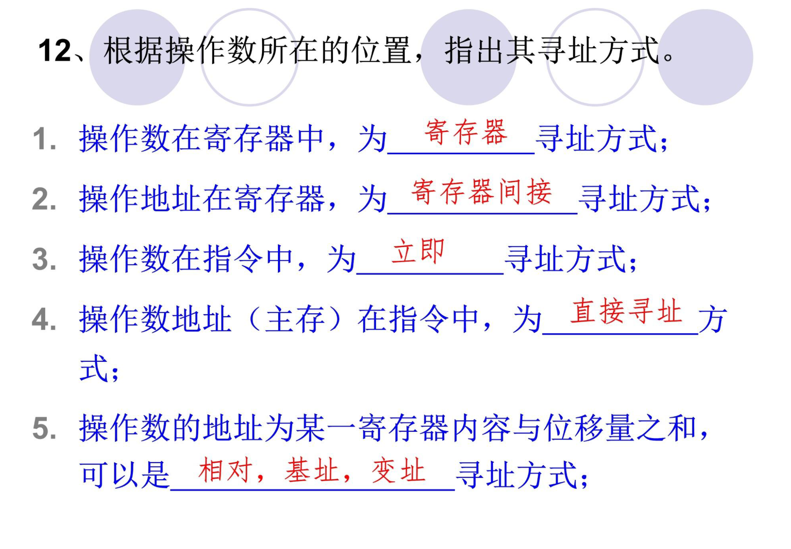

---


### 例题1：寻址方式识别

**题目**：指出下列各指令的寻址方式
1. `MOV AX, 2000H`
2. `MOV AX, [2000H]`
3. `MOV AX, BX`
4. `MOV AX, [BX]`
5. `MOV AX, [BX + 200H]`

**解答**：
1. **立即寻址** - 操作数2000H直接存在于指令中
2. **直接寻址** - 指令中给出内存地址2000H
3. **寄存器寻址** - 操作数在BX寄存器中
4. **寄存器间接寻址** - BX中存放的是操作数的地址
5. **基址寻址** - 有效地址 = BX + 200H

### 例题2：有效地址计算

**题目**：假设有以下寄存器内容：
- BX = 1000H
- SI = 0200H
- BP = 0300H
- 内存单元[1200H] = 5678H

求下列指令操作数的有效地址和操作数：
1. `MOV AX, [BX + 200H]`
2. `MOV AX, [SI + 1000H]`
3. `MOV AX, [BP]`

**解答**：
1. EA = BX + 200H = 1000H + 200H = 1200H
    操作数 = [1200H] = 5678H
2. EA = SI + 1000H = 0200H + 1000H = 1200H
   操作数 = [1200H] = 5678H
3. EA = BP = 0300H
   操作数 = [0300H]（需查内存）

### 例题3：RISC vs CISC特点分析

**题目**：分析RISC指令系统应采用什么寻址方式？为什么？

**解答**：
RISC指令系统应**主要采用简单寻址方式**，原因如下：

1. **简化硬件设计**：简单寻址方式（如寄存器寻址、立即寻址）硬件实现简单，易于硬布线控制
2. **提高执行速度**：RISC强调单周期执行，复杂寻址方式会增加时钟周期
3. **便于流水线**：简单寻址方式便于实现流水线，减少数据相关
4. **更多使用寄存器**：RISC有大量寄存器，算术运算主要在寄存器间进行，减少对复杂寻址的需求
5. **Load/Store架构**：只有 load 和 store 指令访问内存，其他指令只在寄存器上操作

**总结**：RISC主要采用寄存器寻址、立即寻址、寄存器间接寻址等简单方式，避免使用间接寻址等复杂方式。

### 例题4：相对寻址计算

**题目**：某计算机采用相对寻址方式，假设：
- 当前指令地址为 2000H
- 指令中的位移量为 +10H（用补码表示）
- 指令长度为2字节

求该指令执行后的跳转目标地址。

**解答**：

相对寻址的目标地址 = PC(下一条指令地址) + 位移量

当前指令地址 = 2000H
指令长度 = 2字节
所以下一条指令地址（PC） = 2000H + 2 = 2002H

目标地址 = 2002H + 10H = 2012H

### 例题5：指令格式设计

**题目**：某计算机指令字长16位，地址码为6位。请设计：
1. 零地址指令的条数
2. 一地址指令的条数
3. 二地址指令的条数

**解答**：

指令字长 = 16位
地址码 = 6位（每个地址）

1. **零地址指令**：所有位都是操作码
   - 操作码位数 = 16位
   - 条数 = 2^16 = 65536条

2. **一地址指令**：1个地址码 + 操作码
   - 地址码占用：6位
   - 操作码位数 = 16 - 6 = 10位
   - 条数 = 2^10 = 1024条

3. **二地址指令**：2个地址码 + 操作码
   - 地址码占用：6 × 2 = 12位
   - 操作码位数 = 16 - 12 = 4位
   - 条数 = 2^4 = 16条

---

## 本章小结

1. **机器指令**由操作码和地址码组成，按地址码数量可分为零地址、一地址、二地址、三地址指令

2. **指令操作类型**包括：数据传送、算术运算、逻辑运算、移位操作、控制转移

3. **寻址方式**是本章重点：
   - 立即寻址：操作数在指令中
   - 直接寻址：操作数在内存
   - 寄存器寻址：操作数在寄存器
   - 间接寻址：地址的地址
   - 寄存器间接寻址：寄存器中存地址
   - 基址寻址：基址寄存器 + 位移
   - 变址寻址：变址寄存器 + 位移
   - 相对寻址：PC + 位移

4. **RISC vs CISC**：RISC强调指令精简、规整、易于流水线；CISC强调指令功能强大、兼容性好