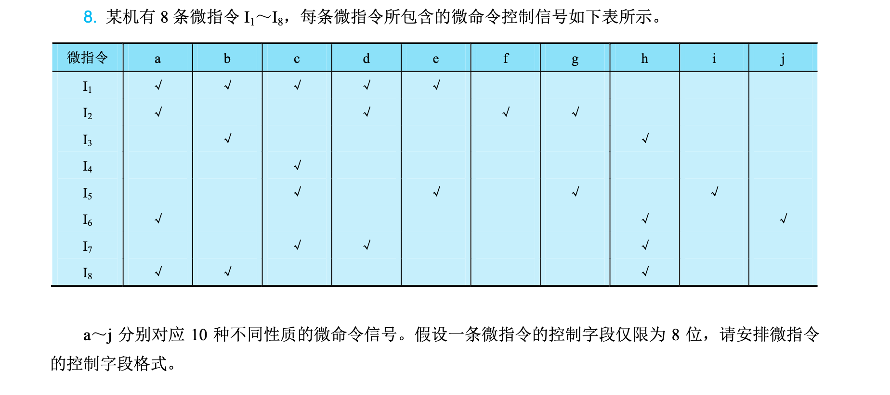
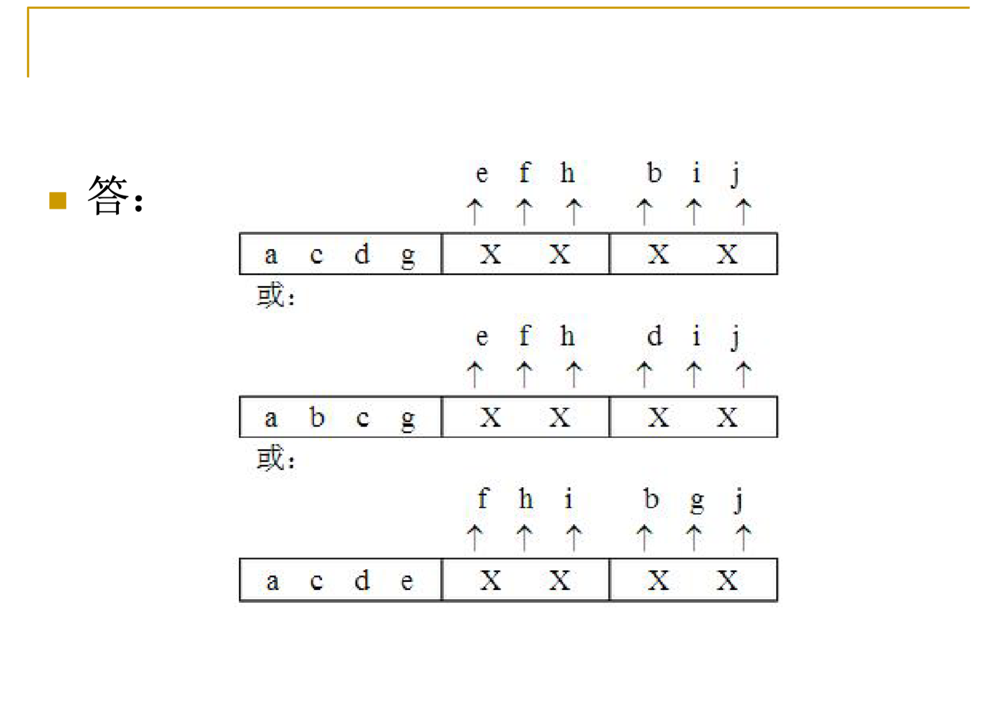
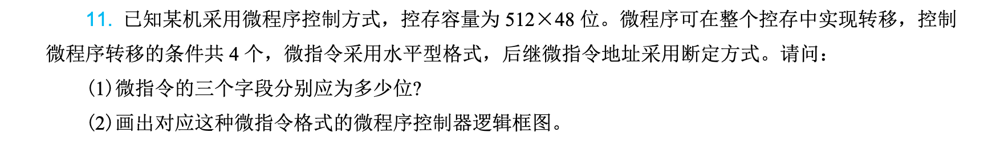
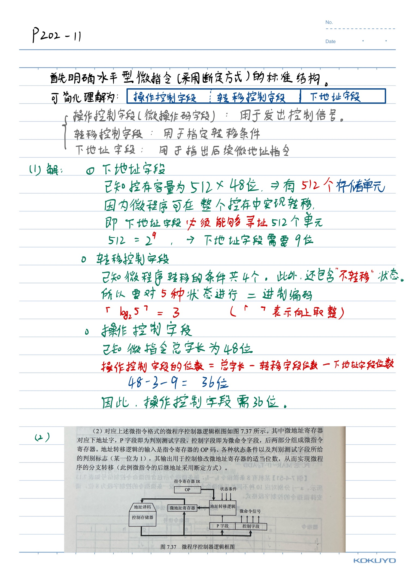
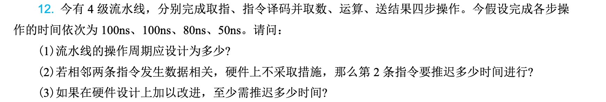
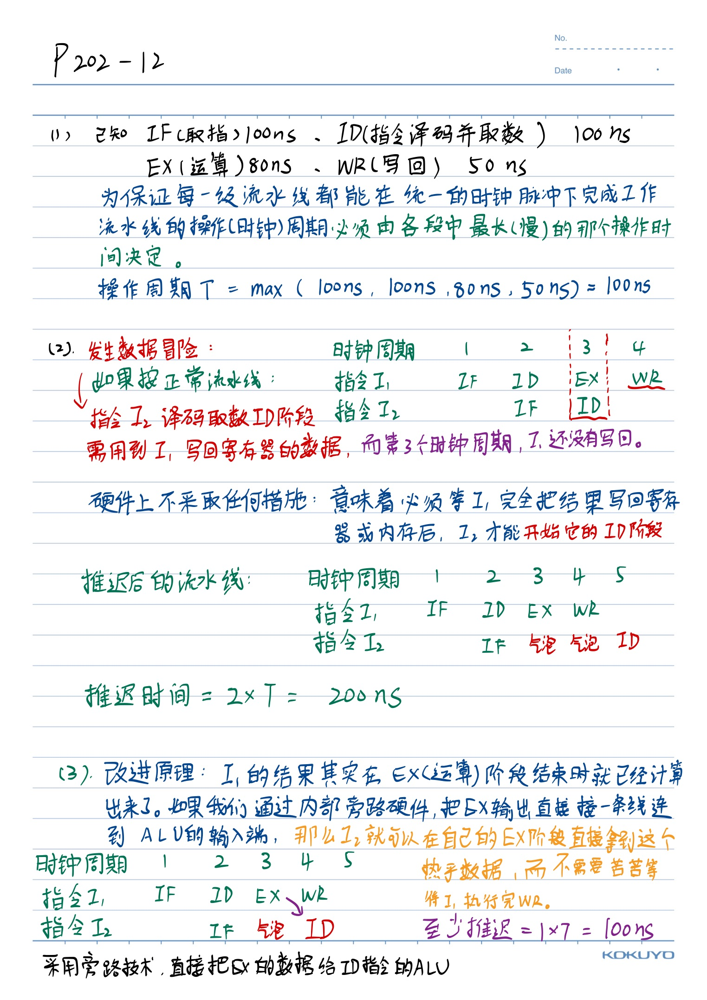
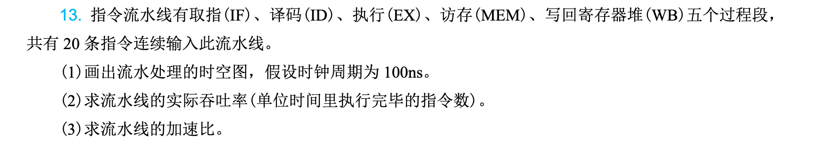
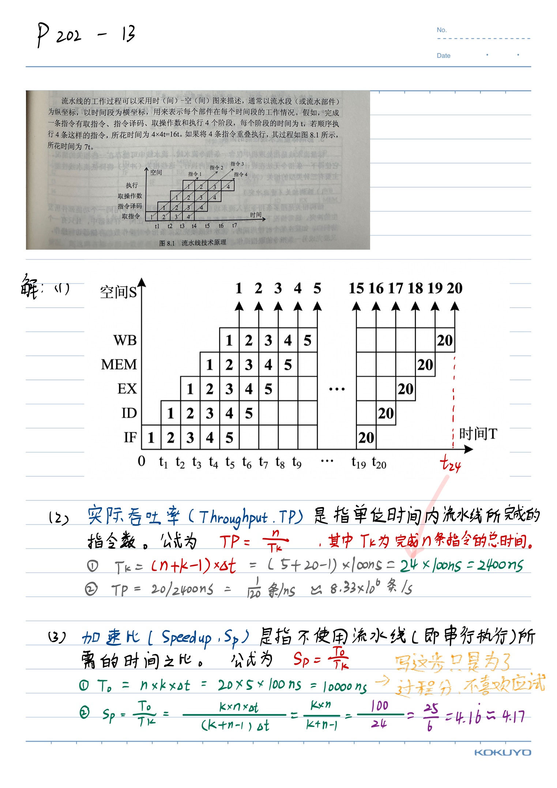

# 第5章：中央处理器

!!! note
    [ppt](./resources/第5章-中央处理器-20260415.pdf)

中央处理器（Central Processing Unit，CPU）是计算机的核心部件，负责执行指令和控制整个计算机系统的运行。本章从处理器基本结构入手，深入分析指令执行过程、数据通路设计、流水线技术以及控制单元的实现方式，最后通过典型处理器的分析，帮助读者理解现代计算机处理器的设计原理与实现技术。

**本章要点：**

- 处理器数据通路的组成与时钟控制
- 指令流水线的基本概念与实现
- 流水线冒险的类型与处理方法
- 处理器控制方式（硬布线与微程序）
- 典型处理器的结构与特点

## 5.1 处理器数据通路与时钟

### 5.1.1 处理器的功能与组成

处理器是计算机系统的核心，负责解释和执行指令。根据冯·诺依曼结构的规定，程序和数据都存储在存储器中，处理器从存储器中取出指令、分析指令并执行指令，完成各种算术逻辑运算和数据传输操作。

处理器主要由以下几个部分组成：

**1. 运算单元**

运算单元是处理器的执行核心，负责完成各种算术运算和逻辑运算。主要包括：

- 算术逻辑单元（ALU）：执行加、减、乘、除等算术运算，以及与、或、非、异或等逻辑运算
- 移位器：对数据进行移位操作，包括算术移位、逻辑移位和循环移位
- 乘除法器：专门处理乘法和除法运算（在简单处理器中可能由ALU通过多次加法实现）

**2. 寄存器组**

寄存器是处理器内部的高速存储单元，用于暂存指令操作数、中间结果和控制信息。典型处理器包含以下寄存器：

- 通用寄存器：存放程序运行过程中的临时数据
- 专用寄存器：具有特定用途，如程序计数器（PC）、指令寄存器（IR）、状态标志寄存器（FLAGS）等
- 堆栈指针（SP）：指向调用栈的顶端，用于函数调用和返回

**3. 控制单元**

控制单元负责协调各部件工作，产生控制信号序列以完成指令的执行。控制单元根据指令操作码生成相应的控制信号，控制数据通路中各多路选择器、寄存器的读写操作以及ALU的运算类型。

**4. 时钟与定时电路**

时钟电路为处理器提供统一的时钟信号，决定各部件的工作节奏。处理器的性能很大程度上取决于时钟频率的高低。

### 5.1.2 处理器数据通路

数据通路（Datapath）是处理器中数据流动的路径，包括寄存器、运算单元、总线等部件。数据通路的设计直接影响处理器的性能和实现复杂度。

**1. 单周期数据通路**

最简单的设计是每个指令在一个时钟周期内完成执行。这种单周期（Single-cycle）数据通路的特点是：

- 时钟周期必须足够长，以容纳最复杂的指令（如乘法或除法指令）
- 每条指令执行完毕后才能开始下一条指令
- 硬件利用率较低，但控制逻辑简单

图5-1给出了一个简化的单周期MIPS处理器数据通路。该数据通路包含指令存储器、数据存储器、寄存器堆、ALU以及必要的控制线路。指令从指令存储器取出后，经过译码产生控制信号，控制数据通路中各部件的操作。

**2. 多周期数据通路**

为了提高硬件利用率，可以将指令执行分解为多个时钟周期，每个周期完成一部分工作。这种多周期（Multi-cycle）数据通路的特点是：

- 时钟周期较短，只需满足基本操作的时间需求
- 不同指令需要不同数量的周期完成
- 通过复用硬件部件减少资源消耗
- 控制逻辑相对复杂，需要状态机协调

多周期数据通路中，一个典型指令的执行过程包括：取指（Fetch）、译码（Decode）、执行（Execute）、访存（Memory Access）和写回（Write Back）五个阶段。

**3. 流水线数据通路**

流水线（Pipeline）技术将指令执行分为多个阶段，使多条指令能够同时处于不同执行阶段，从而提高指令吞吐率。流水线数据通路是现代处理器广泛采用的设计技术，将在5.2节详细讨论。

### 5.1.3 时钟与时序控制

时钟信号是处理器正常工作的基础，决定了各部件何时进行数据采样和状态更新。

**1. 时钟周期**

时钟周期（Clock Cycle）是处理器最基本的时间单元，由时钟信号的上升沿或下降沿定义。一个时钟周期内，处理器完成部分数据传送或处理操作。

时钟周期的选择需要考虑：

- 最长组合逻辑路径的延迟
- 寄存器建立时间和保持时间
- 时钟偏斜（Clock Skew）的影响
- 处理器功耗与发热

**2. 同步时序与异步时序**

处理器通常采用同步时序设计，所有操作都在时钟边沿同步进行。这种设计的优点是：

- 易于设计与调试
- 数字电路可靠性高
- 可以进行时序分析

异步时序在某些特定场景下使用，如处理器与外设的握手通信、高速缓存的一致性协议等。

**3. 流水线寄存器**

在流水线处理器中，各阶段之间需要设置流水线寄存器（Pipeline Register）来暂存阶段间的数据。流水线寄存器的设计需要考虑：

- 正确的时序控制，确保数据在时钟边沿正确传递
- 适当的寄存器级数，平衡各阶段的工作量
- 减少寄存器输出到输入的延迟，提高工作频率

### 5.1.4 指令执行过程

指令的执行过程涉及多个操作步骤，需要各硬件部件协同工作。以MIPS指令为例，说明指令的执行过程。

**1. 取指阶段（Instruction Fetch，IF）**

- 将程序计数器（PC）的值发送到指令存储器地址端口
- 从指令存储器中读取指令
- PC更新为下一条指令的地址（PC+4）

取指阶段需要使用的部件包括：PC寄存器、指令存储器、加法器（计算PC+4）。

**2. 译码阶段（Instruction Decode，ID）**

- 从指令中解析出操作码（Opcode）和寄存器字段
- 读取寄存器堆中的操作数
- 进行指令译码，产生控制信号

译码阶段需要使用的部件包括：指令寄存器（IR）的高位、寄存器堆、立即数扩展模块、控制单元。

**3. 执行阶段（Execute，EX）**

- ALU执行运算：算术逻辑运算、地址计算或分支目标计算
- 根据运算结果判断分支是否成立

执行阶段需要使用的部件包括：ALU、立即数扩展单元。

**4. 访存阶段（Memory Access，MEM）**

- 对于访存指令，访问数据存储器
- 对于分支指令，若条件成立则更新PC

访存阶段需要使用的部件包括：数据存储器、PC选择器。

**5. 写回阶段（Write Back，WB）**

- 将运算结果或访存结果写回寄存器堆

写回阶段需要使用的部件包括：寄存器堆的写端口、多路选择器。

图5-2给出了MIPS指令执行各阶段使用的主要硬件部件。

## 5.2 指令流水线

### 5.2.1 流水线技术概述

流水线是一种将重复性工作分解为多个相互关联的子任务的技术，每个子任务由专门的部件处理。处理器采用流水线技术后，多条指令可以同时执行，只是处于不同的执行阶段。

**1. 流水线的基本原理**

以洗衣店的工作为例说明流水线的思想：

传统方式（单周期处理器）：一个人完成洗、甩干、熨烫、叠放的整个过程，然后下一批衣服才能开始。这种方式效率低下，硬件利用率不高。

流水线方式（流水线处理器）：建立多条工作线，不同批次的衣服在不同阶段同时处理。第一批衣服进入熨烫阶段时，第二批衣服正在进行甩干，第三批衣服正在洗涤。这样在稳定状态下，每个时钟周期都有一批衣服完成处理。

处理器指令流水线的原理类似。将指令执行分为取指（IF）、译码（ID）、执行（EX）、访存（MEM）、写回（WB）五个阶段，每个阶段由专门的硬件部件负责。在理想情况下，流水线处理器可以在每个时钟周期完成一条指令，吞吐量是非流水线处理器的五倍。

**2. 流水线的时空图**

流水线的性能可以用时空图（Space-Time Diagram）直观表示。时空图的横轴表示时间（时钟周期），纵轴表示流水线的各个阶段。

图5-3展示了五级流水线在连续执行多条指令时的时空图。从图中可以看出：

- 在流水线充满之前，存在填充阶段
- 流水线充满后，每个周期都有一条指令完成
- 理想情况下，n条指令的执行时间为：填充时间 + (n-1) × 周期时间 = 5 + (n-1)个周期

**3. 流水线的性能指标**

流水线的性能主要用以下指标衡量：

- **吞吐率（Throughput）**：单位时间内完成的指令数量。理想情况下，k级流水线的吞吐率为1/周期时间，即非流水线时代的k倍。

- **加速比（Speedup）**：流水线处理器与非流水线处理器执行相同数量指令的时间比值。理想情况下的最大加速比为k（流水线级数）。

- **效率（Efficiency）**：实际加速比与理想加速比的比值，反映流水线中硬件的利用程度。由于填充和清空阶段的存在，实际效率通常低于100%。

### 5.2.2 经典五级流水线

经典的五级流水线是RISC处理器广泛采用的结构，将指令执行分为五个阶段。

**1. IF（取指）**

从指令存储器中取出指令，同时计算PC+4，为取下一条指令做准备。对于分支指令，可能需要根据分支结果修改PC。

主要硬件：PC寄存器、指令存储器、加法器。

**2. ID（译码/读寄存器）**

- 指令译码，解析操作码和功能码
- 读取寄存器堆中的操作数
- 立即数符号扩展或零扩展
- 产生控制信号

主要硬件：指令译码器、寄存器堆、立即数扩展单元、控制单元。

**3. EX（执行/有效地址计算）**

- ALU执行算术或逻辑运算
- 计算访存有效地址
- 计算分支目标地址并判断分支条件

主要硬件：ALU、零标志检测器、分支目标加法器。

**4. MEM（访存）**

- 对数据存储器进行读/写操作
- 对于分支指令，若条件成立则更新PC

主要硬件：数据存储器、PC选择器。

**5. WB（写回）**

- 将运算结果或从存储器读出的数据写回寄存器堆

主要硬件：寄存器堆写端口。

图5-4给出了经典五级流水线的结构框图。各阶段之间设置了流水线寄存器（IF/ID、ID/EX、EX/MEM、MEM/WB），用于保存各阶段产生的需要传递到后续阶段的信息。

### 5.2.3 流水线冒险

流水线冒险（Pipeline Hazard）是指指令流水线无法按照理想方式工作的情况。由于指令间存在相关性或资源冲突，某些指令必须暂停等待，从而降低流水线效率。

**1. 结构冒险（Structural Hazard）**

结构冒险是指硬件资源不足以支持所有指令组合同时执行的情况。例如：
- 同一时刻，一条指令需要访问指令存储器，另一条指令需要访问数据存储器
- 同一时刻，两条指令都需要写寄存器堆

解决方案：
- 分离指令存储器和数据存储器（如采用Harvard架构）
- 分时复用寄存器堆的写端口
- 增加硬件资源

**2. 数据冒险（Data Hazard）**

数据冒险是指指令之间存在数据依赖关系，后一条指令需要使用前一条指令的结果，但结果尚未计算完成。主要有三种类型：

**读后写（Read After Write，RAW）**：也称真实数据依赖。后一条指令需要读取前一条指令写入的数据，但前一条指令尚未完成写回。这是必须处理的冒险。

例如：
```
ADD R1, R2, R3    # R1 = R2 + R3
SUB R4, R1, R5    # R4 = R1 - R5
```

 第二条指令需要读取R1的值，但第一条指令的R1结果尚未写回。

**写后读（Write After Read，WAR）**：也称反相关。后一条指令需要写入的寄存器是前一条指令要读取的寄存器，但前一条指令还未读完。

在按序流水线中，WAR冒险不会发生，因为指令按序发射和完成。

**写后写（Write After Write，WAW）**：也称输出相关。两条指令都向同一寄存器写入数据，后一条指令应该先于前一条指令完成写入。

在按序流水线中，WAW冒险不会发生。

**3. 控制冒险（Control Hazard）**

控制冒险是由于分支指令和跳转指令造成的。当执行到分支指令时，流水线需要确定下一条指令的地址，但在分支条件判断完成之前，后续指令已经进入流水线。

图5-5给出了分支指令对流水线的影响。分支目标在EX阶段才能确定，但IF阶段已经取走了后续指令。

### 5.2.4 流水线冒险的处理

**1. 停顿（Stall）**

最简单的处理方法是插入气泡（Bubble），使后续指令暂停执行。停顿会导致流水线效率下降，但实现简单。

图5-6展示了数据冒险导致的停顿。在RAW冒险中，需要插入2个时钟周期的停顿，等待前一条指令完成写回。

停顿的实现方式是在流水线寄存器中插入空操作（NOP），同时停止向流水线寄存器输入新的指令。

**2. 转发（Forwarding）**

转发技术也称为旁路（Bypassing），将计算结果直接从一个阶段转发到另一个阶段，而不需要等待结果写回寄存器堆。

例如，在五级流水线中，ALU的计算结果在EX阶段末尾产生，可以直接转发到下一条指令的EX阶段，而不需要等待结果写回MEM/WB寄存器。

图5-7展示了使用转发技术处理RAW冒险的流水线时序。通过从EX/MEM和MEM/WB寄存器中获取数据，避免了大部分数据冒险导致的停顿。

**3. 加载互锁（Load Interlock）**

加载指令的结果在MEM阶段才从数据存储器中读出，无法通过转发解决。对于紧跟在加载指令之后的指令，可能存在数据冒险，需要插入停顿。

```
LW R1, 0(R2)     # 加载指令，在MEM阶段才能得到结果
ADD R3, R1, R4   # 需要R1的值，但此时加载尚未完成
```

这种加载互锁需要硬件检测并插入停顿，直到加载完成。

**4. 分支预测（Branch Prediction）**

分支预测是解决控制冒险的主要技术，包括：

- **静态分支预测**：预测分支永远不发生或永远发生。简单但准确率低。
- **动态分支预测**：根据历史行为预测，包括：

  - 1位预测器：根据上次分支结果预测
  - 2位饱和计数器：使用2位计数器记录分支历史，避免偶尔的错误预测影响过多
  - 全局历史预测器：结合全局分支历史进行预测
  - 本地历史预测器：记录每个分支自己的历史

**5. 延迟分支（Delayed Branch）**

延迟分支技术将分支指令与分支延迟槽（Delay Slot）结合。延迟槽中的指令无论分支是否发生都会执行，充分利用了流水线。

编译器负责调度延迟槽中的指令，通常选择：

- 调度分支前的指令
- 调度与分支无关的指令
- 调度循环中的指令

### 5.2.5 流水线优化技术

**1. 超标量（Superscalar）**

超标量处理器在每个时钟周期发射多条指令到流水线。典型配置包括2路、4路甚至更多路的超标量。

超标量处理器的挑战：

- 指令调度和并行性检测
- 多个执行单元的协调
- 乱序执行与按序提交

**2. 超长指令字（VLIW）**

超长指令字（Very Long Instruction Word）技术将多条指令打包成一个长指令字，由编译器负责指令调度和并行性分析。

优点：硬件简单，不需要动态调度
缺点：代码密度低，需要编译器完成复杂的依赖分析

**3. 动态流水线**

动态流水线允许指令乱序执行，通过硬件进行指令调度和资源分配。Intel Pentium 4处理器采用了动态流水线技术。

主要技术：

- 乱序执行（Out-of-Order Execution）
- 寄存器重命名（Register Renaming）
- 分支预测
- 指令调度

## 5.3 流水线冒险

### 5.3.1 数据冒险详解

数据冒险是流水线中最常见的冒险类型，深入理解其产生原因和处理方法对掌握处理器设计至关重要。

**1. RAW冒险的产生**

RAW冒险产生的原因是写后读的操作数在时间上存在重叠。当后一条指令需要读取前一条指令的目标寄存器，而前一条指令尚未完成写回时，就会产生RAW冒险。

考虑以下指令序列：
```
I1: ADD R1, R2, R3    # R1 ← R2 + R3
I2: SUB R4, R1, R5    # R4 ← R1 - R5
I3: AND R6, R1, R7    # R6 ← R1 & R7
```

在五级流水线中：

- I1的R1结果在第5个周期的WB阶段才写回
- I2在第3个周期的ID阶段需要读取R1，但R1尚未写回
- I3在第4个周期的ID阶段需要读取R1，但R1尚未写回

**2. 转发路径**

为了减少停顿，可以添加转发路径。处理器通常提供以下转发路径：

- **ALU结果转发**：从EX/MEM流水线寄存器（EX阶段输出）转发到后续指令的ALU输入
- **内存数据转发**：从MEM/WB流水线寄存器（MEM阶段输出）转发到后续指令的ALU输入
- **寄存器写回转发**：从寄存器堆的写端口输出转发到读端口输入

图5-8展示了完整的数据转发路径。通过这些转发路径，可以消除大部分RAW冒险导致的停顿。

**3. 加载指令的延迟**

加载指令（LW）的结果从数据存储器中读出，需要等到MEM阶段才能获得。即使使用转发技术，也无法直接满足后续指令对该数据的需求。

解决方法是检测加载-使用（Load-Use）冒险并插入停顿：
```
LW R1, 0(R2)     # MEM阶段才能得到R1
NOP              # 停顿
NOP              # 停顿
ADD R3, R1, R4   # 现在可以安全使用R1
```

硬件检测逻辑：检查当前指令的源寄存器是否与前一条加载指令的目标寄存器相同。

### 5.3.2 控制冒险详解

控制冒险主要来源于分支指令和跳转指令。准确预测分支行为并快速确定分支方向，是提高流水线效率的关键。

**1. 分支延迟槽**

早期RISC处理器（如MIPS）采用分支延迟槽技术。分支指令后的一条指令总是在分支目标或 fall-through路径之间进行选择。

编译器优化准则：

- 从循环中调度指令到延迟槽
- 从分支前调度指令到延迟槽
- 使用不影响程序结果的指令填充延迟槽

2. **分支预测器设计**

现代处理器采用更复杂的分支预测技术：

**BTB（Branch Target Buffer）**：缓存分支指令的目标地址，用于预测分支跳转方向和目标。

**2位饱和计数器**：每个分支对应一个2位计数器，状态转换如下：

- 强不跳转（00）→ 弱不跳转（01）→ 弱跳转（10）→ 强跳转（11）
- 预测错误时，计数器向相反方向移动两位

**全局历史寄存器（GHR）**：记录最近N次分支的结果，用于预测当前分支。典型的全局预测器将GHR与分支指令地址进行哈希，形成分支历史表（BHT）索引。

**局部历史表**：为每个分支保存其独立的历史记录，更准确地预测具有特定行为模式的分支。

**3. 混合分支预测器**

现代处理器采用多种预测器的组合：

- 采用局部历史预测器和全局历史预测器
- 使用选择器决定使用哪个预测器的结果
- 感知上下文切换，清空预测器状态

### 5.3.3 结构冒险与其他问题

**1. 结构冒险**

结构冒险发生在硬件资源不足时。典型情况包括：

- **访存冲突**：取指和访存同时发生
  
  - 解决方案：分离指令Cache和数据Cache（Harvard架构）
  
- **寄存器访问冲突**：同一周期既读又写
  
  - 解决方案：前半周期写，后半周期读；或设置多个写端口

**2. 时序问题**

- **时钟偏斜**：时钟信号到达不同触发器的时间存在差异，可能引起建立时间或保持时间违例
  
  - 解决：时钟树设计、加入缓冲器、采用同步设计
  
- **关键路径**：数据通路中最长的组合逻辑路径，决定最高工作频率
  
  - 解决：流水线分割、并行前缀计算、电路优化

**3. 功耗问题**

流水线级数增加会导致：

- 流水线寄存器数量增加，动态功耗上升
- 时钟网络功耗增加
- 泄漏功耗随晶体管数量增加而增加

现代处理器的功耗管理技术：

- 动态电压频率调节（DVFS）
- 时钟门控
- 功率门控

## 5.4 处理器控制方式

### 5.4.1 控制单元概述

控制单元（Control Unit，CU）是处理器的指挥中心，负责生成控制信号序列，协调数据通路各部件完成指令的执行。

控制单元的主要功能：

- 指令译码：解析指令操作码，确定指令类型
- 控制信号生成：根据指令类型和当前状态，产生相应的控制信号
- 流程控制：控制指令执行的顺序和流程

控制单元的实现方式主要有两种：硬布线控制（Hardwired Control）和微程序控制（Microprogrammed Control）。

### 5.4.2 硬布线控制

硬布线控制采用组合逻辑电路直接从操作码和状态产生控制信号。这种方式类似于组合逻辑电路，输出仅由当前输入决定。

**1. 设计方法**

硬布线控制的设计步骤：

1. 确定处理器的指令集
2. 为每条指令设计执行步骤（微操作）
3. 列出每个执行步骤中各部件的控制信号
4. 用布尔表达式描述各控制信号的逻辑
5. 用门电路实现组合逻辑

**2. 微操作**

微操作（Micro-operation）是处理器中最基本的不可分割的操作。常见的微操作包括：

- **寄存器传输微操作**：数据在寄存器间传输，如 `R1 ← R2`
- **ALU微操作**：算术逻辑运算，如 `ALU ← R1 + R2`
- **访存微操作**：存储器的读写，如 `MA ← PC`
- **转移微操作**：程序计数器修改，如 `PC ← BR`

**3. 控制信号示例**

以MIPS的R型指令为例，其执行过程如下：

| 阶段 | 微操作 | 控制信号 |
|------|--------|----------|
| IF | IR ← Mem[PC]，PC ← PC + 4 | PCSrc=0, MemRead, IRWrite, PCWrite, ALUSrcA=0, ALUSrcB=01, ALUOp=00 |
| ID | A ← Reg[rs], B ← Reg[rt] | RegDst=0, RegWrite, ALUSrcA=0, ALUSrcB=10, ALUOp=00 |
| EX | ALUOut ← A op B | ALUSrcA=1, ALUSrcB=00, ALUOp=10 |
| MEM | 无操作（仅R型不访存） | — |
| WB | Reg[rd] ← ALUOut | RegDst=1, RegWrite, MemtoReg=0 |

**4. 硬布线控制的优缺点**

优点：

- 执行速度快，控制信号生成延迟小
- 易于流水线实现，时序分析简单
- 适合RISC处理器

缺点：

- 设计复杂，尤其是指令集较大时
- 修改困难，新指令或新功能难以添加
- 控制逻辑的调试和验证困难

**5. 状态机实现**

硬布线控制通常用有限状态机（FSM）实现，包括：

- 取指状态：IF
- 译码状态：ID
- 执行状态：EX（根据指令类型有多个子状态）
- 访存状态：MEM
- 写回状态：WB

每个状态包含所有控制信号的输出值，状态转移由指令类型和标志位决定。

### 5.4.3 微程序控制

微程序控制采用存储技术，将控制信号序列存储在控制存储器（Control Memory）中，通过微指令的解释执行来产生控制信号。

**1. 基本原理**

微程序控制的核心思想是：将每条机器指令的执行过程分解为一系列微操作，每个微操作对应一条微指令，微指令序列存储在控制存储器中。

执行机器指令时：

1. 从控制存储器中取出微指令
2. 微指令解释产生控制信号
3. 执行微操作
4. 根据微指令的下址字段取出下一条微指令

**2. 微指令格式**

微指令包括两个主要字段：

- **控制字段**：直接产生控制信号，或选择产生控制信号的方式
- **下址字段**：指明下一条微指令的地址

微指令格式设计：

- 水平型微指令：每一位对应一个控制信号，效率高但微指令字长
- 垂直型微指令：编码表示微操作，字长短但执行速度慢

**3. 微程序结构**

微程序通常包括：

- 取指微程序：所有指令的公共操作
- 指令微程序：每条指令对应的微程序
- 中断处理微程序
- 异常处理微程序

**4. 顺序控制**

微程序的顺序控制方式：

- **顺序转移**：下址字段 = 当前地址 + 1
- **条件转移**：根据标志位或指令特征码选择下一地址
- **转子程序**：调用微子程序（微地址入栈）
- **返回**：微子程序返回

**5. 微程序控制的优缺点**

优点：

- 规整性好，设计相对简单
- 修改容易，指令集变更时只需修改微程序
- 调试方便，可以单步跟踪微指令执行

缺点：

- 执行速度慢，需要访问控制存储器
- 硬件成本高，需要额外的控制存储器
- 不适合高速处理器

现代CISC处理器（如x86）仍采用微程序控制，而RISC处理器通常采用硬布线控制。

### 5.4.4 两种控制方式的比较

| 特性 | 硬布线控制 | 微程序控制 |
|------|------------|------------|
| 执行速度 | 快 | 慢 |
| 设计难度 | 高 | 低 |
| 修改难度 | 高 | 低 |
| 可维护性 | 差 | 好 |
| 适用场景 | RISC处理器、高速处理器 | CISC处理器、复杂指令集 |
| 电路规模 | 组合逻辑较大 | 需要控制存储器 |
| 可靠性 | 较高 | 较低（控制存储器可能出错） |

现代处理器的控制单元设计趋向于结合两种方式的优点：

- 对于常用指令采用硬布线控制，保证速度
- 对于复杂指令或微码ROM可更新情况采用微程序控制，保持灵活性

## 5.5 典型处理器分析

### 5.5.1 简单处理器实例

以简化的MIPS处理器为例，说明处理器的实现方法。

**1. 数据通路设计**

简化MIPS数据通路包括：

- 指令存储器：存放程序代码
- 数据存储器：存放程序数据
- 寄存器堆：32个通用寄存器
- ALU：算术逻辑运算单元
- PC：程序计数器
- 必要的多路选择器和控制逻辑

支持的指令类型：

- R型：add, sub, and, or, slt
- I型：lw, sw, beq
- J型：j

**2. 控制信号设计**

主要的控制信号包括：

| 控制信号 | 功能 |
|----------|------|
| RegDst | 选择目标寄存器号（0=rt, 1=rd） |
| Jump | 是否为跳转指令 |
| Branch | 是否为分支指令 |
| MemRead | 读存储器信号 |
| MemtoReg | 写回数据选择（0=ALU结果, 1=存储器） |
| ALUOp | ALU操作选择 |
| MemWrite | 写存储器信号 |
| ALUSrc | ALU第二操作数选择（0=寄存器, 1=立即数） |
| RegWrite | 写寄存器信号 |

**3. ALU控制**

ALU需要根据指令类型和功能码确定操作：

| 指令 | ALUOp | 功能码 | ALU操作 |
|------|-------|--------|----------|
| add | 00 | — | 010（加） |
| sub | 00 | — | 110（减） |
| and | 00 | — | 000（与） |
| or | 00 | — | 001（或） |
| slt | 00 | — | 111（less） |
| beq | 01 | — | 110（减，比较） |
| lw/sw | 00 | — | 010（加，计算地址） |

**4. 主控制单元真值表**

以R型指令-add为例（opcode=000000，funct=100000）：

- RegDst=1, Jump=0, Branch=0, MemRead=0, MemtoReg=0, ALUOp=00, MemWrite=0, ALUSrc=0, RegWrite=1
- 其他指令类似

### 5.5.2 流水线处理器实例

**1. 流水线数据通路**

在简单处理器基础上加入流水线寄存器：

- IF/ID寄存器：保存取出的指令和PC+4
- ID/EX寄存器：保存译码结果、操作数、立即数等
- EX/MEM寄存器：保存ALU结果、访存数据、写回寄存器号等
- MEM/WB寄存器：保存访存结果、写回寄存器号等

**2. 控制信号传递**

流水线的控制信号需要通过流水线寄存器传递到相应阶段：

- IF阶段：PCSrc（分支决策）
- ID阶段：所有控制信号在此产生
- EX阶段：ALUOp, ALUSrc, RegDst
- MEM阶段：Branch, MemRead, MemWrite
- WB阶段：RegWrite, MemtoReg

**3. 冒险处理**

- 数据冒险：使用转发路径和加载互锁
- 控制冒险：使用分支预测和延迟槽

### 5.5.3 现代高性能处理器特点

**1. 多发射技术**

现代处理器采用多发射技术，在一个时钟周期内发射多条指令：

- 静态多发射：编译器打包指令，VLIW
- 动态多发射：硬件动态调度，超标量

**2. 乱序执行**

乱序执行（Out-of-Order Execution）允许指令不按程序顺序执行，只要不违反数据依赖：

- 指令队列（Reorder Buffer，ROB）
- 寄存器重命名
- 寄存器映射表（Register Alias Table，RAT）

**3. 分支预测**

高性能处理器采用复杂的分支预测：

- 多级BTB
- 全局和局部历史预测器
- 感知分支方向和目标
- 分支目标缓存（Return Stack）

**4.  Cache层次**

高速缓存对处理器性能至关重要：

- L1指令Cache和数据Cache分离
- L2和L3 Cache提供更大容量
- 预取技术减少缓存 miss
- 多端口Cache支持多发射

**5. 多核处理器**

现代处理器大多是 multicore设计：

- 共享或独立Cache
- 片上互连网络
- 一致性协议（MESI等）
- 同步原语

### 5.5.4 处理器发展趋势

**1. 指令级并行（ILP）的极限**

- ILP受限于程序固有依赖和硬件资源
- 乱序执行和超标量的收益递减
- 功耗成为主要瓶颈

**2. 线程级并行（TLP）**

- 多核处理器通过线程级并行提高性能
- 挖掘程序的并行性是软件的责任
- 需要更好的编程模型和工具

**3. 数据级并行（DLP）**

- SIMD指令（AVX, NEON等）
- GPU计算
- 矢量处理器的复兴

**4. 专用处理器**

- 特定领域处理器（DSA）
- 神经网络处理器（NPU）
- 图形处理器（GPU）通用化

## 本章小结

本章围绕中央处理器的设计与实现，系统介绍了处理器数据通路、指令流水线、流水线冒险以及控制方式等核心内容。

处理器数据通路是数据流动的物理路径，包括运算单元、寄存器组和控制单元。处理器通过指令的分阶段执行完成计算功能，经典的五级流水线将指令执行分为取指、译码、执行、访存和写回五个阶段。

流水线技术通过重叠指令执行阶段来提高处理器吞吐量，但需要处理结构冒险、数据冒险和控制冒险三类问题。数据冒险可以通过转发技术和加载互锁来处理，控制冒险主要依赖分支预测技术。

控制单元负责生成指令执行所需的控制信号，硬布线控制和微程序控制是两种主要的实现方式。RISC处理器多采用硬布线控制以获得更高的执行速度，而CISC处理器则采用微程序控制来保持灵活性和兼容性。

现代高性能处理器采用多发射、乱序执行、精密分支预测等技术，在指令级并行、线程级并行和数据级并行三个层面挖掘程序的并行性。

## 作业题

### 作业p201 - 6

**6. 假设某机器有 80 条指令，平均每条指令由 4 条微指令组成，其中有一条取指微指令是所有指令共用的。已知微指令长度为 32 位，请估算控制存储器容量。**

##### 🛠️ 核心概念与破题逻辑

在微程序控制器中，CPU 的每一条**机器指令**（比如 `ADD`、`MOV`），在底层其实都是通过执行一段**微程序**来实现的。而微程序就像是一段代码，是由若干条**微指令**组成的。

这些底层的微指令，全部被提前固化在 CPU 内部的一个专属小仓库里，这个仓库就叫**控制存储器（CM, Control Memory）**。

要算控制存储器的总容量，本质上就像算一个矩阵的面积，核心公式非常固定：


$$\text{控制存储器容量} = \text{微指令总条数} \times \text{微指令长度 (位长)}$$

题目中微指令长度已知为 $32\text{位}$，因此整个题目的**唯一难点和破题关键**，就在于精准求出控制存储器里究竟存了多少条**互不相同**的微指令。这里需要注意“公共复用”的扣除。

##### 🏃‍♂️ 详细解题步骤

##### 第一步：分析单条指令的微指令构成

题目指出，平均每条机器指令由 4 条微指令组成。但其中有 1 条“取指微指令”是所有机器指令**公共共用**的。
这意味着，每条指令在控制存储器里，真正属于自己**独占、不与别人共享**的执行微指令平均只有：


$$\text{单条指令独占微指令数} = 4 - 1 = 3\text{ 条}$$

##### 第二步：计算所有指令独占的微指令总数

系统总共有 80 条机器指令，它们各自独占的微指令在控制存储器里必须分别开辟空间存放，不能重叠，总共是：


$$\text{所有指令独占微指令总数} = 80 \times 3 = 240\text{ 条}$$

##### 第三步：合并计算微指令的实际物理总条数

最后，我们必须把那 1 条默默在后台被所有人共用的“取指微指令”加回来。这才是控制存储器里真正要存储的总物理行数：


$$\text{微指令物理总条数} = 240 + 1 = \mathbf{241\text{ 条}}$$

##### 第四步：代入容量公式求总容量

将算出的总条数 $241$ 条与单条微指令的长度 $32\text{位}$ 相乘，即可得到控制存储器的总容量：


$$\text{总容量 (bit)} = 241 \times 32\text{ 位} = \mathbf{7712\text{ 位 (bit)}}$$

为了让答案更符合工业常规表达，我们可以将其转化为字节（Byte）单位：


$$\text{总容量 (Byte)} = \frac{7712\text{ 位}}{8} = \mathbf{964\text{ B}}$$


##### 📌 最终答案：

该机器控制存储器的规格为 **$241 \times 32\text{位}$**，总容量约为 **$7712\text{位}$**（或 **$964\text{B}$**）。

---

### 作业p201 - 8



**这道题目很简单，我就自己总结了，就是微指令信号数，大于控制字段，需要把指令不发生冲突的微指令放在同一组，共享控制字段，而剩下的互斥的就各自为一组，然后这么多组把字段用完即可**

**因为分组，所以答案不唯一，所以我觉得做这题解析没有意义，但是做这一题可以，辅助理解微指令编码**

{"width=80%"}

以答案的第一个解为例，分组就是{e,f,h},{b,i,j},以及a,c,d各自为一组

---

### 作业p202 - 11




---

### 作业p202 - 12





---

### 作业p202 - 13




---