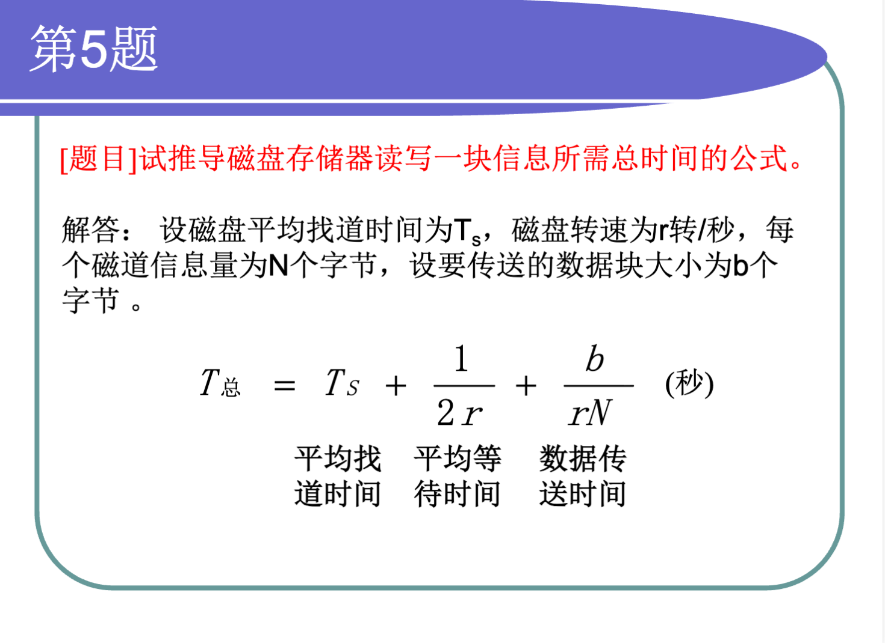
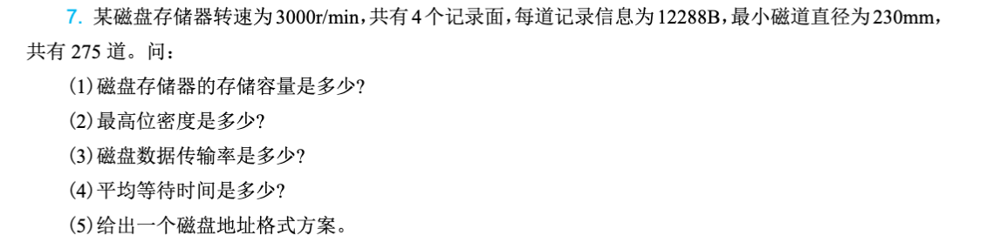
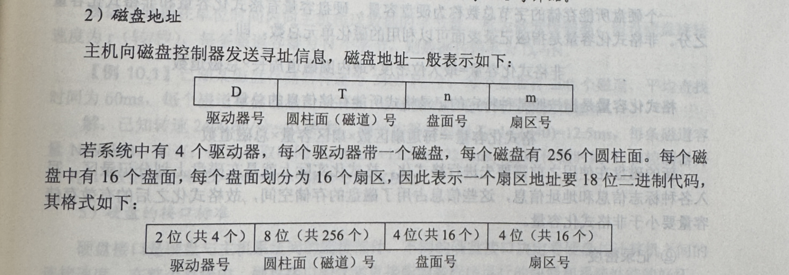
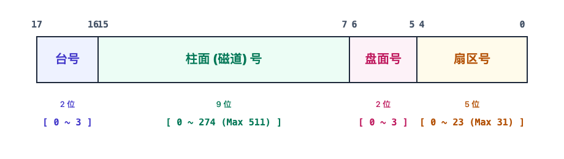
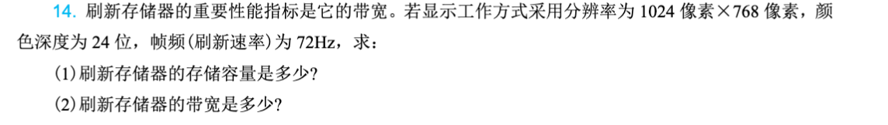

# 第7章：外围设备

!!! note
    [ppt](./resources/第7章-外围设备.pdf)

外围设备（Peripheral Equipment）是计算机系统的重要组成部分，负责与外部世界进行数据交互。本章主要介绍常见的输入设备、输出设备以及外存储器的原理和特点，帮助读者全面了解计算机系统的外围设备技术。

本章要点：

- 输入设备的类型与工作原理
- 输出设备的类型与工作原理
- 硬盘存储器的结构与原理
- 固态存储技术
- 光盘与新型存储技术

## 7.1 概述

### 7.1.1 外围设备的作用

外围设备是计算机系统与外部世界交互的桥梁。虽然CPU和内存是计算机的核心，但如果没有外围设备，计算机将无法获取外界信息，也无法将处理结果呈现给用户。

可以将计算机系统想象成一个人：CPU是大脑，负责思考和计算；内存是记忆，负责临时存储信息；而外围设备就是人的感官（输入设备）和表达方式（输出设备），以及记录文字的本子（外存储器）。

### 7.1.2 外围设备的分类

**1. 输入设备**

输入设备将外部信息转换为计算机能够处理的数字信号。常见的输入设备包括：

- 键盘：最传统的文本输入设备
- 鼠标：图形界面操作的主要设备
- 触摸屏：直观的交互设备
- 扫描仪：将纸质文档转换为数字图像
- 麦克风：将声音转换为数字信号

**2. 输出设备**

输出设备将计算机处理后的信息转换为人类能够感知的形式。常见的输出设备包括：

- 显示器：将数字信号转换为视觉图像
- 打印机：将数字文档打印到纸张上
- 扬声器：将数字音频信号转换为声音

**3. 外存储器**

外存储器用于永久存储大量数据，即使断电也不会丢失数据。常见的外存储器包括：

- 硬盘驱动器（HDD）
- 固态硬盘（SSD）
- 光盘（CD、DVD、蓝光光盘）
- 磁带
- U盘和存储卡

### 7.1.3 外围设备的发展趋势

**1. 智能化**

现代外围设备越来越多地内置智能控制器，能够独立完成部分处理工作，减轻主机负担。例如，智能打印机可以独立完成图像处理和色彩管理。

**2. 高速化**

数据传输接口不断升级，从早期的并口、串口发展到USB、Thunderbolt等高速接口，大大提升了数据传输速度。

**3. 小型化与便携化**

移动设备的发展推动了外围设备的小型化，U盘、无线鼠标、移动硬盘等便携设备越来越普及。

**4. 多功能整合**

单一设备集成多种功能成为趋势，如多功能一体机集合了打印、复印、扫描功能。

## 7.2 输入设备

### 7.2.1 键盘

键盘是最基本也是最重要的输入设备，负责将用户的按键操作转换为计算机能够识别的电信号。

**1. 键盘的工作原理**

键盘内部有一个由行线和列线组成的矩阵电路。每个按键位于某一行和某一列的交叉点。当按下某个按键时，对应的行线和列线被连通，键盘控制器检测到这个连通事件后，通过扫描确定具体位置，并将按键编码通过接口发送给计算机。

键盘的工作过程可以想象成一个二维坐标系统：行就像X轴，列就像Y轴。当按下某个键时，相当于确定了坐标（行号，列号），控制器查找这个坐标对应的字符编码并发送出去。

**2. 键盘接口**

- **PS/2接口**：早期的键盘接口，现在较少使用
- **USB接口**：现代计算机的标准接口，支持热插拔
- **蓝牙**：无线键盘使用的连接方式

**3. 键盘类型**

- **机械键盘**：每个按键使用独立的机械开关，寿命长，手感好
- **薄膜键盘**：按键通过按压薄膜电路接触，造价低，但手感较差
- **电容键盘**：利用电容变化检测按键，寿命极长，手感出色

### 7.2.2 鼠标

鼠标是图形用户界面的主要操作工具，通过移动光标和点击操作来控制计算机。

**1. 鼠标的工作原理**

**机械鼠标**：底部有一个滚球，移动时滚球带动两个相互垂直的轴转动，轴上的编码盘转动产生脉冲信号，通过计算脉冲数量和方向确定移动距离。

**光电鼠标**：使用发光二极管照射鼠标垫表面，通过检测表面反射光的变化来计算移动方向和距离。高端光电鼠标使用激光技术，更加精确。

**2. 鼠标的性能指标**

- **分辨率（DPI）**：每英寸对应的像素数，DPI越高移动越精确
- **采样率**：每秒报告位置的次数，通常以Hz为单位
- **加速度**：鼠标移动速度与光标移动速度的比例关系

**3. 鼠标接口**

- USB接口：现代鼠标的标准接口
- 蓝牙：无线鼠标的常用连接方式
- PS/2：早期接口，已基本淘汰

### 7.2.3 触摸屏

触摸屏是一种直观的输入设备，用户直接在屏幕上进行触摸操作来控制计算机。

**1. 触摸屏的类型**

**电阻式触摸屏**：由两层透明导电薄膜组成，中间有绝缘点。触摸时两层薄膜接触，形成电信号，通过检测接触位置确定触摸点。优点是成本低、可使用任何物体触摸，缺点是透光率低、硬度有限。

**电容式触摸屏**：利用人体电场产生的电容变化来检测触摸位置。当手指接触屏幕时，会改变触点处的电容值，控制器检测这个变化并计算触摸位置。优点是透光率高、支持多点触控，缺点是需要导体触摸。

**红外式触摸屏**：在屏幕边缘安装红外发射管和接收管，形成红外线网格。手指遮挡红外线时，通过被遮挡的光束位置确定触摸点。优点是寿命长、可做大尺寸，缺点是易受干扰。

**表面声波触摸屏**：利用超声波在玻璃表面的传播特性，触摸时吸收部分声波，通过检测吸收位置确定触摸点。精度高、透光好，但成本较高。

**2. 多点触控**

现代触摸屏支持多点触控，可以同时检测多个手指的触摸位置和动作。手势识别技术使得缩放、旋转、滑动等操作成为可能。

### 7.2.4 其他输入设备

**1. 扫描仪**

扫描仪将纸质文档、照片或实物转换为数字图像。主要技术指标包括：

- 光学分辨率：每英寸的像素数，如300dpi、600dpi
- 色彩深度：表示颜色的位数，如24位真彩色、48位色深
- 扫描速度：每页所需时间

工作原理：扫描仪使用光源照射文档，反射光通过光学系统聚焦到CCD（电荷耦合器件）或CIS（接触式图像传感器）上，将光信号转换为电信号，再经过模数转换变成数字图像。

**2. 数码相机**

数码相机使用图像传感器（CCD或CMOS）将光学图像转换为数字信号。关键参数包括：

- 像素数：传感器的像素总数
- 传感器尺寸：对角线长度，越大画质越好
- ISO感光度：传感器对光的敏感程度
- 光学变焦：镜头物理变焦倍数

**3. 麦克风**

麦克风将声音信号转换为电信号，再通过模数转换变成数字信号。主要类型包括：

- 动圈式麦克风：结构简单、耐用，频响特性好
- 电容式麦克风：灵敏度高、频响宽
- 驻极体麦克风：体积小、成本低，广泛应用于手机和电脑

## 7.3 输出设备

### 7.3.1 显示器

显示器是将数字信号转换为人眼可见图像的输出设备，是计算机最重要的输出设备之一。

**1. 显示系统的组成**

显示系统由显示器和显示适配器（显卡）组成。显卡负责将计算机内部的数字信号转换为显示器能够识别的信号，显示器负责将电信号转换为光图像。

**2. 显示器的工作原理**

**CRT显示器**（阴极射线管）：使用电子枪发射电子束，轰击荧光屏发光。每个像素点由红、绿、蓝三种荧光粉构成，电子束按顺序逐点扫描整个屏幕，通过控制电子束的强度来控制每个像素的亮度。

工作原理类似于在一张纸上用笔画画：电子枪就像笔，荧光屏就像纸，不同的是电子束每秒钟要重复扫描整个屏幕几十次，形成稳定的图像。

**LCD显示器**（液晶显示器）：利用液晶分子在电场作用下的排列变化来控制光线通过。屏幕由大量液晶像素组成，每个像素后面有背光源，前面有彩色滤光片。通过控制每个像素液晶分子的排列，可以调节该像素的亮度和颜色。

**LED显示器**：实质上也是液晶显示器，但使用LED作为背光源。相比传统CCFL背光，LED更节能、寿命更长、色域更广。

**OLED显示器**：采用有机发光材料，每个像素自发光的显示器。不需要背光源，因此可以做得更薄、对比度更高、可视角度更大。

**3. 显示器的主要参数**

- **分辨率**：屏幕上像素的数量，如1920×1080、3840×2160（4K）
- **像素间距**：相邻像素中心的距离，越小越清晰
- **刷新率**：每秒钟画面更新次数，如60Hz、144Hz
- **响应时间**：像素从一种颜色变换到另一种颜色所需时间，越小越好
- **对比度**：最亮与最暗的亮度比值
- **色域**：显示器能够显示的颜色范围

### 7.3.2 显卡

显示适配器（显卡）负责处理图形数据并输出到显示器。

**1. 显卡的组成**

- **GPU（图形处理器）**：专门处理图形运算的处理器
- **显存**：存储显示数据的高速内存
- **数模转换器（DAC）**：将数字信号转换为模拟信号（针对模拟输出）
- **输出接口**：连接显示器的接口

**2. 显卡的分类**

- **集成显卡**：集成在芯片组或CPU中，共享系统内存，性能较低但省电
- **独立显卡**：独立的图形处理器，拥有独立的显存，性能较强
- **专业显卡**：针对专业应用优化，驱动和硬件都针对特定软件优化

**3. 图形处理流水线**

现代GPU采用可编程的渲染流水线：

- 顶点处理：处理3D模型的顶点坐标变换
- 图元装配：将顶点组合成几何图元
- 光栅化：将几何图元转换为像素
- 片元处理：对每个像素进行着色计算
- 输出合并：处理透明度、深度测试等，输出最终像素颜色

### 7.3.3 打印机

打印机是将数字文档输出到纸张上的设备。

**1. 打印机的类型**

**针式打印机**：使用打印针击打色带将墨水转移到纸上。优点是耗材成本低、可打印多层复写纸，缺点是噪音大、精度低、速度慢。现在主要用于发票、收据等特殊场景。

**喷墨打印机**：将墨水微粒喷射到纸上形成图像。优点是彩色效果好、噪音低、相对便宜，缺点是耗材成本高、打印速度较慢。适合家庭和小型办公使用。

**激光打印机**：使用激光束在感光鼓上形成静电潜像，吸附碳粉后转印到纸上并加热定影。优点是速度快、打印质量高、耗材成本低，缺点是设备成本较高、彩色效果不如喷墨。适合办公环境使用。

**2. 打印机的主要参数**

- **分辨率**：每英寸的打印点数（dpi），常见有300、600、1200dpi
- **打印速度**：每分钟打印页数（PPM）
- **月打印负荷**：厂家建议的每月最大打印量
- **内存容量**：影响打印大数据量时的性能

### 7.3.4 其他输出设备

**1. 扬声器与耳机**

扬声器将电信号转换为声音。系统组成包括：

- 数模转换器（DAC）：将数字音频信号转换为模拟信号
- 放大器：放大信号以驱动扬声器
- 扬声器单元：将电信号转换为声波

**2. 投影仪**

投影仪将图像放大投影到幕布上。常见技术：

- LCD投影：使用液晶光阀控制光线通过
- DLP投影：使用数字微镜器件反射光线
- LCOS投影：结合LCD和DLP技术

**3. 3D打印机**

3D打印机通过逐层堆积材料来制造三维物体。常见技术：

- FDM（熔融沉积）：加热并挤出塑料丝
- SLA（立体光刻）：使用激光固化光敏树脂
- SLS（选择性激光烧结）：使用激光烧结粉末材料

## 7.4 外存储器

### 7.4.1 硬盘存储器

硬盘驱动器（Hard Disk Drive，HDD）是计算机最主要的外部存储设备，以其大容量和低成本成为数据存储的核心。

**1. 硬盘的结构**

硬盘由多个涂有磁性材料的盘片组成，数据就存储在这些盘片表面。每个盘片被分为同心圆轨道（磁道），每个磁道又分为扇区。盘片高速旋转，磁头在磁臂的控制下移动到不同的磁道进行读写。

可以想象成一个唱片机：盘片就像唱片，磁道就像唱片上的音轨。不同的是，唱片机用唱针读取声音，而硬盘用磁头读写数据；唱片是连续的音乐，硬盘的数据是分成扇区存储的。

**2. 硬盘的工作原理**

硬盘采用磁记录技术存储数据。盘片表面的每个微小区域都可以被磁化为南、北极两种状态，分别代表二进制数据的0和1。写入数据时，磁头产生磁场改变盘片上相应区域的磁极化方向；读取数据时，磁头感应盘片表面的磁场变化，将其转换为电信号。

**3. 硬盘的主要性能指标**

- **容量**：存储数据的总量，从几百GB到数十TB
- **转速**：盘片每分钟旋转次数，常见有5400RPM、7200RPM、10000RPM
- **平均寻道时间**：磁头移动到指定磁道所需的平均时间，通常为几毫秒
- **平均延迟时间**：等待盘片旋转到正确位置的时间
- **缓存**：内置的高速缓存，提高读写效率，通常为64MB~256MB
- **接口类型**：SATA、USB等，决定数据传输速度

**4. 硬盘的接口**

- **IDE（PATA）**：早期接口，已淘汰
- **SATA**：串行ATA，当前主流的硬盘接口
- **SAS**：面向服务器的接口，可靠性更高
- **USB**：外接硬盘的常用接口

### 7.4.2 固态硬盘

固态硬盘（Solid State Drive，SSD）使用闪存芯片存储数据，没有机械部件，在速度、功耗、抗震性等方面全面超越传统硬盘。

**1. 固态硬盘的结构**

固态硬盘由NAND Flash闪存芯片、主控芯片和缓存组成。数据存储在NAND Flash中，主控芯片负责数据的读写管理和磨损均衡。

**2. NAND Flash的工作原理**

NAND Flash使用浮栅晶体管存储电荷。每个存储单元可以存储1位（SLC）、2位（MLC）、3位（TLC）或4位（QLC）数据。单元中充电表示1，放电表示0（或反之），通过检测阈值电压来确定存储的数据。

**3. 固态硬盘的性能优势**

- **速度极快**：读写速度可达数GB/s，是机械硬盘的10倍以上
- **延迟极低**：无寻道时间，延迟在微秒级
- **无噪音**：没有机械部件
- **功耗低**：闲置时几乎不耗电
- **抗震**：可承受较大的冲击和振动

**4. 固态硬盘的缺点**

- **成本高**：每GB价格仍高于机械硬盘
- **寿命有限**：闪存单元有写入次数限制
- **数据恢复困难**：损坏后数据基本无法恢复

**5. SSD的术语解释**

- **TRIM**：操作系统告诉SSD哪些数据已删除，可以擦除
- **磨损均衡**：将写入操作分散到不同区块，延长寿命
- **垃圾回收**：后台整理闪存空间
- **SLC/MLC/TLC/QLC**：不同级别的单元密度

### 7.4.3 混合硬盘与存储加速

**1. 混合硬盘**

混合硬盘（SSHD）将小容量SSD作为缓存与大容量机械硬盘结合。常用数据自动缓存到SSD中，提高启动和常用程序的加载速度，成本介于纯SSD和纯HDD之间。

**2. 缓存加速**

Intel Optane Memory使用3D XPoint技术作为缓存，加速机械硬盘的性能接近SSD。

### 7.4.4 光盘存储器

光盘利用激光技术在光盘片上存储数据。

**1. 光盘的分类**

- **CD**（光盘）：容量约700MB，波长780nm红外激光
- **DVD**（数字视频光盘）：单面4.7GB，双面8.5GB，波长650nm红光
- **蓝光光盘**：容量25GB~128GB，波长405nm蓝光

**2. 光盘的工作原理**

**只读光盘（CD-ROM、DVD-ROM）**：在生产时在光盘表面压制凹坑和平坦区域。读取时，激光照射在光盘表面，利用光的反射差异检测凹坑和平坦区域，从而读取数据。

**可记录光盘（CD-R、DVD-R）**：使用有机染料作为记录层，激光照射使染料发生不可逆变化来记录数据。只能写一次。

**可重写光盘（CD-RW、DVD-RW）**：使用相变材料，可以通过激光加热改变材料晶体状态来反复读写。

**3. 光驱的类型**

- **只读光驱**：只能读取光盘
- **康宝（COMBO）**：可读光盘和VCD/DVD，可刻CD
- **蓝光光驱**：可以读取和刻写蓝光光盘

### 7.4.5 磁带存储器

磁带是一种古老的存储介质，至今仍在特定领域使用。

**1. 特点**

- **容量大**：单卷磁带可达数十TB
- **成本低**：每GB成本最低
- **寿命长**：可保存30年以上
- **速度慢**：随机访问性能差
- **可靠性高**：不易受电磁干扰

**2. 应用场景**

主要用于数据备份和归档，尤其适合长期保存不经常访问的"冷数据"。企业级备份系统、影视后期制作等领域广泛应用。

### 7.4.6 存储卡与U盘

**1. 存储卡**

各种存储卡用于手机、相机、游戏机等设备：

- **SD卡**：最常见的存储卡类型
- **Micro SD卡**：手机和平板常用
- **CF卡**：早期专业相机使用

**2. U盘**

使用USB接口的闪存盘，便携、、即插即用。容量从几GB到数百GB不等。

### 7.4.7 新型存储技术

**1. 3D XPoint**

Intel和Micron开发的革命性存储技术，性能介于DRAM和NAND Flash之间。现已推出Optane Persistent Memory产品。

**2. MRAM**

磁阻随机存取存储器，使用磁性存储单元，非易失性、读写速度快、寿命无限。

**3. ReRAM**

阻变存储器，通过改变材料的电阻来存储数据。

## 本章小结

本章系统介绍了计算机系统的各类外围设备及其工作原理。

输入设备将外部信息转换为计算机能够处理的数据，包括键盘、鼠标、触摸屏等传统设备和扫描仪、麦克风等专用设备。不同的输入设备各有特点，适用于不同的应用场景。

输出设备将计算机处理后的结果呈现给用户，显示器、打印机和显卡是最常见的输出设备。显示技术从CRT发展到LCD、LED再到OLED，打印机技术从针式、喷墨到激光，各有优缺点。

外存储器是计算机系统永久存储数据的核心。硬盘以其大容量和低成本长期占据主导地位，固态硬盘凭借卓越的性能正在快速普及。光盘和磁带在特定领域仍有重要应用。随着技术发展，新型存储技术如3D XPoint正在改变存储格局。

---

## 作业题

### p254 - 5 

这道题是计算机组成原理中非常经典的**磁盘访问时间计算**。要理解这个推导公式，我们需要把机械磁盘读写一个数据块的过程拆解为三个步骤。

整个过程的总时间 $T_{\text{总}}$ 由以下三部分相加组成：

1. 平均寻道时间（Seek Time）：$T_s$

* **含义**：当磁头需要读写数据时，首先必须移动到数据所在的那个磁道（Track）上。
* **推导**：这个时间取决于机械手臂移动的速度，通常由硬件性能决定。题目中直接将其设为已知量 $T_s$。

2. 平均等待时间（Rotational Delay）：$\frac{1}{2r}$

* **含义**：磁头到达正确的磁道后，数据所在的扇区（Sector）不一定刚好在磁头下方，需要等待磁盘旋转把扇区送过来。
* **推导**：
* 磁盘转速为 $r \text{ 转/秒}$，那么转一圈所需的时间就是 $\frac{1}{r} \text{ 秒}$。
* 在最理想的情况下，磁头刚到，扇区就到了，等待时间为 $0$；
* 在最坏的情况下，磁头刚到，扇区刚转过去，需要等一整圈，等待时间为 $\frac{1}{r}$。
* 计算机中通常取其**平均值**，即转半圈的时间：

$$\text{平均等待时间} = \frac{1}{2} \times \frac{1}{r} = \frac{1}{2r}$$

3. 数据传送时间（Transfer Time）：$\frac{b}{rN}$ 

* **含义**：磁头对准了扇区起点，开始边旋转边读写这 $b$ 个字节的数据所需的时间。
* **推导**：
* 已知磁盘转一圈需要 $\frac{1}{r} \text{ 秒}$。
* 转一圈可以读完整个磁道的信息，即读取 $N \text{ 个字节}$。
* 由此可以得出磁盘的数据传输率（Data Transfer Rate）为：$D = \frac{N}{\frac{1}{r}} = rN \text{ 字节/秒}$。
* 现在要传送的数据块大小为 $b \text{ 个字节}$，那么所需的时间就是：

$$\text{数据传送时间} = \frac{\text{数据大小}}{\text{传输率}} = \frac{b}{rN}$$

**总结公式**

将这三个阶段的时间加在一起，就得到了最终的推导公式：

$$T_{\text{总}} = T_s + \frac{1}{2r} + \frac{b}{rN} \text{ （秒）}$$

---

### p254 - 7

这是一道经典的计算机组成原理中关于**磁盘存储器参数计算**的题目。下面是详细的求解过程和步骤：

**补充下磁盘地址的知识**

**已知条件整理：**

* 转速 $n = 3000 \text{ r/min} = \frac{3000}{60} \text{ r/s} = 50 \text{ r/s}$（转/秒）
* 记录面数（磁头数） $S = 4$ 个
* 每道记录信息量 $N = 12288 \text{ B}$
* 最小磁道直径 $d_{\text{min}} = 230 \text{ mm}$
* 磁道数（柱面数） $C = 275$ 道

###### (1) 磁盘存储器的存储容量是多少?

磁盘的总容量等于：**记录面数 $\times$ 每面的磁道数 $\times$ 每道的信息量**。

$$\text{存储容量} = S \times C \times N$$

$$\text{存储容量} = \frac{13200}{1024} \text{ MB} \approx 12.89 \text{ MB}$$

* **答**：磁盘存储器的非格式化存储容量约为 **$12.89 \text{ MB}$**（或 $13,516,800 \text{ B}$）。

###### (2) 最高位密度和最低位密度是多少?

**位密度（Bit Density）**是指磁道单位长度上记录的二进制位数。
好的，我们统一将单位转换为**字节/毫米（B/mm）**。

在磁盘存储器中，所有磁道记录的信息量完全相同（都是 $12288 \text{ B}$），因此：

* **最内圈（直径最小）**：周长最短，数据密度最高，即**最高位密度**。
* **最外圈（直径最大）**：周长最长，数据密度最低，即**最低位密度**。

 ① 计算最高位密度（最内圈）

* 最小磁道直径 $d_{\text{min}} = 230 \text{ mm}$
* 最小磁道周长 $L_{\text{min}} = \pi \times d_{\text{min}} = 230\pi \text{ mm}$
* 每道信息量：$12288 \text{ B}$

$$\text{最高位密度} = \frac{\text{每道信息量 (B)}}{\text{最小磁道周长 (mm)}} = \frac{12288}{230\pi} \approx 17.01 \text{ B/mm}$$

 ② 计算最低位密度（最外圈）

*注：本题在缺失“道密度”或“外圈直径”时，常规机密答案通常采用经典教材默认的道密度 $D_t = 40 \text{ 道/mm}$（即道距 $\Delta r = 0.025 \text{ mm}$）进行推导：*

1. **计算最大磁道直径 $d_{\text{max}}$**：
总磁道数 $C = 275$ 道，单侧磁道所占的宽度为：

$$\text{单侧宽度} = \frac{275 \text{ 道}}{40 \text{ 道/mm}} = 6.875 \text{ mm}$$

由于直径是双侧延展，所以最大磁道直径为：

$$d_{\text{max}} = d_{\text{min}} + 2 \times \text{单侧宽度} = 230 + 2 \times 6.875 = 243.75 \text{ mm}$$

2. **计算最低位密度**：
最大磁道周长 $L_{\text{max}} = \pi \times d_{\text{max}} = 243.75\pi \text{ mm}$

$$\text{最低位密度} = \frac{\text{每道信息量 (B)}}{\text{最大磁道周长 (mm)}} = \frac{12288}{243.75\pi} \approx 16.05 \text{ B/mm}$$

* **答**：最高位密度约为 **$17.01 \text{ B/mm}$**，最低位密度约为 **$16.05 \text{ B/mm}$**。
###### (3) 磁盘数据传输率是多少?

**数据传输率（Data Transfer Rate）**是指单位时间内磁头读写的数据量。它等于**磁盘转速（转/秒） $\times$ 每道记录的信息量**。

* 转速 $r = 50 \text{ r/s}$
* 每道信息量 $N = 12288 \text{ B}$

$$\text{数据传输率} = r \times N = 50 \text{ r/s} \times 12288 \text{ B} = 614,400 \text{ B/s}$$

转换单位：

$$\text{数据传输率} = \frac{614,400}{1024} \text{ KB/s} = 600 \text{ KB/s}$$

* **答**：磁盘数据传输率是 **$600 \text{ KB/s}$**。

###### (4) 平均等待时间是多少?

**平均等待时间（Average Rotational Delay）**是指磁头定位到磁道后，等待目标扇区旋转到磁头下方的平均时间，通常取**旋转半圈的时间**。

$$\text{平均等待时间} = \frac{1}{2r} = \frac{1}{2 \times 50 \text{ r/s}} = 0.01 \text{ s} = 10 \text{ ms}$$

* **答**：平均等待时间是 **$10 \text{ ms}$**。

###### (5) 给出一个磁盘地址格式方案。

要合理设计磁盘地址格式，我们需要确定表示**台号、柱面（磁道）**、**记录面（磁头）**和**扇区**分别需要多少个二进制位（bit）。

- 台号（第 17~16 位，共 2 位）：可寻址 $2^2 = 4$ 台独立的磁盘存储器。

- 柱面（磁道）号（第 15~7 位，共 9 位）：可寻址 $2^9 = 512$ 个柱面（本题实际使用 $0 \sim 274$）。

- 盘面（磁头）号（第 6~5 位，共 2 位）：可寻址 $2^2 = 4$ 个记录面（本题刚好全部用满 $0 \sim 3$）。

- 扇区号（第 4~0 位，共 5 位）：可寻址 $2^5 = 32$ 个扇区（按 $512\text{B}$ 标准扇区算，本题每道有 24 个扇区，实际使用前 $24$ 个）。

**方案设计如下（假设总地址长度为 16 位）：

---

### p255 -14

好的，我们全部统一用 **MB**（存储容量）和 **MB/s**（数据带宽）来规范书写，计算过程如下：

(1) 刷新存储器的存储容量

存储容量由屏幕的总像素点和每个像素的颜色深度决定：

* **总像素数**：$1024 \times 768 = 786,432$ 像素
* **每像素位数**：$24 \text{ bit}$
* **单帧总位数**：$1024 \times 768 \times 24 = 18,874,368 \text{ bit}$

将单位换算为字节 (Byte)，再换算为 **MB**：

* 换算为 Byte：$\frac{18,874,368}{8} = 2,359,296 \text{ Byte}$
* 换算为 MB ($1 \text{ MB} = 1024 \times 1024 \text{ Byte}$生)：

$$\text{存储容量} = \frac{2,359,296}{1024 \times 1024} = 2.25 \text{ MB}$$

> **答：** 刷新存储器的存储容量是 **$2.25 \text{ MB}$**。

(2) 刷新存储器的带宽

带宽是指每秒钟需要刷新读取的数据量，等于“单帧容量 $\times$ 刷新速率”：

* **单帧容量**：$2.25 \text{ MB}$
* **帧频 (刷新速率)**：$72 \text{ Hz}$（即每秒刷新 72 次）

$$\text{带宽} = 2.25 \text{ MB} \times 72 \text{ /s} = 162 \text{ MB/s}$$

> **答：** 刷新存储器的带宽是 **$162 \text{ MB/s}$**。

---

## 思考题

1. **外围设备作用**：外围设备在计算机系统中承担什么角色？如果没有外围设备，计算机能否正常工作？

2. **触摸屏原理**：电阻式触摸屏和电容式触摸屏有什么区别？各有什么优缺点？

3. **显示器原理**：比较CRT显示器和LCD显示器的工作原理差异，以及各自的优缺点。

4. **SSD vs HDD**：固态硬盘相比机械硬盘有哪些优势？为什么现在固态硬盘还没有完全取代机械硬盘？

5. **硬盘性能**：某硬盘转速为7200RPM，平均寻道时间为8ms，请计算其平均访问时间（假设平均延迟为旋转半圈所需时间）。

6. **显卡功能**：解释什么是GPU，它与CPU有什么区别？为什么图形渲染需要专门的GPU？

7. **存储技术**：为什么SSD有写入次数限制？这对普通用户使用有什么影响？

8. **打印机选择**：为家庭打印照片、为办公室打印黑白文档、为打印店打印彩色杂志分别应该选择什么类型的打印机？为什么？

9. **存储层次**：解释计算机存储层次中内存、SSD、HDD、磁带各自的定位和适用场景。

10. **技术发展**：预测未来10年存储技术的发展方向，固态硬盘可能完全取代机械硬盘吗？为什么？