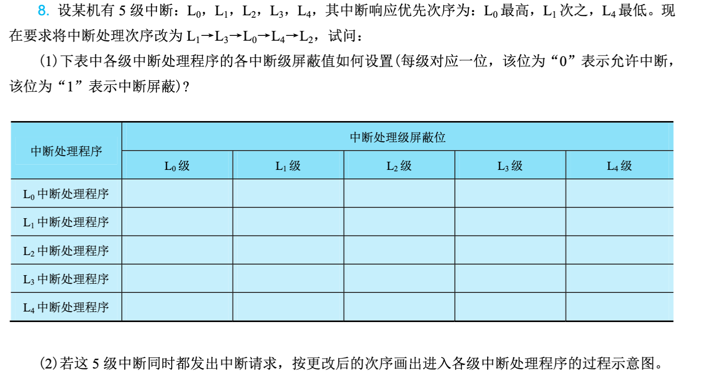

# 第8章：输入输出系统

!!! note
    [ppt](./resources/第8章-输入输出系统.pdf)

输入输出系统是计算机系统的重要组成部分，负责协调CPU与各类外围设备之间的数据交换。本章从I/O系统概述入手，详细介绍程序直接控制方式、程序中断方式、DMA方式以及通道方式等I/O控制方法，分析I/O接口的组成和功能，最后讨论系统层次结构和性能分析。

**本章要点：**

- I/O系统的基本概念与组成
- 四种I/O控制方式：程序直接控制、中断、DMA、通道
- I/O接口的结构与功能
- I/O系统层次结构
- I/O性能评估与优化

## 8.1 I/O系统概述

### 8.1.1 I/O系统的组成

I/O系统（输入输出系统）的核心任务是解决高速CPU与低速I/O设备之间的速度不匹配问题，实现它们之间高效、可靠的数据传输。整个I/O系统由三部分组成：

**1. I/O设备**

泛指各种外围设备，包括前面章节介绍的输入设备（键盘、鼠标、扫描仪等）、输出设备（显示器、打印机等）以及外存储器（硬盘、光盘等）。每个设备都有其独特的工作方式和数据格式。

**2. I/O接口**

也称为I/O控制器或适配器，是介于CPU和I/O设备之间的硬件电路。I/O接口负责将设备的具体特性抽象为CPU能够统一处理的接口，完成数据格式转换、速度匹配、电平转换等功能。

可以把I/O接口想象成翻译：CPU说的是计算机的"语言"（二进制数据），设备说的是自己的"语言"（可能是模拟信号、并行数据等），接口负责翻译两者之间的信息。

**3. I/O软件**

包括设备驱动程序、设备管理程序等软件，负责控制和管理I/O设备的工作。

### 8.1.2 I/O设备的特点

与CPU和内存相比，I/O设备具有以下显著特点：

**1. 速度差异巨大**

CPU的工作频率可达数GHz，内存的访问时间在纳秒级，而大多数I/O设备的访问时间在毫秒级。例如，从硬盘读取一个扇区需要约10毫秒，而CPU在这段时间内可以执行数百万条指令。

**2. 数据格式多样**

不同设备使用不同的数据表示方式：键盘输入的是按键代码，显示输出的是像素颜色，打印机需要的是字符或图形点阵。I/O系统必须能够处理这些格式转换。

**3. 设备多样化**

计算机系统可能连接数十种不同类型的I/O设备，它们的工作原理、传输速率、数据量等差异巨大。

**4. 可靠性问题**

I/O设备通常涉及机械部件或外部环境，可靠性相对较低，可能出现各种异常情况。

### 8.1.3 I/O系统的性能瓶颈

I/O系统通常 是计算机系统性能的主要瓶颈。CPU技术飞速发展，处理能力大幅提升，但磁盘、网络等I/O设备的速度增长相对缓慢。这就是著名的"内存墙"和"I/O墙"问题。

**Amdahl定律**提醒我们，即使 CPU处理速度无限快，如果I/O系统不给力，整体系统性能仍然无法提升。举例来说，即使CPU每秒能处理10亿条指令，但如果硬盘每秒只能读取1000万字节数据，系统性能也会被硬盘限制。

## 8.2 I/O控制方式

CPU与I/O设备之间的数据传输控制方式经历了从简单到复杂的发展过程，主要有四种：程序直接控制方式、程序中断方式、DMA方式和通道方式。

### 8.2.1 程序直接控制方式

程序直接控制方式是最简单的I/O控制方式，CPU主动轮询设备状态，直到设备准备就绪，然后进行数据读写。

**1. 工作原理**

CPU不断读取设备的状态寄存器，检查设备是否准备好。如果设备未就绪，继续轮询；如果就绪，则进行数据读写。

以从键盘读取一个字符为例：
```
循环：
    读取键盘状态寄存器
    如果状态显示"有数据"
        读取键盘数据寄存器
        跳出循环
    否则
        继续轮询
```

这种方式的流程就像你去银行柜台办理业务：不断问柜台"轮到我了吗"，直到柜台说"到你了"，然后办理业务。

**2. 实现方式**

- **无条件传送**：假设设备始终就绪，直接读写数据。适用于简单设备如开关、指示灯。
- **程序查询**：CPU不断查询设备状态，等待就绪后再传输数据。适用于速度较慢的设备。

**3. 优缺点**

优点：

- 控制简单，硬件支持少
- 易于理解和编程
- 成本低

缺点：

- **CPU效率低**：CPU在轮询期间无法执行其他任务，一直在做无用功
- **实时性差**：设备准备好后需要等待CPU轮询到才能处理
- **无法并行**：CPU与I/O设备串行工作，无法同时进行多个任务

**4. 适用场景**

适用于低速或简单的设备，如开关量输入输出、简单的LED显示等。不适合高速设备和高性能要求的系统。

### 8.2.2 程序中断方式

中断方式改变了CPU被动等待的局面，改为I/O设备主动通知CPU。

**1. 中断的基本概念**

中断是一种异步事件机制，当I/O设备完成操作或发生异常时，向CPU发送中断请求信号。CPU收到中断请求后，暂停当前任务，保存当前状态，转去执行中断处理程序，处理完成后返回原来的任务继续执行。

中断机制就像手机的来电提醒：当你正在专注做某件事时，如果有电话进来，手机会响铃通知你，你接完电话后再继续之前的工作。

**2. 工作流程**

中断方式的工作流程包括：

1. 设备完成I/O操作后发出中断请求
2. CPU在每条指令执行结束后检查中断请求
3. 如有中断请求且CPU允许响应，则进入中断处理
4. CPU保存当前程序状态（PC、寄存器等）
5. 根据中断类型跳转到对应的中断处理程序
6. 中断处理程序执行I/O操作的后续处理
7. 恢复程序状态，返回原程序继续执行

**3. 中断处理过程**

一次完整的中断处理包括：

- **中断请求**：设备发出中断请求信号
- **中断响应**：CPU检测到中断，响应中断
- **保护现场**：保存当前程序状态
- **中断服务**：执行具体的I/O处理
- **恢复现场**：恢复被保存的程序状态
- **中断返回**：返回原程序继续执行

图8-1展示了中断处理的完整流程。

**4. 中断优先级与嵌套**

当多个中断同时发生时，CPU根据优先级决定处理顺序。高优先级中断可以打断低优先级中断的处理，这称为中断嵌套。

**5. 优缺点**

优点：

- **提高CPU效率**：CPU不用轮询，设备准备好后主动通知
- **支持并行**：CPU与I/O设备可以并行工作
- **实时性好**：能够及时响应外部事件

缺点：

- **硬件复杂**：需要中断控制器等硬件支持
- **开销较大**：每次中断都有保存/恢复现场的开销
- **中断频繁**：高速设备可能产生大量中断

**6. 适用场景**

适用于中低速设备，如键盘、鼠标、网卡等。仍然是现代计算机最常用的I/O控制方式之一。

### 8.2.3 DMA方式

DMA（Direct Memory Access，直接内存访问）方式让数据直接在I/O设备和内存之间传输，CPU只在传输开始和结束时参与。

**1. DMA的引入**

中断方式虽然提高了CPU效率，但每传输一个数据单元就需要一次中断，仍然消耗大量CPU资源。对于高速设备如硬盘、网络卡，每秒可能产生数十万次中断，CPU将不堪重负。

DMA方式的核心思想是：让一个专门的硬件——DMA控制器——代替CPU管理数据传输。CPU只需要告诉DMA控制器传输的起始地址、数据长度和方向，剩下的工作全部由DMA控制器完成。传输完成后，DMA控制器再通知CPU。

这就像你要搬家：如果你自己搬所有东西（程序查询方式），累且效率低；如果每搬一件家具都叫人来帮忙（中断方式），频繁打扰；如果请搬家公司（DMA方式），你只需要告诉他们从哪里搬到哪里、搬多少，然后就可以做自己的事情，搬家公司完成后再通知你。

**2. DMA控制器的工作过程**

1. CPU对DMA控制器进行初始化：设置源地址、目标地址、传输数量和传输方向
2. 设备准备好数据后，向DMA控制器发出请求
3. DMA控制器向CPU申请总线使用权
4. CPU响应并释放总线，DMA控制器接管总线
5. DMA控制器直接在设备和内存之间传输数据
6. 每传输一个数据单元，地址自动递增，计数递减
7. 传输完成后，DMA控制器释放总线，并发出中断通知CPU

**3. DMA的传输方式**

- **停止CPU访问**：DMA工作时完全占用总线，CPU停止访问内存。传输效率高，但CPU无法执行其他任务。
- **周期挪用**：DMA利用CPU不访问内存的空闲周期进行传输。不需要停止CPU工作，但可能引起单周期延迟。
- **DMA与CPU交替访问**：将内存时间分成两部分，一部分供CPU使用，一部分供DMA使用。无需等待，但控制复杂。

**4. 优缺点**

优点：

- **极大减少CPU干预**：数据直接在设备和内存间传输
- **传输效率高**：适合大数据量传输
- **CPU可以并行工作**：传输期间CPU可以执行其他程序

缺点：

- **硬件复杂**：需要DMA控制器，增加系统成本
- **控制复杂**：需要CPU初始化和最后处理
- **可能冲突**：与CPU访问内存产生冲突

**5. 适用场景**

适用于高速、大批量数据传输，如硬盘读写、网络数据传输、内存间数据复制等。

### 8.2.4 通道方式

通道方式是对DMA的进一步扩展，可以看作是一个专门负责I/O处理的简单处理器。

**1. 通道的概念**

通道（Channel）是一种专门处理I/O的处理器，有自己的指令系统，可以执行I/O程序（称为通道程序）。通道独立于CPU工作，能够完成复杂的I/O控制任务。

**2. 通道的工作原理**

CPU只需要向通道发出I/O指令，指定要执行的通道程序在内存中的地址。通道读取通道程序，解释执行，并与设备进行数据交换。完成后，通道向CPU发出中断报告结果。

整个过程就像你给秘书一个任务清单（通道程序），告诉秘书"按这个清单去处理"（启动通道），然后你就可以去做自己的事情。秘书完成任务后向你汇报结果（中断通知）。

**3. 通道的类型**

- **字节多路通道**：为多个低速设备服务，交叉传输数据
- **选择通道**：为一台高速设备服务，独占通道直到传输完成
- **数组多路通道**：为多台高速设备服务，数据传输以块为单位交叉进行

**4. 通道与DMA的比较**

| 特性 | DMA | 通道 |
|------|-----|------|
| 处理能力 | 简单数据传输 | 执行通道程序 |
| 独立性 | 依赖CPU初始化 | 相对独立 |
| 复杂度 | 较低 | 较高 |
| 适用场景 | 中等高速设备 | 大型高速设备 |

**5. 优缺点**

优点：

- **处理能力强**：可以执行复杂的I/O操作
- **CPU介入最少**：几乎完全解放CPU
- **并行度高**：通道与CPU可真正并行工作

缺点：

- **硬件复杂**：通道处理器成本高
- **系统复杂**：需要额外的软件支持
- **不常用**：只在大型机和高端服务器中使用

典型的通道I/O系统如IBM mainframe，现在较少见于普通计算机系统。

### 8.2.5 四种控制方式的比较

| 特性 | 程序查询 | 中断 | DMA | 通道 |
|------|----------|------|-----|------|
| CPU介入程度 | 全程参与 | 传输时参与 | 始终止和结束参与 | 启动和结束参与 |
| 数据传输单位 | 字节/字 | 字节/字 | 数据块 | 数据块或多个块 |
| 并行性 | 无 | 有 | 有 | 有 |
| 硬件复杂度 | 简单 | 中等 | 较复杂 | 复杂 |
| 传输速度 | 慢 | 中等 | 快 | 快 |
| CPU开销 | 高 | 较高 | 低 | 最低 |
| 适用场景 | 低速简单设备 | 中低速设备 | 高速批量传输 | 大型I/O系统 |

## 8.3 I/O接口

### 8.3.1 I/O接口的功能

I/O接口是连接CPU与外设的桥梁，需要完成多种功能：

**1. 数据缓冲**

高速CPU与低速外设之间的数据缓冲，解决速度不匹配问题。通常使用寄存器或小型FIFO队列。

**2. 数据格式转换**

- 并行与串行转换
- 电平信号转换
- 数据宽度转换（如8位到32位）

**3. 设备选择**

当多个设备共享总线时，接口需要识别CPU要访问的设备。CPU发送设备地址，接口判断是否为自己。

**4. 状态监视**

向CPU报告设备的状态，如忙/闲、就绪/未就绪、错误/正常等。

**5. 控制与定时**

产生设备所需的控制信号，协调工作节奏。

**6. 中断处理**

提供中断请求和屏蔽功能。

### 8.3.2 I/O接口的组成

**1. 数据寄存器**

用于暂存输入或输出的数据。输入时，设备将数据写入数据寄存器，CPU从中读取；输出时，CPU将数据写入数据寄存器，设备从中读取。

**2. 状态寄存器**

反映设备当前状态，常用位包括：

- 忙位（Busy）：设备是否正在工作
- 就绪位（Ready）：设备是否准备好数据
- 错误位（Error）：是否发生错误

**3. 控制寄存器**

CPU写入控制命令，设置设备的工作模式。

**4. 地址译码电路**

解析CPU发送的地址信号，判断是否在访问本设备。

**5. 控制逻辑**

产生设备所需的各种控制信号。

### 8.3.3 I/O接口的编址

CPU如何访问I/O设备？有两种主要的编址方式：

**1. 统一编址（内存映射I/O）**

将I/O设备的寄存器映射到内存地址空间中，CPU使用访问内存的指令来访问I/O设备。

优点：

- 不需要专门的I/O指令
- 灵活的寻址方式
- 编程简单

缺点：

- 占用内存地址空间
- 访问速度可能较慢

**2. 独立编址**

I/O设备有独立的地址空间，与内存地址空间分开。CPU使用专门的I/O指令访问I/O设备，如x86的IN和OUT指令。

优点：

- 不占用内存地址空间
- 访问速度快

缺点：

- 需要专门的I/O指令
- 编程灵活性较差

### 8.3.4 典型I/O接口

**1. 并行接口**

一次传输多位数据，适合距离近、速度要求高的场景。如早期的打印机接口（并口）、IDE硬盘接口。

**2. 串行接口**

一次传输一位数据，接口简单、成本低、距离远。如RS-232串口、USB、SATA。

**3. SCSI接口**

Small Computer System Interface是一种高性能设备接口，曾广泛用于服务器的外存储设备连接。

**4. SATA接口**

Serial ATA是现代硬盘的主要接口，采用串行传输，点对点连接。

**5. USB接口**

通用串行总线，支持热插拔，即插即用，是现代计算机最主要的I/O接口。

**6. Thunderbolt接口**

Intel开发的高速接口，融合了PCIe和DisplayPort，最新版本带宽达40Gbps。

## 8.4 I/O软件

### 8.4.1 设备驱动程序

设备驱动程序（Device Driver）是操作系统与硬件设备之间的接口，负责控制和管理硬件设备。

**1. 驱动程序的作用**

- 向上为操作系统提供统一的设备抽象
- 向下控制设备硬件完成具体操作
- 处理设备的各种异常情况

**2. 驱动程序的功能**

- 设备初始化
- 设备的打开与关闭
- 数据的读写操作
- 设备状态查询与管理
- 中断处理
- 设备释放

**3. 驱动程序的加载**

现代操作系统支持即插即用（Plug and Play），设备插入后自动加载相应驱动程序。驱动程序可以静态加载（系统启动时加载）或动态加载（需要时加载）。

### 8.4.2 设备管理

操作系统通过设备管理模块统一管理所有I/O设备。

**1. 设备分配**

当多个进程需要使用同一设备时，设备管理负责合理分配互斥访问。

**2. 设备抽象**

为应用程序提供统一的接口，隐藏硬件细节。应用程序通过操作系统调用使用设备，无需关心具体硬件细节。

**3. 缓冲管理**

设置缓冲区来解决速度不匹配问题。常用的缓冲技术包括：

- 单缓冲
- 双缓冲
- 循环缓冲
- 缓冲池

### 8.4.3 设备无关性

设备无关性是指应用程序可以不考虑具体物理设备，通过统一的逻辑设备名使用设备。

**1. 逻辑设备名**

应用程序使用逻辑设备名（如"打印机1"），由操作系统映射到具体物理设备。

**2. 设备独立性优点**

- 应用程序易于移植
- 便于系统管理和维护
- 简化应用程序开发

## 8.5 I/O系统性能

### 8.5.1 I/O性能指标

**1. 吞吐量（Throughput）**

单位时间内完成的数据传输量，通常以MB/s或GB/s表示。

**2. 响应时间（Response Time）**

从发出I/O请求到完成的时间，包括排队等待时间、传输时间等。

**3. 利用率（Utilization）**

I/O设备或系统处于工作状态的时间比例。

### 8.5.2 I/O性能的优化

**1. 缓存技术**

在高速和低速设备之间设置缓存，临时存放数据，减少低速设备访问次数。

**2. 预读技术**

提前读取可能需要的数据，减少等待时间。

**3. 异步I/O**

应用程序发出I/O请求后可以继续执行，不必等待I/O完成。

**4. 应用程序层的优化**

- 减少I/O次数，批量处理
- 合理使用缓冲区
- 优化数据结构，提高缓存命中率
- 异步I/O与多线程

### 8.5.3 I/OBencharking

I/O性能测试常用的benchmark工具：

- ** fio**：灵活的I/O测试工具
- **IOmeter**：Windows平台的I/O测试工具
- **CrystalDiskMark**：简单的存储设备测试
- **IOzone**：文件系统测试工具

### 8.5.4 存储层次与性能

从CPU寄存器到硬盘，数据访问速度递减，容量递增：

- L1 Cache：亚纳秒级，几十KB
- L2/L3 Cache：纳秒级，几MB
- 主存：几十纳秒，几十GB
- SSD：微秒级，几百GB到几TB
- 硬盘：毫秒级，TB级

合理的缓存策略和I/O调度对系统整体性能至关重要。

## 本章小结

本章系统介绍了计算机系统的输入输出控制技术，包括四种I/O控制方式、I/O接口的组成与功能，以及I/O系统性能分析。

程序直接控制方式是最简单的I/O方式，但CPU效率极低。中断方式通过异步通知机制提高了CPU效率，是应用最广泛的I/O方式。DMA方式通过专用硬件在设备和内存间直接传输数据，极大减少CPU干预，适合高速大批量传输。通道方式则进一步将I/O控制智能化，用于大型高性能系统。

I/O接口是CPU与外设之间的桥梁，承担数据缓冲、格式转换、设备选择、状态监视等功能。接口的编址方式有统一编址和独立编址两种。

I/O性能是计算机系统整体性能的关键因素。通过缓存、预取、异步I/O等技术可以有效提升I/O性能。理解并合理应用这些技术，对于系统性能优化至关重要。

---

## 作业题

### p290 -7


这是一道关于**中断系统饱和时间**（或中断响应与处理开销）的经典计算机组成原理题。

**中断饱和时间**的本质是指：**CPU 完全被中断服务程序以及中断开销所占满，没有任何空闲时间去执行主程序（即不能取指并执行主程序指令）的状态**。


1. 单个设备的中断总开销

当一个设备发出中断请求并被响应后，CPU 为了处理这个中断，需要付出以下时间代价：

1. **中断周期时间 $t_4$**：硬件响应中断、暂停当前程序、压入 PC 和 PSW 等。
2. **保护现场时间 $t_2$**：软件（中断服务程序开头）保存通用寄存器的值。
3. **设备服务时间 $t_{\text{设备}}$**：CPU 真正为该设备执行 I/O 操作或处理数据的时间（如 $t_{\text{A}}, t_{\text{D}}, t_{\text{G}}$）。
4. **恢复现场时间 $t_3$**：软件（中断服务程序结尾）恢复通用寄存器的值。

因此，对于任意设备 $X$，CPU 处理它的一次中断所花费的**总时间**为：


$$T_X = t_4 + t_2 + t_X + t_3$$

2. 什么是“系统中断饱和时间”？

题目问的是“**系统中断饱和时间**”。在多设备的中断系统中，饱和状态意味着：

> 在某一段时间 $T_{\text{饱和}}$ 内，设备 A、D、G **各自恰好发出并完成了一次中断处理**，且这三个中断开销加起来，**刚好把 CPU 的时间全部榨干**，留给主程序取指执行的时间（$t_1$）变成了 **0**。

换句话说，系统中断饱和时间 $T_{\text{饱和}}$ 就是这三个设备完成一次中断处理所耗费的时间总和。

3. 公式推导与计算

我们将设备 A、D、G 的中断处理总时间相加，即可得到系统中断饱和时间：

$$T_{\text{饱和}} = T_{\text{A}} + T_{\text{D}} + T_{\text{G}}$$

将各自的展开式代入：

* $T_{\text{A}} = t_4 + t_2 + t_{\text{A}} + t_3$
* $T_{\text{D}} = t_4 + t_2 + t_{\text{D}} + t_3$
* $T_{\text{G}} = t_4 + t_2 + t_{\text{G}} + t_3$

把它们相加，进行合并同类项：

$$T_{\text{饱和}} = (t_4 + t_2 + t_{\text{A}} + t_3) + (t_4 + t_2 + t_{\text{D}} + t_3) + (t_4 + t_2 + t_{\text{G}} + t_3)$$

$$T_{\text{饱和}} = 3 \times (t_2 + t_3 + t_4) + (t_{\text{A}} + t_{\text{D}} + t_{\text{G}})$$

结论答复

> **答：** 只有设备 A, D, G 时的系统中断饱和时间为：
> 
> $$3(t_2 + t_3 + t_4) + t_{\text{A}} + t_{\text{D}} + t_{\text{G}}$$
> 
> 
---

### p290 -8



还没更完，我5.30做。

---

## 思考题

1. **I/O系统组成**：I/O系统由哪几部分组成？各部分的主要功能是什么？

2. **控制方式比较**：比较程序查询方式、 中断方式、DMA方式和通道方式的特点和适用场景。

3. **中断过程**：详细描述一次中断处理的过程，包括中断请求、响应、服务和返回各阶段的工作。

4. **DMA原理**：DMA控制器是如何实现数据直接传输的？DMA相比中断方式有什么优势？

5. **I/O编址**：解释统一编址和独立编址的区别，并说明各自的优缺点。

6. **中断与DMA选择**：为键盘、鼠标、硬盘和网络卡分别选择合适的I/O控制方式，并说明理由。

7. **性能分析**：假设某硬盘的平均寻道时间为8ms，转速为7200RPM，平均旋转延迟为3ms，读取4KB数据的传输时间为0.1ms。计算读取4KB数据需要的总时间。

8. **I/O优化**：有哪些方法可以提高I/O系统的性能？请从硬件和软件两个角度分别说明。

9. **设备驱动**：解释设备驱动程序在I/O系统中的作用。为什么操作系统需要不同的驱动程序来管理不同设备？

10. **未来趋势**：分析I/O技术的发展趋势，如NVMe over Fabric、持久内存等新技术对I/O系统的影响。